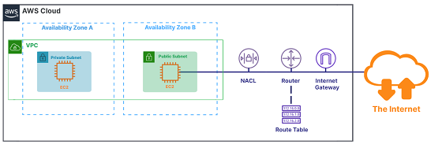

# Summary

# 02 Foundations of Cloud Computing

## 02-01 Understanding Cloud Computing

클라우드 하면 뭐가 떠오르세요? 클라우드는 실존하는 장소입니다. 여러분의 데이터가 어딘가 저장되어 있죠. 서버는 여러분의 요청을 다루기 좋은 고성능 컴퓨터들 입니다. Data센터는 클라우드 사업자가 여러분이 사용할 수 있는 수백개에서 수천개의 서버들로 이뤄져 있습니다.

**클라우드 컴퓨팅**
- **인터넷에서 컴퓨팅 서비스를 제공(Delivery of Computing Services)**
  - 컴퓨트: EC2, Lambda
  - 저장소: S3, EBS
  - 개발: Cloud9, CodeCommit
  - 디비: RDS, DynamoDB
  - 네트워킹: VPC, Direct Connect
  - 분석: Athena, Redshift
  - 보안: IAM, Macie

**클라우드 컴퓨팅의 특징**
1. **가상화(Virtualization)**
   - 가상화(Virtualization)은 여러분의 하나의 물리적 서버의 하드웨어 자원을 더 작은 단위로 나눌 수 있습니다.
   - The smaller units are called Virtual Machines(VMs).
   - 가상화는 클라우드 컴퓨팅의 핵심입니다.
2. **사용량(Usage)**
   - **On-Demand**: 장기 계약이나 선결제 없이 필요할 때 사용 가능
   - **Pay as You Go**: 사용한 시간이나 초단위로 지불

## 02-02 Exploring the Advantages of Cloud Computing

6가지의 클라우드 컴퓨팅의 장점(advantages)
1. **전세계에 쉽게 배포** 가능
2. 데이터 센터에 **유지 보수에 대한 지출을 멈춤**
3. **용량(scale)에 대한 절약** 이점
4. **속도와 민첩성(Agility) 향상**
5. 용량의 추측을 안하고 **요구한 만큼 적용**
6. 선결제 비용 대신 **사용할 것에 대한 것만 비용 지불**
   - 고정비용(capital expense)을 변동 비용(variable expense)으로 교체

**4가지의 클라우드 컴퓨팅의 이점(benefits)**

1. **고가용성(High Availability)**: 오랫동안 지속적으로 **서비스를 로스 없이 가능**
2. **유연함(Elasticity)**: 리소스들을 **자유롭게 늘리고 줄일 수 있음**
3. **민첩성(Agility)**: 속도와 **변경사항을 빠르게 변경** 가능
4. **내구성(Durability)**: **장기간 동안 데이터의 보호** 가능

## 02-03 Reviewing Cloud Computing and Deployment Models

**클라우드 컴퓨팅 모델(Cloud Computing Models)**

1. **IaaS(Infrastructure as a Service)**
   - **인프라를 빌림**(AWS, Azure, GCE 등)
   - 가장 유연한 클라우드 컴퓨팅 모델
2. **PaaS(Platform as a Service)**
   - **인프라 걱정 없이 플랫폼을 서비스 가능**
   - 개발자를 위한 플랫폼을 주로 서비스함
3. **SaaS(Software as a Service)**
   - 어플리케이션 서비스라고 부름
   - 사용자가 **하드웨어나 소프트웨어에 대한 책임이 없음**

**클라우드 개발 모델(Cloud Deployment Models)**

1. **Private Cloud**
   - 'On-Premises"라고도 부름
   - **내부(iternal) 데이터 센터에 존재**
   - 클라우드 컴퓨팅의 장점을 제공하지 않음
2. **Public Cloud**
   - AWS로 제공
   - 하드웨어에 대한 책임이 없음
   - **클라우드 컴퓨팅의 장점을 제공**
3. **Hybrid Cloud**
   - **프라이빗 클라우드와 퍼블릭 클라우드를 합침**
   - 민감한 데이터는 로컬에 저장함
   - 웹 어플은 AWS 인프라에서 돌아감
   - AWS는 둘이 통신 하기위해 툴 제공(AWS Direct Connect등을 통해서)

## 02-04 Leveraging the AWS Global Infrastructure

1. **지역(Regions)**
  - 독립적이고 개별적인 공간(Fully Independent and Isolated)
  - 자원들이 **지역끼리는 자동으로 복제되지 않아 고유함**
2. **가용 영역(Availability Zones)**
  - Availability Zones(AZs)는 **데이터 센터들이 1개 이상으로 분리되어 구성**되어 있음
  - 물리적으로 완전히 나눠짐
  - **저지연성(low latency)으로 데이터센터끼리 연결**되어 있음
  - 장애 허용 시스템(Fault tolerant)
  - 고가용성(high availability) 지원
3. **엣지 로케이션(Edge Locations)**
  - 사용자들을 위해 **cache content로 빠르게 제공**
  - 지연성을 낮춤

## 02-05 Exploring Your Amazon Web Services (AWS) Account

1. The AWS Management Console
   - 웹 페이지에서 AWS 계정에서 돌고있는 앱들을 관리 가능
   - The AWS Management Console allows you to access your AWS account and manage applications running in your account from a web browser.
2. **슈퍼 계정(Root User)**
   - **MFA(2중 보안)으로 계정을 보호**해 주세요.
   - Protect me with multi-factor authentication(MFA).  
3. **AWS Command Line Interface(CLI)**
   - 명령어 기반으로 터미널이나 커멘드윈도우로 AWS 접근 가능
   - The AWS Command Line Interface(CLI) allows you to access your AWS account through a terminal or command window.

# 03 Technology

## 03-01 Section Introduction

We have a lot of services to cover in this section!

## 03-02 Exploring Compute Services: EC2

### **EC2(Elastic Compute Cloud)**
- Elastic 컴퓨트 파워이며, 가상 서버 입니다.
- EC2는 가상 서버를 빌리고 관리할 수 있습니다.
- 지역 -> AZ -> Data centre안에 있는 서버는 **물리적인 하드웨어** 입니다.
- EC2 Instance는 물리적인 서버에서 가상 서버로 돌아갑니다.
- EC2는 서버리스가 **아닙니다**.
- AMI(Amazon Machine Image)라는 템플릿으로 인스턴스를 쉽게 구성할 수 있습니다.
- EC2 인스턴스에서 앱이나 DB를 배포할 수 있습니다.

**EC2에 연결하는 방법**
- AWS Management Console: 웹에서 관리 가능
- EC2 Instance Connect(EIC): IAM 정책(SSH 엑세스 제어)을 사용해서 연결
- **Secure Shell(SSH)**: PC에서 SSH를 통해 보안 연결
  - 가장 많이하는 방법, 키페어를 생성
  - 프라이빗 키와 퍼블릭 키로 EC2 인스턴스에 접근
- AWS Systems Manager: AWS CLI나 웹에서 시스템 매니저를 사용해 관리

**EC2 가격 모델**
1. **사용한 만큼(On-Demand)**
   - 시간당 요금을 지불함
   - 선불이나 장기약정 없이 저렴하게 사용하고 싶은 사람들
   - 단기의 갑작스럽거나 예측 불가한 워크로드가 있고, 중단되선 안되는 앱
   - EC2에서 처음으로 개발, 시험 중인 앱, 사용이 1년 이하의 앱
   - **용량(capacity)을 On-Demand 용량 예약**을 통해 예약할 수 있음
   - EC2 용량은 인스턴스 실행 여부에 상관 없이 유지됨
2. **스팟(Spot)**
   - **미사용 EC2 인스턴스를 요청**해 가격을 낮춤, **가장 저렴**
   - 사용자 제시 가격(입찰가격)을 정해놓고 저렴할 때 이용(90%까지 저렴함)
   - 시작과 종료 시간이 자유로운 앱
   - 컴퓨팅 가격이 매우 저렴해야만 수익이 나는 앱
   - 대량의 서버 용량을 추가로 긴급히 컴퓨팅 파워가 필요한 사람
3. **예약(Reserved Instances(RIs))**
   - 용량을 예약하고, 시간당 요금을 할인!
   - **꾸준한 사용중이고 1~3년 정도 예측 가능한 앱**
   - 선결제를 해서 가격이 할인 됨, 길게 계약하면 할인 혜택이 더해짐
   - 예약된 만큼의 용량이 필요한 앱
   - 예약 인스턴스 가격의 종류들
     - 스탠다드(Standard): 75%까지 할인, 길게 계약하면 더 큰 할인
     - 컨벌터블(Convertable): 54%까지 할인, 인스턴스 속성 변경 가능
4. **전용 호스팅(Dedicated Hosts)**: 인스턴스를 돌리기 위한 전용 물리적 서버
   - MS나 Oracle처럼 **자신의 소프트웨어 라이선스를 서버에 가져오고 싶을 때**
   - 독립성이나 클라우드 배포를 지원하지 않는 라이센스에 적합
   - 예약 형태로 구매 가능, 온디멘드 가격보다 70% 까지 할인
5. **Savings Plans**
   - 1년 또는 3년 기간에 **특정 사용량 약정(시간당 요금)**
   - 낮은 비용(72%까지 저렴)으로 여러대 컴퓨터 서비스가 필요할 때
   - 컴퓨터 서비스나 인스턴스 타입, 운영체재, 지역 등 유연하게 바꾸고 싶을 때
   - EC2나 Fargate나 람다 같은 다양한 서비스들을 나눠서 절약할 수 있음
   - **용량 예약이 불가능 함**

**EC2의 특징**
- **Elastic Load Balancer**
  - **로드 밸런서로 자동으로 트래픽 분산**
  - 클래식, 앱, 게이트웨이, 네트워크 로드 밸런서가 있음
- **Auto Scaling**
  - 자동으로 필요에 따라, 요구한 만큼 바꿈
  - **Horizontal Scaling(scaling out)을 지원**해서 시스템 오류 방지나 가용성 증가
  - Vertical Scaling(scaling up, Upgrading)와 햇갈리지 말 것

## 03-03 Exploring Compute Services: EC2 in Action

## 03-04 Exploring Compute Services: Lambda

### **AWS Lambda**
- 람다는 **서버리스 컴퓨터 서비스(a Building Block)이며** 서버 관리 없이 **코드를 돌릴 수 있음**
- 서버리스란 AWS에서 서버를 관리해 **서버 관리를 할 필요가 없음**
- **이벤트가 발생할 때 코드를 실행**
- email 알람, **백앤드 비지니스 로직** 등으로 사용 가능
- 실시간으로 파일을 프로세싱 함, 유명한 프로그래밍 언어를 지원
- 여러분이 작성한 코드를 콘솔이나 여러분이 좋아하는 IDE를 통해 작성
- 15분의 타임아웃이 발생하기 때문에 **코드가 15분 이내에 실행되어야 함**

**AWS Lambda 가격 모델**
- **컴퓨터 돌아갈 때만 요금 부과**
- **요청수**에 따라 요금 부과
- 한달에 백만개까지 무료

## 03-05 Exploring Compute Services: Additional Compute Services

### **AWS Fargate**
- 도커처럼 **컨테이너를 관리**합니다.
- 컨테이너를 위한 **서버리스 컴퓨트 앤진**입니다.
- ECS(Elastic Compute Service)같이 동작합니다.

### **AWS Lightsail**
- **작은 프로젝트를 위한 모든 자원들을 빠르게 런칭**할 때 사용
- 워드프레스(WordPress) 웹사이트 처럼 이미 구성된 앱을 배포
- **클라우드 경험이 없는 사람을 위한 편리한 UI**로 구성
- VM, SSD, Data Transfer, DNS 관리, 고정 주소 등의 기능 포함
- 저렴하고 예측 가능한 가격 요금 제공, 낮은 가격은 $3.5

### **AWS Outposts**
- **내부 데이터 센터에 클라우드 서비스를 제공 및 설치**
- 데이터와 지연성 때문에 **온프레미스에 남겨 작업 진행을 도움**
- 하이브리드 개발 모델
- 클라우드 서비스 및 API에 액세스하여 **사내 앱 개발** 등에 쓰임

### **AWS Batch**
- **대규모 워크로드를 더 작은 청크(배치)로 처리 가능**
- 수백, 수천 개의 소규모 **배치 처리 작업 실행**
- **볼륨 기반**으로 **인스턴스를 동적으로 프로비저닝**

## 03-06 Leveraging Storage Services: S3

### **S3(Simple Storage Services)**
- **객체(Objects) 저장 서비스**
- 오브젝트(Objects or files)은 **버킷(bucket or directory)에 저장**
- 기본적으로 버킷당 수백만 개의 객체를 저장할 수 있는 **무제한 스토리지**
- 콘솔이나 CLI나 프로그램이나 SDKs의 코드를 사용해 업로드 가능
- S3 access logs를 이용해 객체나 버킷의 접근을 추적 가능
- **버저닝이 가능**해 이전 버전을 사용하거나 삭제 사고를 보호
- **지역 서비스**지만 버킷 **이름은 글로벌로 유니크**하게 지어야 함

**데이터 접근성**
- **내구성(Durability)**: 없어지거나(lost) 손상(Compromised)없이 잘 보관, (11 9's)
- **고가용성(Availability)**: 필요할 때 빠르게 접근 가능 (99.99%)

**S3의 스토리지 클래스들**
1. **S3 Standard**
   - 일반적인 목적의 저장소
   - 여러 AZ에 걸쳐 데이터가 저장
   - **저지연성과 높은 처리량**
2. **S3 Intelligent-Tiering**
   - **자동적으로 데이터를 가장 효율적인 스토리지 클래스에 이동**
   - 여러 AZ에 걸쳐 데이터가 저장
   - 자동적으로 비용 절감, 회수(retrieval) 요금이 없음
   - 알수 없는 데이터나 접근 방법이 변경되는 경우
3. **S3 Standard-Infrequent Access(IA)**
   - **자주 접근하지는 않지만 필요시 빠르게 접근**해야할 데이터 보관
   - 여러 AZ에 걸쳐 데이터가 저장
   - S3 Standard보다 저렴함
   - 장기 보관 데이터면서 빈번하지않은 접근이지만 빠르게 접근해야할 데이터에 추천
4. **S3 One-Zone-Infrequent Access(IA)**
   - **하나의 AZ에 데이터가 저장**
   - S3 Standard IA보다 20%정도 저렴하지만 **손실 가능성이 있음(99.5%의 가용성)**
   - 재생산된 데이터나 빈번하지 않지만 빠르게 접근가능하며 가용성이 필수적이지 않을 때
5. **S3 Glacier**
   - 저비용의 **아카이브와 장기 보관 데이터 저장소**
   - 여러 AZ에 걸쳐 데이터가 저장
   - 데이터 retrieval이 김(1~5분, 3~5시간, 5~12시간 옵션)
   - **장기간 백업용**이거나 저장소보다 값 싼 옵션이 필요할 때
6. **S3 Glacier Deep Archive**
   - S3 Glacier같지만 접근 시간이 더 김(12시간, 48시간)
   - 여러 AZ에 걸쳐 데이터가 저장
   - **제일 값이 싼 클래스**
   - **1년에 1~2번 액세스하는 데이터**거나 규정 요구 준수(regulatory compliance requirements)한 데이터
7. **S3 Outposts**
   - 온프레미스 서비스로 **객체를 로컬에 저장**
   - 단일 스토리지 클래스로 여러 장치나 서버에 데이터를 저장
   - 로컬에 데이터를 보관해야 되거나 앱 퍼포먼스가 필요할 때

**S3 실제 사례들**
- **정적 웹 페이지**: S3로 배포하고 CloudFront로 글로벌 분산
- **데이터 아카이브**: Glacier를 통한 데이터 아카이빙
- 분석 시스템: RedShift나 Athena와 같은 **분석 서비스를 위해 데이터 저장**
- 모바일 앱: **유저들의 파일을 S3에 저장**

## 03-07 Leveraging Storage Services: S3 in Action

## 03-08 Leveraging Storage Services: Additional Storage Services

**EC2 Storage**
- EC2는 인스턴스에 여러 저장소 옵션을 제공
- EBS(Elastic Block Store), EFS(Elastic File System), Instance Store(자체 저장소)

### **EBS(Elastic Block Storage)**
- **USB처럼 붙였다 땔 수 있는 저장소**
- 인스턴스가 돌지 않아도 **데이터가 지속**됩니다.
- **하나의 AZ에 연결**됩니다.
- 같은 AZ의 **하나의 인스턴스에만 붙일 수 있습**니다.
- **빠르게 데이터를 접근**하고 인스턴스의DB를 돌릴 때, **데이터 장기 보관용**

**Instance Store**
- 물리적으로 호스트의 로컬 저장소에 붙어있어 **제거가 불가능**합니다.
- EC2 **인스턴스가 중지되면 data 손실되고 스토리지는 사라집**니다.
- **I/O 스피드는 더 빠릅**니다.
- 임시 저장 공간이나 여러 인스턴스들로 **데이터 복제할 때(로드벨런서 기능처럼) 필요**

### **EFS(Elastic File System)**
- Linux에서만 동작하는 **서버리스 네트워크 파일 공유 시스템** 입니다.
- EBS보다 더 비쌉니다.
- **같은 지역 다른 AZ에서 접근이 가능**합니다.

### **Storage Gateway**
- **하이브리드 스토리지 서비스** 입니다.
- **온프레미스와 클라우드 데이터를 연결**해서 하이브리드 모델을 지원합니다.
- 클라우드에 백업을 하거나 하이브리드 **클라우드 저장소의 가격을 줄이고 싶을 때**
- **데이터 접근의 저지연성으로 연결하고 싶을 때**

## 03-09 Understanding Content Delivery Services

**CDN이 필요한 이유**
- 웹이나 데이터 등 많은 요청이 있을 때 빠르고 효율적으로 전달 가능
- 네트워크는 거리에 의존, 가까운 곳에 연결하기 때문에 **Low latency(저지연성) 발생**

### **CloudFront**
- CDN이며 **데이터나 앱을 저지연성으로 글로벌하게 제공**
- Static Web(하나의 파일로 구성)이나 다이나믹 웹을 빠르게 제공
- edge locations을 사용해서 캐쉬content로 사용
- S3에 배포된 Static 웹은 CloudFront에 사용되곤 합니다.
- CloudFront는 **DDoS같은 웹 공격을 예방**할 수 있습니다.
- 지역 제한에 때문에 다른 나라에서 접근하는 것을 보호합니다.

### **Global Accelerator**
- **단일 지역 앱의 접근성과 가용성을 증가** 시킵니다.
- AWS 글로벌 네트워크 인프라를 통해 트래픽을 보냄
- **60%의 성능 향상**
- 트래픽을 정상적인 사용 가능한 **endpoints로 자동 재라우팅**

### **S3 Transfer Acceleration**
- S3버킷에서 S3버킷, 또는 다른곳으로 **컨텐츠 업로드/다운로드 속도 향상**
- 긴 거리에도 빠르게 전송 가능
- **CloudFront**의 전 세계에 분산된 **edge locations을 사용**
- 전 세계 고객이 **중앙 버킷에 업로드 가능**

## 03-10 Understanding Networking Services: VPC and Subcomponents

**Networking**
- 네트워킹은 컴퓨터를 서로 연결하고 가상 라우터, 방화벽 및 네트워크 관리 서비스를 사용하여 전 세계의 데이터와 앱을 안전하게 공유

### **VPC**
- **전용 가상 네트워크**
- 리소스를 시작하는 AWS 클라우드에서 **안전한 전용 네트워크**를 만들 수 있는 기본 서비스
- VPC안에 EC2같은 **리소스를 가동**함(EC2는 실제로는 서브넷에서 작동)
- **리소스 격리 및 보호**
- VPC는 지역의 **AZ에 걸쳐 있습**니다.

- **Internet Gateway(인터넷 게이트웨이)**: 퍼블릭 트레픽을 **VPC의 인터넷으로 열어줌**
- **Router(라우트, 라우트 테이블)**: **네트워크 트레픽의 길안내를 정의**
- **NACL(Network Access Control Lists)**: **올바른 트래픽만 서브넷에 허락**
- **Subnet(서브넷)**: **VPC의 안의 네트워크를 나눔**, EC2 인스턴스처럼 자원을 런칭

**VPC Peering**
- VPC 피어링을 사용하면 **2개의 VPC를 함께 연결**할 수 있습니다.
- 피어링은 **안전한 방법으로 데이터 전송을 용이**하게 합니다.

## 03-11 Understanding Networking Services: Additional Networking Services

### **Amazon Route 53**
- **사용자를 앱으로 라우팅하는 DNS 서비스**
- 도메인 **이름 등록 가능**
- AWS 리소스에 대한 **상태 점검 수행**
- **하이브리드 클라우드 아키텍처 지원**

### **AWS Direct Connect**
- 사내 데이터 센터에서 AWS로의 **전용 물리적 네트워크 연결**
- **대규모 데이터셋을 AWS로 전송**, **직접 연결**되어서 **매우 빠름**
- 인터넷 서비스 공급자를 무시하고 내부 데이터를 AWS로 직접 전송
- **하이브리드 환경 구축**

### **AWS VPN**
- Site-to-Site VPN은 **내부 네트워크와 AWS VPC 간에 보안 연결을 만듬**
- **사이트 간 VPN을 사용**하면 엡을 클라우드로 **더 쉽게 이동**
- Direct Connect와 유사하지만 데이터는 **공용 인터넷을 통해 이동**
- **데이터**는 자동으로 **암호화**하여 전송
- 사내 데이터 센터를 AWS에 연결, **하이브리드 환경 지원**

## 03-12 Utilizing Databases

**Database**
- DB는 다양한 형태의 데이터를 수집해 관리
- 데이터를 수집, 저장, 검색(retrieve), 정렬, 그래프화, 조작을 하기 위해 DB가 필요
- 많은 웹, 앱, 서비스 등에서 사용, 앱 실행을 위해 데이터를 유지하는 데 필요
- 쿼리로 데이터를 저장, DBMS(Database Management System)으로 데이터를 조작

### **Amazon RDS(Relational Database Service)**
- RDS 서비스는 **관계형DB를 조작**하고 런칭하기 쉽게 도와줌
- **Amazon Aurora, PostgreSQL, MySQL, MariaDB, Oracle Database, and SQL Server** 지원
- Multi-AZ 배포 옵션을 통해 **고가용성과 무결함성을 제공**함
- AWS manages를 통해 소프트웨어 자동 패치, 백업, OS관리 등을 함
- read replicas(읽기 복제용)을 론칭해 **속도와 내구성을 증가**시킴

### **Amazon Aurora**
- AWS에서 만든 **MySQL와 Postgre와 호환되는 관계형 데이터베이스**
- MySQL 및 Postgre PostgreSQL 데이터베이스 엔진 지원
- 일반 MySQL보다 5배, 일반 PostgreSQL보다 3배 빠름
- 내구성 및 고가용성을 제공하는 동시에 자동으로 확장 가능
- **RDS에서 관리**

### **DynamoDB**
- **Non-relational DB**이며 NoSQL database로 **key-value, Document DB**입니다.
- 대규모 워크로드를 **빠른 성능으로 자동 확장** 가능

### **Amazon DocumentDB**
- **MongoDB를 지원**하는 **다큐먼트 DB**
- **Non-relational**, **서버리스**

### **Amazon ElastiCache**
- **Redis 또는 Memcached와 호환** **in-memory 데이터저장소** 입니다.
- **데이터 손실 가능성**이 있지만 **높은 성능과 저지연성을 제공**합니다.

### **Amazon Neptune**
- **그래프 DB**이며 **고도로 연결된 데이터셋을 지원**, **서버리스**
- 소셜 미디어와 같은 연결된 데이터셋 지원
- **빠르고 신뢰할 수 있음**

**올바르게 짝짓기**
- Migrate an on-premises Oracle database to the cloud. -> RDS
- Migrate an on-premises PostgreSQL database to the cloud. -> RDS, Aurora
- Alleviate(완화) database load for data that is accessed often. -> ElastiCache
- Process large sets of user profiles and social interactions. -> Neptune
- NoSQL database fast enough to handle millions of requests per second. -> DynamoDB
- Operate MongoDB workloads at scale. -> DocumentDB

## 03-13 Exploring Migration and Transfer Services

### **DMS(Database Migration Service)**
- **AWS로 또는 AWS 내에서 데이터베이스를 마이그레이션**을 도와줌
- **지속적으로 데이터 복제**
- 같은 제품이나 **다른 제품 마이그레이션 지원**
  - Oracle DB를 Aurora MySQL로 마이그래이션 가능
  - Oracle을 Oracle로 마이그래이션 가능
  - Aurora MySQL로 RDS Oracle DB로 마이그래이션 가능
- **다운받는 시간이 거의 없음**

### **SMS(Server Migration Service)**
- **사내 서버를 AWS로 마이그레이션**
- 서버가 **새 AMI(Amazon 시스템 이미지)로 저장**
- AMI를 사용하여 **서버를 EC2 인스턴스로 시작 가능**

### **SnowFamily**
- **오프라인으로**(물리적 장치를 사용) 대량의 사내 데이터를 **AWS로 전송** 가능

1. **Snowcone**
   - **데이터 전송 장치의 최소 단위**
   - **8테라바이트의 가용 스토리지**
   - **오프라인 배송**
   - DataSync를 통한 온라인으로도 가능

2. **Snowball**
   - **인터넷 전송보다 저렴**

3. **Snowball Edge**
   - **EC2 및 람다를 지원**

4. **Snowmobile**
   - 수 페타바이트 또는 엑사바이트 스케일로 **S3에 데이터 로드해** 차로 운반

### **DataSync**
- 사내에서 S3 또는 EFS와 같은 **AWS 스토리지 서비스로 온라인으로 데이터를 전송**
- **Direct Connet나 인터넷을 통해 데이터 복사를 함**
- **AWS 스토리지 서비스 간에 데이터 복사 가능**
- **지역 간 또는 교차 계정 간 데이터 복제 가능**

## 03-14 Leveraging Analytics Services

**데이터 웨어하우스(Data Warehouse)**
- **분석 가능한 형태로 정보들이 저장되어 있는 중앙 저장소**
- 서로 다른 소스의 과거의 데이터들을 통합하는 데이터 스토리지 솔루션
- 쿼리, 보고, 분석 등을 지원, **트랜잭션 처리용과 분리하여 효율적**

### **Amazon Redshift**
- 확장 가능한 **데이터 웨어하우스 솔루션**
- 데이터를 **통합**, **여러 데이터 소스를 보기 위해** 사용
- **속도, 효율성이 좋음**, **엑사바이트 규모의 데이터 처리**를 함
- **실시간 트랜잭션 처리가 필요하지 않은 데이터베이스를 실행하려는 경우**(삽입 업데이트 및 삭제) 적합

### **Athena**
- **S3의 쿼리 서비스** 입니다.
- **쿼리 당 요금**이 발생하며 분석은 **S3 데이터를 SQL을 사용해** 합니다.
- **서버리스로 간주**됩니다.
- Athena를 사용하면 S3에 저장된 과거 데이터를 표준 SQL을 사용하여 관계형 데이터인 것처럼 조회

### **Glue**
- 데이터 분석을 위해 **데이터를 전처리**하여 데이터 이해를 돕습니다.
- **ETL(추출(Extract), 변환(Transform), 로드(load)) 서비스**가 있습니다.

### **Kinesis**
- **데이터와 비디오 스크림**을 **실시간으로 분석**합니다.
- 비디오, 오디오, 앱 로그, 웹 사이트 클릭 스크림 및 IoT 지원합니다.
- Kinesis는 앱 모니터링 또는 해킹 등을 거의 실시간으로 로그를 분석합니다.

### **Elastic MapReduce(EMR)**
- **대용량 데이터의 처리를 도와줍**니다.
- **하둡을 사용해서 데이터를 분석**하거나 **빅데이터 프레임워크로 동작**합니다.

### **Data Pipeline**
- AWS 또는 사내에서 실행되는 컴퓨팅 및 스토리지 **서비스 간에 데이터를 이동이 가능**합니다.
- **특정 간격을 두고 데이터가 이동**합니다.
- **데이터 상태에 따라 이동**하고 성공 실패를 알려줍니다.

## 03-15 Leveraging Machine Learning Services

### **Rekognition**
- **이미지, 비디오 등의 분석 자동화**
- 이미지를 라벨화해서 식별하고 얼굴, 텍스트 등을 감지
- 인스타 등 **사진 관련 분석 가능**

### **Comprehend**
- 텍스트 간의 관계를 찾아 **자연어 처리(Natural Language Processing(NLP))하는** 서비스
- 소셜 미디어 같은 곳의 **댓글 등을 분석 가능**

### **Polly**
- **text to speech**
- 사람 목소리로 자연스럽게 흉내내고 다양한 언어 지원, 커스텀 보이스 가능
- MP3 format으로 다운 가능

### **SageMaker**
- **머신 러닝을 빠르게 구축, 트래이닝 및 배포**
- **딥러닝 AMI를 제공**함, 제공 모델로 빠르게 분석 가능

### **Translate**
- **번역**
- 실시간, 다양한 언어 지원, 다양한 방식으로 번역

### **Lex**
- **음성인식**으로 챗봇과 같은 대화 인터페이스를 구축하는 데 도움
- Amazon Alexa의 음성인식 모델임

## 03-16 Understanding Developer Tools

### **Cloud9**
- **웹 브라우저에서 IDE의 기능**, 많은 프로그래밍 언어 지원, 디버그 가능
- 다양한 SDK나 libraries 지원해 빠르게 가능, **람다로 바로 지원**

### **CodeCommit**
- 전용(Private) 레파지토리의 소스 컨트롤 시스템
- **아마존의 깃허브 역할**, 코드 커밋, 브랜치, 머지 등 가능

### **CodeBuild**
- 코드로 **컴파일, 빌드, 테스트 가능**
- **환경 변화(장비, 인프라)에 따라 작동 여부 판단 가능**

### **CodeDeploy**
- 클라우드 또는 사내의 컴퓨트 서비스를 위한 코드 **배포를 관리**
- 새 버전을 배포 시 **롤링하기 때문에 다운타임을 없엠**

### **CodePipeline**
- 소프트웨어 **배포 프로세스를 자동화**
- 새로운 기능 및 업데이트를 신속하게 제공
- **CI/CD 파이프라인을 구현**

### **X-Ray**
- **시제품 앱을 디버그**
- 앱 구성을 매핑, end-to-end 리퀘스트 분석 등
- 생성된 SQL 조회 등에 대한 **정보를 추적 가능**

## 03-17 Exploring Deployment and Infrastructure Management Services

**Infrastructure as Code(IaC)**
- **AWS 리소스를 프로비저닝하는 코드**를 작성 -> 스크립트
- 스크립트는 JSON, YAML 파일로 존재
- 스크립트로 만들어서 사용하기 때문에 재생산성이 높고 시간 절약 가능
- S3 관리 콘솔을 사용하여 버킷을 생성할 필요가 없음

### **CloudFormation**
- **스크립트를 사용해 AWS 리소스들을 프로비저닝**할 수 있음
- 프로비저닝할 **리소스에 대한 템플릿 만들기** 가능
- 대부분의 AWS 서비스와 함께 작동
- AWS 계정에서 EC2 인스턴스 생성을 자동화 가능

### **Elastic Beanstalk**
- **웹 앱과 웹 서비스를 AWS에 배포**
- 사실 컴퓨트 서비스이지만 배포가 준비되면 배포용으로 사용함
- **리소스를 프로비저닝하는 오케스트래이션(Orchestration, 자동화)** 서비스 제공
- **배포를 자동화**, 상태 대시보드를 통해 앱 상태 모니터링 가능

### **OpsWorks**
- Chef 또는 Puppet을 사용하여 **서버 구성을 자동화하고 코드를 배포**
- EC2 인스턴스나 사내 서버 관리
- 소프트웨어 설치 스크립트를 정의하고 앱 서버의 구성을 자동화함

## 03-18 Utilizing Messaging and Integration Services: SQS

**coupling**
- 커플링이란 시스템 구성간의 **연결이나 의존성을 정의**한 것
- **Loose coupling은 구성요소간의 실패 요소를 줄일 수 있음**, not dependent on each other

### **SQS(Simple Queue Service)**
- loosely coupled로 된 메시지 큐(FIFO) 서비스
- 돈 거래 시스템 같은 경우 전송과 저장 등을 바로 처리하면 느려질 수 있기 때문에 SQS를 사용하여 성능과 확장성을 개선할 수 있음

## 03-19 Utilizing Messaging and Integration Services: SNS and SES

### **SNS(Simple Notification Service)**
- 앱에서 plain text 이메일과 문자 메시지를 보낼 수 있음
- CloudWatch에서 EC2 사용량이 많아질 대 Email을 보내 경고할 때 사용 가능

### **SES(Simple Email Service)**
- 앱에서 **HTML 양식의 이메일을 대량으로 보내는 서비스**
- 마케팅용이나 전문적인 것에 이상적임, 클릭율 등 의미있는 insight를 얻을 수 있음

## 03-20 Exploring Auditing, Monitoring, and Logging Services

### **CloudWatch**
- 클라우드 **리소스들을 관찰하고 모니터링 해주는 서비스** 모음 입니다.
- 측정, 로그, 이벤트들을 수집, 환경에서 변칙적인 것(anomalies)을 발견, 시각화, 알람 설정
- 부가 기능들
  - CloudWatch Alarms: **가격 알람 등을 설정**  
  - CloudWatch Logs: AWS의 람다나 EC2 같은 **리소스들의 퍼포먼스를 모니터링** 함
  - CloudWatch Metrics: **시계열 데이터 시각화**, EC2 인스턴스의 CPU 사용량 등
  - CloudWatch Event: **트러블슈팅 이슈나 자동 실행을 통해 이메일 알람**을 받을 수 있음
- 50%이상 점유율일때 Alarms를 통해서 SNS로 이메일을 받음
- 루트유저가 로그인했을 때 Event를 통해 SNS로 이메일을 받음

### **CloudTrail**
- **계정 내 API 호출이나 유저의 활동을 추적**할 수 있음
- 계정 활동을 기록 및 보관, 이상한 활동 감지, 변경한 사용자 식별
- 콘솔이나 SDK, CLI를 통해 활동 추적
- 이벤트 기록 로그를 사용하여 지난 90일 동안의 이벤트 문제를 해결하여 지역별로 이벤트가 발생한 특정 시간을 찾을 수 있음
- 유저 이름, 이벤트 시간과 이름, IP 주소, 접근 키, 지역, 에러 코드 등을 추적할 수 있음

## 03-21 Section Review

# 04 Security and Compliance

## 04-01 Section Introduction

## 04-02 Understanding the Shared Responsibility Model

**AWS가 해야할 클라우드 보안**
- **인프라**: 지역, AZ, 엣지 로케이션
- **건물**: 물리적인 건물 보안
- **네트워크 구성**: 네트워크 전원(UPS system), 서버실 공기(CRAC, computer room air conditioning), 소방 대책 등
- **소프트웨어**: 데이터 접근과 **호스트 OS 패치**와 RDS, S3, ECS, Lambda 등의 관리의 책임

**고객이 해야할 클라우드 보안**
- **데이터**: 암호화를 통한 앱 데이터 관리(EBS 볼륨의 암호화, RDS의 DB 백업 등)
- **보안 구성**: API 요청 보안, 인터넷 제한, 위험 요소(credentials, 비밀번호 등) 변경
- **패치**: EC2의 **게스트 OS 패치(업데이트, 보안 패치)**
- **인증과 관리**: ID와 접근 관리, 앱 보안
- **네트워크 트래픽**: 네트워크 보호, 방화벽 설정
- **소프트웨어 설치**: 취약점 패치와 자주 모니터링, 보안프로그램 설치

## 04-03 Leveraging the Well-Architected Framework

**Well-Architected Framework(5 pillars)**
- **Operational Excellence(운영이 잘되는)**
  - 제품 워크로드의 **지원 효율성을 높임**
  - plan for anticipate failure(**장애발생에 대한 계획**)
  - deploy smaller reversible changes(**작게 리팩토링해서 배포**)
  - Script operations as code(**스크립트 작업을 코드로 사용**)
  - Learn from failure and refine(**장애로부터 학습 및 개선**)
  - CodeCommit: CloudFormation템플릿으로 인프라 버전 컨트롤 가능
- **Security(보안)**
  - **시스템과 데이터 보호**
  - Automate security tasks(**보안 작업 자동화**)
  - Encrypt data in transit and at rest(**전송 및 보관 데이터 암호화**)
  - Assign only the least privileges required(**필요한 최소 권한만 할당**)
  - Track who did what and when(**누가 언제 무엇을 했는지 추적**)
  - Ensure security at all application layers(**모든 앱 계정에서 보안 보장**)
  - CloudTrail: 계정에 대한 엑션을 중앙화 로깅하여 설정
- **Reliability(신뢰성)**
  - **일관성**된 작업과 **복구가 빠르게 된 시스템 구축**
  - Recover from failure automatically(**고장 자동 복구**)
  - Scale horizontally for resilience(**복원력을 위해 수평적 확장**)
  - Reduce idle resources(**쉬는(유휴) 리소스 감소**)
  - Manage change through automation(**자동화로 변경 관리**)
  - Test recovery procedures(**테스트 복구 진행**)
  - RDS: 신뢰성과 멀티AZ를 통한 가용성 증가
- **Performace Efficiency(효율성)**
  - **bottleneck을 없에**고 비지니스 요구와 시스템이 만나 **컴퓨팅 자원을 효율적으로 쓰는 것**
  - Use serverless architectures first(**서버리스 아키텍서 우선 사용**)
  - Use multi-region deployments(**다양한 지역에 배포**)
  - Delegate tasks to a cloud vendor(**클라우드 벤더에 작업 위임**)
  - Experiment with virtual resources(**가상 자원으로 실험**)
  - Lambda: 관리없이 코드 실행
- **Cost Optimization(비용 최적화)**
  - **저비용으로 탄력적**이고 최적의 솔루션 제공
  - **소비 기반 가격 책정**
  - **클라우드 재무 관리 시행**
  - **전반적인 효율 측정**
  - **필요한 앱 요구에만 비용 지불**
  - S3 Intelligent-Tiering: 비용 최적화

## 04-04 Understanding IAM Users

### **IAM(Identity and Access Management)**
- **AWS의 리소스나 서비스의 접근을 조정**함
- 클라우드 리소스들의 보안을 돕고 글로벌 무료 서비스임
- 누가 무엇을 접근할 수 있는지 확인

**Identities**
- 누가 접근이 가능한지
- 루트 사용자, 개인 사용자, 그룹, 역할(Roles)

**Access**
- 정책(Policies), AWS 정책, 커스텀 정책, 권한구역 설정

**Authentication(인증)**
- 누구인지 확인하는 절차

**Authorization(인가)**
- 서비스나 인증된 아이디에 접근 권한을 부여

**Users**
- 여러분이 IAM에서 만든 독립적인(entities) 것인데 **AWS 리소스들에 접근에 필요한 사람이나 앱**을 나타냅니다.
  - 루트유저: AWS 계정을 만들 때 처음 만들어지는 계정
  - 유저: 개인적인 유저, 사용 요금은 루트유저에게 청구됨
  - 앱: 앱도 유저처럼 작동 가능, 클라우드에서 액세스 해야 사내 앱을 돌릴 수 있는 키를 리소스에서 발급받음
- principle of least privilege(최소 특권 원칙): 최소한의 권한만 부여
- AWS의 CLI를 접근하려면 IAM 유저를 위한 키 발급 필요, IAM에서 발급

**Groups**
- **IAM 유저의 모임으로 컨트롤 하기 쉬워집**니다. 부서 개념
- Administrators: 사용자 생성 및 관리
- Developers: 앱 구축용 개발자들
- Analysts: 예산, 사용량 보고서 발행
- 많은 유저를 한 번에 같은 접근 권한을 부여 할 수 있음

## 04-05 Understanding IAM Permissions

**Roles**
- **접근 권한을 정의하고 IAM 사용자나 서비스를 임시로 할당함**
- 어떠한 유저나 서비스에 필요한 역할 배정 가능
- 단일 세션에 업무의 룰을 배정할 수 있음
- 정책 사용으로 권한 할당
- AWS 계정의 리소스 접근을 다른 계정 접근 권한으로 줄 수 있음
- EC2 인스턴스가 S3 버킷 업로드 룰을 적용하면 S3에 접근 가능

**Policies**
- **IAM 유저나 그룹, 룰을 JSON 정책 문서로 만들어서 관리 가능**
  - 유저에게 정책을 부여해서 RDS에 접근 가능
  - 그룹에게 정책을 부여해서 개발자 그룹이 Cloud9에 접근 가능
  - 룰에다가 S3접근 권한 정책을 주어서 룰이 적용되는 유저들이 접근 가능
  - S3에 버킷과 객체의 접근 권한을 주는 정책을 S3에 직접 부여 가능

IAM 사용 사례
- MFA를 특권있는 유저에게 활성화 가능
- 비밀번호 정책을 강화하기
- 루트유저 사용 대신에 개인 유저를 만들어서 사용
- EC2의 인스턴스에 룰을 부여해서 쉽게 접근 가능

**IAM Credential Report**
- 모든 유저와 계정과 민감 정보를 목록으로 보여줌
- 감사(auditing)나 규정 준수(compliance)에 사용됨

## 04-06 Exploring Application Security Services

방화벽
- 들어오거나 나가는 트래픽을 검사해서 허용하지 않은 접근을 방어함

### **WAF(Wab Application Firewall)**
- **웹방화벽으로 웹 공격에 대비해 웹 보호**를 도와줌
- 일반적인 공격 패턴을 보호함, SQL injection, cross-site scripting
- EC2 인스턴스나 클라우드프론트의 방화벽을 적용해 cross-site scripting 방어

**DDoS(Distributed Denial of Service)**
- 대규모 트래픽을 발생시켜 웹을 마비시킴

### **Shield**
- **DDoS 방어 서비스** 입니다.
- 항상 감지하며 Standard은 무료고 Advanced는 유료입니다.
- CloudFront, Route 53, Elastic Load Balancing, AWS Global Accelerator 지원
- DDoS 공격을 실시간으로 감지하고 알림

### **Macie**
- **민감 데이터를 발견하고 보고**함
- 머신러닝에 사용, S3 환경 평가, 개인정보 노출을 알림
- S3에 여권 정보가 들어있으면 알려줌

## 04-07 Exploring Additional Security Services

### **Config**
- **리소스들의 구성을 평가하고 감사**
- 환경 설정을 추적, 사내의 서버나 **EC2 인스턴스의 변경이 생기면 기록**
- 환경 설정 히스토리 파일을 S3로 전송
- 모든 환경 설정 변화를 SNS를 통해 알림
- **EC2의** OS나 소프트웨어 네트워크 등의 **변화나 업데이트 등을 기록**

### **GuardDuty**
- **허가되지 않은 행동의 위협 감지**
- **머신러닝을 사용**, EC2, S3, IAM의 **내장 탐지**
- CloudTrail, VPC, Flow Logs, DNS logs 검토
- 이상한 API 요청을 감지, 이상 감지

### **Inspector**
- **EC2 인스턴스에서 작동하며 취약점(vulnerability) 파악 및 보고**
- EC2 인스턴스에 내부에 직접 설치, 취약점 보고
- 인터넷 접속, 취약한 소프트웨어 버전, 멀리서 루트 계정 로그인 등을 체크
- 의도하지 않은(unintended) 네트워크 접속하면 심각한 순서로 우선 보고, 취약점 찾음 

### **Artifact**
- **AWS 보안 및 규정 준수 보고서에 대한 온디맨드 액세스 제공**
- 외부 감사인의 중앙화된 규정 준수 보고서
- SOC(Service Organization Controls) 보고서, PCI(Payment Card Industry) 보고서 등을 찾음
- ex) AWS ISO 인증을 보고 싶으면 Artifact로 찾아보면 됨

## 04-08 Utilizing Data Encryption and Secrets Management Services

데이터 암호화는 중요함

Data in Flight: 데이터의 이동, 메시지나 API 호출 등
Data at Rest: 사용중이지 않은 데이터

### **KMS(Key Management Service)**
- **암호키를 생성 및 저장**
- 자동으로 연관된 서비스 비활성화
- ex) EBS 볼륨을 암호화 하기 위해서 KMS에서 키 발급

### **CloudHSM(Hardware Security Module)**
- **암호키를 발급**하여 **하드웨어 보안 모듈을 사용**
- 전용 하드웨어를 위한 보안, 암호키 발급과 관리
- AWS에서 암호키를 엑세스 할 수 없음, 우리가 관리해야 함
- ex) 규정 준수를 위해 하드웨어를 암호화 해야 할 때

### **Secrets Manager**
- **시크릿(password or keys)를 회수하고 관리**할 때
- 쉽게 변경, 관리, 회수
- 비밀 암호화, DB같은 서비스 통합
- API 호출로 DB 자격 증명을 검색, 하드코딩할 필요가 없음

## 04-09 Section Review

# 05 Pricing, Billing, and Governance

## 05-01 Section Introduction

## 05-02 Understanding AWS Pricing

**가격(Pricing)**
- 비용이 있는 3가지 기본 드라이브
- 컴퓨트(시작부터 종료까지 시간당)
  - EC2: On-Demand, Savings Plan, Reserved Instances, Spot Instances, Dedicated Hosts
  - Lambda Pricing: Number of requests, code execution time
- 저장소(클라우드에 저장된 데이터)
  - S3: Storage class, storage, data transfer, request and data 검색
  - RDS: 동작 시간, DB 타입, 저장소, 구매 타입, DB 갯수, API 요청수, 개발 타입, 데이터 이동간 비용 발생
- 데이터 이동(시스템 간의 데이터 이동)

**TCO(Total Cost of Ownership)**
- **direct와 indirect AWS 비용을 이해시키는데 도움을 주는 금융 측정 서비스**임

### **Application Discovery Service**
- AWS로 프로젝트 마이그래이션 계획을 도와줌
- TCO 측정, 서버를 마이그래이션하는 다른 서비스와 함께 동작

AWS를 사용하면서 TCO를 줄일 수 있는 방법
- capital expenditures 최소화
- Utilize 예약 인스턴스
- 리소스들의 올바른 규모 사용

### **Pricing Calculator**
- **AWS의 요금과 비용을 측정**해주는 기능
- 여러분의 상황을 바탕으로 서비스를 찾아줍니다.
- 필요한 인스턴스 타입을 찾아줍니다.

## 05-03 Understanding Billing Services

### **Budgets**
- **비용이나 사용량이 예산 초과되면 경고**해 줌
- 비용 조절과 계획을 개선, 예산 계획
- 예산 종류들
  - Cost Budgets: 하나의 서비스 소비 요금 계산
  - Usage Budgets: 한개 이상 서비스 사용 요금 계산
  - Reservation Budgets: Rls 설정, utilization 절약, 목표 coverages
- Real World) 프리티어에서 모니터링해서 불필요한 사용 발생을 방지를 함

### **Cost and Usage Reoprts**
- **데이터 사용과 비용에 대한 전반적인 이해**를 도와줌
- **각 서비스 카태고리의 사용 및 요금별 목록화**
- 자세하고 포괄적인 보고서를 다운 가능

### **Cost Explorer**
- **비용과 사용에 대한 예측과 시각화**를 도와줌
- 3개월까지 비용 예상, 지난 12개월 비용 보여줌

## 05-04 Exploring Governance Services

### **Organizaitons**
- **중앙화된 다양한 AWS 계정들을 하나의 조직화**함
- 모든 계정의 요금을 한번의 간단하게 지불
- SCPs(Service Control Policies)로 조직의 모든 사용자의 정책(권한) 조절 가능
- 자동화로 계정 생성, 계정 간 정책이나 자원 공유
- Real World) 계정 통합 후 사용하면 볼륨을 할인 받을 수 있음

### **Control Tower**
- **여러분의 계정들을 회사의 규정에 맞게 정할 수 있음**
- Multi-account strategy를 사용해서 새 계정 생을 도움
- Organization에 직접 동작 가능
- 계정들에게 최상의 서비스 사용을 강제할 수 있음
- 계정 관리를 위한 대시보드 제공
- Real World) S3 버킷에 여러분의 계정들의 쓰기 권한을 제한하고 싶을 때

### **System Manager**
- **AWS 자원들을 조절(자동화, 윈도우 관리, 패치 매니저)하거나 시각화를 제공**
- 리소스 운영 자동화, 리소스 그룹화 및 작업 수행
- EC2 인스턴스들 명령어로 패치나 실행 및 RDS 인스턴스 관리
- Real World) 대규모 인스턴스에 운영 체제 배포 및 소프트웨어 패치 자동화

### **Trusted Advisor**
- **AWS의 모범 사례에 따른 리소스 프로비저닝 가이드를 실시간으로 제공해 줌**
- 계정에 맞춰 권장 사항 제시, 서비스 제한 확인, 모범 사례 이해를 도와줌
- Real World) DynamoDB에 대한 읽기 쓰기 용량 서비스 제한을 확인
  - EC2 인스턴스의 특별한 포트의 제한된 접근 체크
  - S3 버킷 권한을 확인해 퍼블릭 액세스가 가능한지 체크
  - 루트 계정의 MFA가 설정 되어 있는지 체크
  - RDS 퍼블릭 스냅샷 체크
  - IAM 비밀번호 정책 체크(Enterprise or Business Support required)
  - 서비스의 80%이상 사용중인지 체크(Enterprise or Business Support required)
  - 접근키 체크(Enterprise or Business Support required)
  - CloundFront CDN 최적화 체크(Enterprise or Business Support required)

## 05-05 Utilizing Management Services

### **Managed Services**
- **AWS 인프라 동작을 효율적으로 도와줌**
- 내부 직원을 늘려주고 지속적인 인프라 관리를 제공, 운영 리스크 및 오버헤드 감소
- Real World) 클라우드와치를 이용한 모니터링 앱 개발하도록 지원, 운영 효율성을 높임

### **Professional Services**
- **엔터프라이즈 고객에게 클라우드 기반 운영 모델로 전환을 도와줌**
- 아키텍 솔루션, 구현 솔루션 제안
- Real World) 빠르게 AWS에 사내 앱을 이동 가능

### **AWS Partner Network(APN)**
- **AWS의 컨설팅과 소프트웨어 솔루션을 제공하는 공인 파트너의 커뮤니티**임
- 기술적 파트너가 소프트웨어 솔루션 제공
- 파트너들이 프로페셔널 서비스를 컨설팅해줌
- AWS 전문 지식을 가진 승인된 벤더들 찾기
- Real World) 새로운 앱 개발을 위한 빌딩과 디자인을 도와줌

### **Marketplace**
- **구입하거나 라이센스를 부여할 수 있는 사전 구축 솔루션을 판매**
- 타사 소프트웨어 구입, AWS 고객에게 솔루션 판매, 검색, 설치
- Real World) 무료버전을 사용해서 소프트웨어 구축, 머신러닝 프로젝트 데이터셋 구매

## 05-06 Exploring Support Plans

**Support Plans**
- 기본, 개발자, 비지니스, 엔터프라이즈가 있음

**Support Case Types**
1. Accout and billing: 모든 고객에게 계정과 요금이 지원
2. Service limit increases: 기본 서비스 quota(limit) 증가
3. Technical support: 기본을 제외한 고객에게만 제공

### **Basic**
- 모든 AWS 계정은 무료로 기본 지원을 제공함
### **Developer**
- 월 29달러~로 개발이나 테스트에 적합
- 기술적 지원을 추가함, 1번 컨택 가능, 무제한 질문
### **Business**
- 월 100달러~로 워크로드 제품에 적합
- 무제한 컨택 가능, 무제한 질문, 믿을만한 충고자의 풀셋팅 체크
### **Enterprise**
- 월 15,000달러~로 사업이나 중요한 워크로드 제품에 적합
- TAM(Techincal Account Manager) 지원, Concierge 지원 팀, d인프라 이벤트 관리

## 05-07 Section Review

# 06 Conclusion

# Finished 😊
