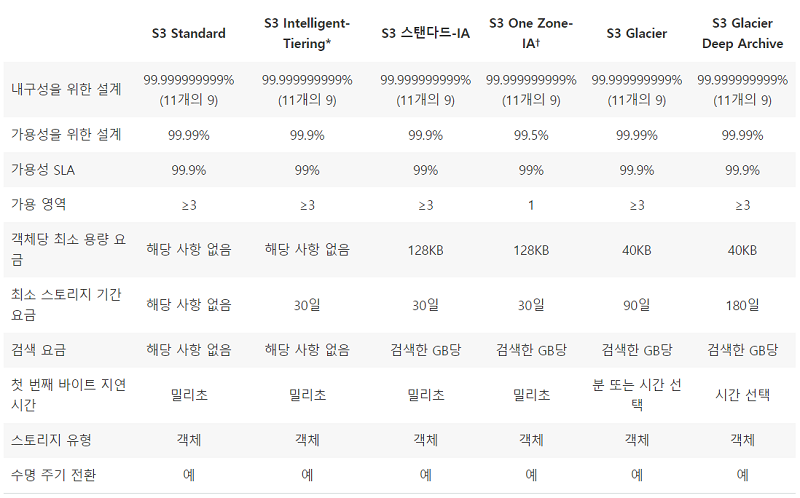
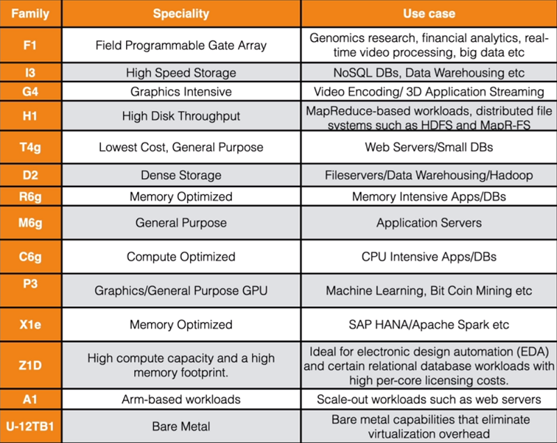

# Chapter 2. 클라우드 개념과 기술(Cloud Concepts and Technology)

- AWS 백서에는 아래 내용이 포함되어 있습니다.

## 2-1. 클라우드 컴퓨팅이란?(What is Cloud Computing?)

- AWS White Paper Link -> [https://docs.aws.amazon.com/whitepapers/latest/aws-overview/introduction.html](https://docs.aws.amazon.com/whitepapers/latest/aws-overview/introduction.html)

### 2-1-1. 클라우드 컴퓨팅이란?(What Is Cloud Computing?)

- 컴퓨터 파워, DB, 스토리지, 앱 등 IT 리소스들을 인터넷을 통해 클라우드 서비스 플랫폼을 이용해 사용한 만큼 지불하는 온디멘드(요구하는 만큼 사용) 방식

### 2-1-2. 클라우드 컴퓨팅의 6가지 장점(Six Advantages of Cloud Computing)

- 가용 비용 대비 거래 자본 비용: 필요한 양만큼 비용을 지불
- 대규모 경제 규모의 이점: 클라우드 컴퓨팅을 사용시 낮은 비용 지불
- 예상 사용량 추측 멈춤: 필요하거나 적은 용량으로 액세스, 스케일 업, 스케일 다운 가능
- 속도와 민첩성 향상: 쉽게 속도 증가 향상 가능
- 데이터 센터에 대한 유지비와 운영비를 멈춤: 프로젝트에 포커스를 할 수 있음
- 세계화를 몇분만에 가능: 쉽게 앱을 다양한 지역에 배포 가능

### 2-1-3. 클라우드 컴퓨팅 타입(Cloud Computing Types)

- Infrastructure As A Service(IAAS): 인프라 구축 서비스, ex) EC2
- Platform As A Service(PAAS): 앱을 위한 서비스, ex) Elatic Beanstalk, Lightsail
- Software As A Service(SAAS): 앱 ex) Gmail

### 2-1-4. 클라우드 컴퓨팅 배포 모델(Cloud Computing Deployment Models)

- 퍼블릭(Public): AWS, Azure, GCP 등 모든 것이 클라우드에서 돌아감
- 하이브리드(Hybrid): Public과 Private의 혼합, 예시로 데이터 센터는 우리가 관리, 나머지는 AWS에서 관리
- 프라이빗(Private): On-Premise

### 2-1-5. AWS 시험에 나오는 범위

- AWS Global Infrastructure
- Compute, Storage, Databases
  - EC2, Lambda
  - Relational Database Services(RDS)
  - DynamoDB(NoN Relational Databases)
  - S3(Simple Storage Services), Glacier
- Security, Indentify & Compliance
- AWS cost Management
- Migrations & Transfer, Network & Content Delivery
  - VPC, Route53

## 2-2. AWS와 세계 둘러보기(Around THe World With AWS)

- AWS Products Link -> [https://aws.amazon.com/products/](https://aws.amazon.com/products/)

### 2-2-1. Introduction to AWS에서 배운 것들을 다시 설명

- AWS Console(2015~2019), 많은 기능들이 있음
- AWS Infrastructure
- Availability Zones, Regions, Edge Location(CDN)
  - Region: 물리적 장소(2~3개로 구성된 가용지역의)
  - AZ: Region은 1개 이상의 AZ로 구성, 다른 AZ로부터 격리(백업용), 전용선 연결로 빠른 속도
  - Edge Locations: AWS의 캐쉬정보가 있는 endpoint, 특히 클라우드프론트(CloudFront)나 아마존 CDN 등으로 구성된 것
  > 참고 블로그 [갓대희](https://goddaehee.tistory.com/178)

## 2-3. AWS 로그인 하기(Let's Log In To AWS)

- Free Tier 가입하기 링크 -> [https://aws.amazon.com/free](https://aws.amazon.com/free)
- [한도 알람 공지](https://aws.amazon.com/about-aws/whats-new/2017/12/aws-free-tier-usage-alerts-automatically-notify-you-when-you-are-forecasted-to-exceed-your-aws-service-usage-limits/)
- 가입하려면 카드 정보를 입력해야 되서 일단 보류함

## 2-4. Mac에서 세팅하기(Setting Up On A Mac)

- Windows 유저는 건너 뛰세요
- `bbedit`, `rdp` 프로그램 다운하세요

## 2-5. Windows에서 세팅하기(Setting Up On A Windows PC)

- `putty 64bit`, `notepad++` 다운하세요
- AWS에 로그인하고 가장 가까운 `지역`을 선택하세요
- `EC2`를 클릭하고 `Key Pairs`를 클릭하고 키 생성을 하세요
- 다운로드하고 `putty Generator`에서 키로 로그인하세요

## 2-6. 가격 알람 받기(Setting Up A Billing Alarm)

- AWS 콘솔에서 `CloudWatch`를 클릭하세요
- `Billing`을 클릭하고 `Alarm`을 생성하세요
- Alarm할 돈의 단위, 범위를 설정하세요
- 생성 후 email인증을 하시면 알람 생성이 됩니다

## 2-7. [LAB: Cloud 시작하기! IAM(Identity Access Management)]

IAM이란 여러분이 그룹이나 사용자, 규칙을 만들게 해줘요.

이 랩은 aws.amazon.com에서 로그인하고 진행하세요~

1. AWS 콘솔에서 지역은 `US-East(N.Virginia)` 선택하고 `IAM`을 클릭하세요.
2. Security Status에서 4개의 느낌표를 완료해야 해요
   1. root 계정의 `MFA`를 활성화를 클릭하세요.
      1. `Multi Factor Authentication`의 약자로 보안을 강화하기 위해 `OTP`처럼 2중 보안 체계
      2. MAF 활성화를 클릭하고 `Virtual MFA device`를 클릭하세요. 그러면 앱으로 인증하는 방법입니다.
      3. QR 코드를 입력하고 코드를 입력해 `MFA`를 등록하세요.
   2. IAM 개인 유저를 생성하세요.
      1. IAM users sign-in link의 주소를 수정하고 복사해서 알려주세요.
      2. Manage Users를 누르고 유저를 추가하세요.
      3. 유저가 들어올 수 있는 접근 권한 타입을 설정하세요.
      4. 그룹을 생성해서 유저를 추가하세요. 그룹을 생성할 때는 여러 룰을 설정해 주세요.
         1. 룰은 JSON 형태로 되어있어서 볼 수 있어요.
      5. 태그를 추가해주세요. 부가 정보를 넣을 수 있어요.
      6. 유저를 잘 만들었으면 다른사람에게 email이나 직접 알려줄 수 있어요.
   3. 허가를 내줄 수 있는 그룹을 사용하세요.
      1. IAM 개인 유저에서 그룹을 생성했어요.
   4. IAM 비밀번호 정책을 설정하세요.

## 2-8. IAM 모범 사례(IAM Best Practices)

- Root Account
  - Only use the root account to create your AWS account. Do not use it to log in.
- Users
  - One user should equal one real human being. Don't create phantom users.
- User/Groups/Policies
  - Always place users in groups, and then apply policies to the groups. This makes management easier.
- Password Policies
  - Have a strong password rotation policy.
- MFA
  - Always enable MFA wherever possible.
- Roles
  - Use roles to access various other AWS services.
- Access Keys
  - Use access keys for programmatic access to AWS.
- IAM Credential Report
  - Use IAM credential reports to audit the permissions of your users/accounts.

## 2-9. IAM 자격 증명 기록(IAM Credential Reports)

자격 증명 기록으로 모든 유저 정보 리스트

- 비밀번호
  - 비밀번호 활성화 여부
  - 마지막 사용 날짜
  - 마지막 변경 날짜
  - 마지막으로 변경해야 되는 날짜
- 접근키
  - 접근키의 활성화 여부
  - 마지막 사용 날짜
  - 마지막 회전(rotated) 날짜
  - 마지막으로 사용된 서비스
- MFA 활성화 여부

## 2-10. [LAB: Managing AWS IAM User Permissions Using Groups and Policies]

- [Managing AWS IAM User Permissions Using Groups and Policies](../HandsOnLab/Managing%20AWS%20IAM%20User%20Permissions%20Using%20Groups%20and%20Policies.md)

## 2-11. S3 101

### 2-11-1. S3 기본(S3 - The Basics)

S3란?

S3는 개발이나 IT팀에게 보안, 내구성, 확장성이 뛰어난 오브젝트 스토리지 입니다.

- 파일을 안전하게 보관하는 장소입니다.
- Object 기반 스토리지 입니다.
- 데이터는 다양한 장소와 시설에 분리 보관합니다.

S3의 기본적인 것들

- S3는 Object 기반입니다. 여러분의 파일을 올릴 수 있습니다.
- 파일은 0~5TB까지 가능합니다.
- 무제한 스토리지 입니다.
- 파일은 **Buckets**에 저장됩니다.
- S3는 **universal namespace**입니다. 세계적으로 유일해야 합니다.
  - ex) <https://s3-eu-west-1.amazonaws.com/acloudguru>
- 성공적으로 업로드 하면 **HTTP 200 code**를 받습니다.

Objects는 그냥 파일입니다. 구성요소들

- Key - 파일 이름
- Value - 내용물
- Version ID - 버전관리의 중요한 것들
- Metadata - 데이터에 대한 데이터(날짜, 크기 등)
- 하위 항목
  - 접근 권한 리스트
  - 토렌트

### 2-11-2. S3의 데이터 일관성 모델(Data Consistency Model For S3)

S3는 어떻게 작동하나요?

- Read after Write consistency for PUTS of new Objects
- Eventual Consistency for overwrite PUTS and DELETES(can take some time to propagate)

다른 말로 하면

- 새 파일(objects)이 생성되고 즉시 읽으면 적절히 잘 읽습니다.
- 파일을 수정하거나 삭제하고 그 파일을 즉시 읽으면 해당 내용이 변경되지 않고 읽어들일 수도 있습니다.(if you update an existing file or delete a file and read it immediately, you may get the older version, or you may not.)
basically changes to objects can take a little bit of time to propagate.

### 2-11-3. S3 - 보장성(S3 - Guarantees)

S3는 아마존의 guarantees를 따릅니다.

- s3 플랫폼의 99.99% 가용성을 위해 구축되요.
- 99.9%의 가용성을 보장해요.
- 99.999999999%의 내구성을 보장해요.

### 2-11-4. S3 - 기능들(S3 - Features)

- 티어별 스토리지 사용 가능(Tiered Storage Available)
- 라이프사이클 관리(Lifecycle Management)
- 버전 관리(Versioning)
- 암호화(Encryption)
- 액세스 제어 목록 및 버킷 정책을 사용해 데이터 보호 기능(Secure your data using Access Control Lists and Bucket Policies)

### 2-11-5. S3 스토리지 클라스(S3 Storage Classes)

참고 링크 -> [https://aws.amazon.com/ko/s3/storage-classes/](https://aws.amazon.com/ko/s3/storage-classes/)

1. S3 Standard
   - 자주 엑세스, 빠르게 처리, 높은 내구성, 가용성
2. S3 - IA(Infrequently Accessed)
   - 자주 엑세스x, 빠르게 처리, retrieval 요금
3. S3 One Zone - IA
   - 단일 AZ에 데이터 저장, 비용 절감
4. S3 Intelligent Tiering
   - 운영 오버헤드 없이 가장 비용이 효과적인 액세스 티어, 머신러닝에 최적화
5. S3 Glacier
   - 저럼, 안정적, 장기 아카이브에 이상적
6. S3 Glacier Deep Archive
   - 가장 저렴한 비용의 스토리지 클래스, 1년에 한 두번 액세스 용, 장기 보관
7. S3 Outpost
   - 온프레미스 AWS Outposts 환경에 객체 스토리지를 제공

### 2-11-6. S3 요금(S3 - Charges)

- 스토리지(Storage)
- 요구(Requests)
- 스토리지 관리 요금(Storage Management Pricing)
- 데이터 전송 요금(Data Transfer Pricing)
- 전송 가속(Transfer Acceleration)
  - 클라우드프론트의 분산된 엣지 로케이션의 이점을 활용한 것!
- 지역 간 복제(Cross Region Replication Pricing)

## 2-12. [LAB: S3 버킷 만들기(Let's Create An S3 Bucket!)]

이 랩은 aws.amazon.com에서 로그인하고 진행하세요~

1. AWS 콘솔에서 `S3`를 들어가면 지역은 `Global`로 변경되요.
2. `버킷 생성`을 눌러주세요.
   1. 버킷 이름을 정하고, 지역을 설정해주세요.
   2. 환경 옵션은 건너 뛰고 권한은 Public으로 설정하게 `체크`를 풀어주고 생성해주세요.
3. 만든 버킷을 클릭해서 들어가주세요.
4. 업로드 버튼을 눌러서 업로드 해주세요.
   1. 업로드를 한 파일들은 자동으로 프라이빗인거 같아요.
   2. `Actions` 버튼을 클릭해 퍼블릭으로 바꿔주세요.
5. 업로드 한 파일의 속성을 눌러주세요.
   1. 우리가 배운 다양한 설정을 할 수 있어요.

## 2-13. [LAB: S3에서 WebSite 만들기(Let's Create A Website On S3)]

1. AWS 콘솔에서 `S3`를 들어가면 지역은 `Global`로 변경되요.
2. `버킷 생성`을 눌러주세요.
   1. 버킷 이름을 정하고, 지역을 설정해주세요.
   2. 환경 옵션은 건너 뛰고 권한은 Public으로 설정하게 `체크`를 풀어주고 생성해주세요.
3. `index.html` 등의 웹 파일을 업로드 해주세요.
   1. 해당 파일을 클릭하고 `Actions`를 눌러서 퍼블릭으로 바꿔주세요.
4. Bucket Policy를 수정을 누르세요.
   1. 정책을 JSON 파일로 추가해주세요.(오픈소스 참고)
   2. 정책의 Resource부분을 `버킷 ARN` 값으로 정해주세요.
5. 버킷의 속성을 들어가세요.
   1. 가장 아래에 `Static website hosting`을 클릭해주세요.
   2. `index document`를 `index.html`로 설정하세요.
   3. `error document`를 `error.html`로 설정하세요.
   4. 변경을 저장하면 새로운 도메인이 있어요. 접속해 보세요.

## 2-14. S3 버전 관리(S3 Versioning)

1. 이전에 생성한 버킷에 들어가서 `속성`을 들어가세요.
2. 제일 위에 `Bucket Versioning`의 수정을 클릭하세요.
   1. Enable로 설정하세요.
3. 수정한 `index.html`을 올리고 오브젝트에 들어가세요.
   1. `List versions`를 클릭하면 버저닝을 볼 수 있어요.
4. 수정한 `index.html`을 지우면 이전 버전으로 돌어가요.

## 2-15. CloudFront 탐험하기(Let's Explore CloudFront)

A content delivery network(CDN)이란?

- 분산형 서버 시스템으로 사용자 위치, 웹 페이지 출처와 문서 전달 서버를 기반으로 웹페이지와 웹 문서를 전달합니다.

CloudFront의 핵심 전문 용어

- Edge Location: 문서의 캐쉬된 장소, AWS의 지역과 AZ와 분리됨
- Origin: CDN이 분산하는 모든 파일의 원조, S3 Bucket, EC2 인스턴스, 엘라스틱 로드벨런서나 라우터53가 될 수 있음
- Distribution: CDN의 이름으로 Edge Location의 모음들로 구성되어 있음

CloudFront의 2가지 타입

- Web Distribution: 웹사이트 용
- RTMP: 미디어 스트리밍

실습

1. AWS 콘솔에서 `CloudFront`를 들어가서 `CreateDistribution`을 클릭하세요.
2. `Web`으로 시작을 눌러주세요.
   1. 도메인 이름을 찾아 등록하고 버킷접속제한을 No로 설정해요.
   2. 다 기본으로 설정(HTTPS만 접속, TTL 등)하고 등록을 해요.
   3. 정말 오래 걸려요. Status가 Deploy로 바뀌면 도메인 `주소+파일이름`으로 들어가보세요.

## 2-16. EC2 101

EC2 란?

- 클라우드에 있는 가상 서버에요.
- 새로운 서버를 만들 때 요구사항이나 부트하는데 시간을 절약해줘요.
- 빠르게 확장, 축소가 가능해요.

EC2 가격 모델

1. 사용한 만큼(On Demand): 시간당 요금을 지불할 수 있어요.
   - 선불이나 장기약정 없이 저렴하게 사용하고 싶은 사람들
   - 단기의 갑작스럽거나 예측 불가한 워크로드가 있고, 중단되선 안되는 앱
   - EC2에서 처음으로 개발, 시험 중인 앱
2. 예약(Reserved): 용량을 예약하고, 시간당 요금을 할인해요.
   - 꾸준한 사용이나 예측 가능한 앱
   - 예약된 만큼의 용량이 필요한 앱
   - 길게 계약하면 할인 혜택이 더해짐
   - 예약 가격의 종류들
     - 스탠다드(Standard): 75%까지 할인, 길게 계약하면 더 큰 할인
     - 컨벌터플(Convertable): 54%까지 할인, 인스턴스 속성 변경 가능
     - 셰쥴드(Scheduled): 특정 시간때만 사용할 때 유용해요
3. 스팟(Spot): 시작과 종료 시간이 유연하면 원하는 가격으로 정할 수 있어요.
   - 시작과 종료 시간이 자유로운 앱
   - 컴퓨팅 가격이 매우 저렴해야만 수익이 나는 앱
   - 대량의 서버 욜양 추가로 긴급히 컴퓨팅 파워가 필요한 사람
4. 전용 호스팅(Dedicated Hosts): 소프트웨어 라이선스를 저렴하게 사용할 수 있어요.
   - 가상화 지원하지 않는 규제 요구사항에 유용
   - 독립성이나 클라우드 배포를 지원하지 않는 라이센스에 적합
   - 온디멘드 형태로 구매 가능(시간당)
   - 예약 형태로 구매 가능, 온디멘드 가격보다 70% 까지 할인

EC2 인스턴스 종류

- 범용성
  - T - 값 싼 목적(Cheap general purpose(think T2 Micro))
  - M - 일반 앱 목적의 주 선택지(Main choice for general purpose apps)
  - A - 암기반 워크로드(Arm-based workloads)
- 컴퓨팅 최적화
  - C - 컴퓨팅 최적화(For Compute)
- 메모리 최적화
  - R - For 램(RAM)
  - X - 메모리 최적화(Extreme Memory)
  - Z - 메모리와 CPU 최적화(Extreme Memory AND CPU)
- 가속화 최적화
  - P - 가속화 컴퓨팅, GPU용(Graphics, think Picture)
  - G - 그래픽용(Graphics)
  - F - For FPGA(Field Programmable Gate Array)
- 스토리지 최적화
  - I - For IOPS(Input/Output Operations Per Second)
  - D - For 밀도(Density)
  - H - 높은 디스크 처리량(High Disk Throughput)
- U - 물리적 서버(Bare Metal)

EBS란?

- Elastic Block Store
- EC2 인스턴스에 붙여 저장공간으로 활용 가능
- EBS 볼륨은 자동으로 특정 AZ에 복제됨
- EBS의 2가지 타입
  - SSD
    - General Purpose SSD(GP2): 가격과 성능이 균형잡힘
    - Provisioned IOPS SSD(IO1): 고성능 SSD
  - Magnetic
    - Throughput Optimized HDD(ST1): 자주 엑세스하는 HDD
    - Cold HDD(SC1): 적게 엑세스하는 SSD(File Servers)

## 2-17. [LAB: EC2 시작하기(Let's Use EC2)]

1. AWS 콘솔에서 `EC2`를 들어가고 지역을 선택해 주세요.
2. `인스턴스 생성`을 눌러주세요.
   1. Free Tier only를 클릭하면 무료로 사용할 수 있어요.
   2. `인스턴스 타입`: `Amazon Linux 2 AMI`를 선택해 주세요.
   3. `인스턴스 환경 구성`
      1. `Purchasing option`: 요금 옵션을 선택하면 Spot instances로 설정 가능해요.
      2. `Network`: 기본적으로 VPC로 통신을 하고 Subnet으로 AZ존을 선택할 수 있어요.
   4. `Storage`를 선택해서 하드를 확장할 수 있어요.
   5. `Tags`를 추가해서 정보를 추가해 수 있어요.
   6. `SG(Security Group)`을 선택해서 쉽게 방화벽을 설정할 수 있어요.
      1. SSH(22)를 Anywhere로 설정해서 어디서나 접속 가능하게 해요.
      2. HTTP(80)을 열어 웹 서비스를 가능하게 해요.
3. 키 페어를 설정해서 SSH 접속을 도와요.(for MAC User)
   1. 키를 활성화를 하기 위해 `chmod 400 <keyname>.pem`를 입력해요.
   2. `ssh ec2-user@<public IP> -i <keyname>.pem`으로 접속해요.
   3. 접속 후 `yum update -y` 입력해 EC2 를 업그래이드 해줘요.
4. 키 페어를 설정해서 SSH 접속을 도와요.(for Windows User)
   1. `Putty`나 `MobaXterm`으로 접속해서 `SSH` 접속을 하면 돼요.

## 2-18. [LAB: Launching an EC2 instance in a Custom Virtual Private Cloud (VPC)]

- [Launching an EC2 instance in a Custom Virtual Private Cloud (VPC)](../HandsOnLab/Launching%20an%20EC2%20instance%20in%20a%20Custom%20Virtual%20Private%20Cloud%20(VPC).md)

## 2-19. 명령어 사용하기(Using The Command Line)

## 2-20. 규칙 사용하기(Using Roles)

## 2-21. 웹 서버 빌드하기(Let's Build A Web Server)

## 2-22. 로드벨런서 사용하기(Let's Use A Load Balancer)

## 2-23. Databases 101

## 2-24. RDS 인스턴스 제공하기(Let's provision an RDS instance)

## 2-25. 자동 규모조정(Autoscaling)

## 2-26. 주소 등록하기(Let's Register A Domain Name)

## 2-27. 엘라스틱 빈토크(Elastic Beanstalk)

## 2-28. 클라우드 포매이션(CloudFormation)

## 2-29. Architecting For The Cloud Best Practices - Part 1

## 2-30. Architecting For The Cloud Best Practices - Part 2

## 2-31. 글로벌 AWS 서비스(Global AWS Services)

## 2-32. 회사에서 구축할 수 있는 AWS 서비스(What AWS Services Can Be Deployed On Premise)

## 2-33. CloudWatch 101

## 2-34. AWS 시스템 매니저(AWS Systems Manager)

## 2-35. 서비스 상태 보기(Service Health Dashboard)

## 2-36. 개인 상태 보기(Personal Health Dashboard)

## 2-37. S3 vs EBS vs EFS

## 2-38. 글로벌 가속기(Global Accelerator)

## 2-39. Cloud Concepts & Technology Summary - Part 1

## 2-40. Cloud Concepts & Technology Summary - Part 2

## 2-41. AWS Certified Cloud Practitioner 2020

## 2-42. Technology Quiz
