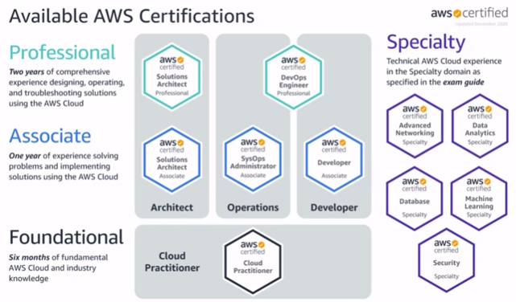

# Exam Readiness: AWS Certified Solutions Architect – Associate (Digital)

- 2021-07-27 ~ 2021-07-28

강의 링크 -> [https://www.aws.training/Details/Curriculum?id=20685](https://www.aws.training/Details/Curriculum?id=20685)

## The Exam Overview

### AWS 시험

### SAA 시험 유형과 범위

### 시험 특징

1. 문제는 객관식이며 1개나 여러개 선택을 해야합니다.
2. 찍기에 패널티가 없습니다.
3. 130분동안 65문제를 풀어야 합니다.
4. 나중에 풀기를 위해 질문에 마킹할 수 있습니다.
5. 시험을 제출 하기 전 마크한 질문을 쉽게 풀 수 있습니다.

### 정답 찾는 방법

1. 질문과 정답을 한번에 읽습니다.
2. 질문에 대한 특징을 찾습니다.
3. AWS의 특징에 적합한 질문의 글을 찾습니다.
4. 가장 적절한의 집중해 주세요. 이게 특정 정답을 제거해 줍니다.
5. 가능한 정답의 폭을 좁히기 위해 오답을 제거해 줍니다.

## Module별 시험 나오는 유형

### Module 1 - Design Resilient Architectures

1. 신뢰적이고(reliable) 탄력적인(resilient) 저장소를 고르는 문제
2. AWS 서비스를 사용하여 디커플링 메커니즘을 설계하는 방법 결정
3. 다중 계층(multi-tier) 아키텍처 솔루션 설계하는 방법 결정
4. 고가용성(availability) 및/또는 결함 방지(fault-tolerant) 솔루션을 설계하는 방법 결정

### Module 2 - Design Performant Architectures

1. 적절한 저장소나 DB를 고르세요.
2. 성능 향상을 위해 캐쉬를 적용하세요.
3. 탄력성 및 확장성 있는 솔루션을 설계하세요.
4. 운영 우수성이 있는 솔루션에서 설계 기능을 선택하세요.

### Module 3 - Specify Secure Applications and Architectures

1. app 티어의 보안을 어떻게 해야할지 결정합니다.
2. 데이터 보안을 어떻게 해야할지 결정합니다.
3. Single VPC 앱의 인프라 네트워킹을 정의합니다.

### Module 4 - Design Cost-Optimized Architectures

1. 적절한 가격의 저장소 설계를 어떻게 할지 결정
2. 적절한 가격의 컴퓨트 설계를 어떻게 할지 결정

## Axioms

### 1 Test Axioms

1. Single AZ 는 절대 정답이 아닐것으로 예상
2. AWS 관리 서비스 사용은 항상 선호
3. 내결함성(Fault-tolerant)과 고가용성(High Availability)은 동일하지 않음
    1. 내결함성: 시스템의 일부 구성 요소가 작동하지 않더라도 계속 작동
    2. 고가용성: 시스템이 항상 작동하며 액세스 가능하며 가동 중지를 최소화하도록 보장
4. 모든 것이 특정 시점에 실패한다고 예상하고 적적하게 설계

### 2 Test Axioms

1. IAM roles는 keys, passwords보다 쉽고 안전합니다.
2. 시스템 전반적인 측정을 모니터링합니다.
3. 적절한 측정을 통해 반응을 자동화합니다.
4. 비정상적인(anomalous) 상황에 대한 경고를 제공

### 3 Test Axioms

1. 루트 유저는 잠그세요.
2. 보안그룹은 허락만, Network ACL은 명시적으로 거부가 가능합니다.
3. 액새스 키보다 IAM을 선호하세요.

### 4 Test Axioms

1. 지속적으로 운영한다면 예약하세요.
2. 사용중이지 않은 CPU의 시간은 돈의 낭비입니다.
3. 데이터 저장소 서비스와 클래스의 비용이 효율적인 것을 사용하세요.
4. 워크로드에 맞는 EC2 가격모델과 인스턴스 타입의 비용이 효욜적인 것을 선택하세요.

## Quiz

### Quiz 1-1

### Quiz 1-2

### Quiz 1-3

### Quiz 1-4

### Quiz 1-5

A. Templates do not have to be region specific

C. Parameters are for inputs from users; AMI IDs are difficult for users to enter

D. AMI IDs differ across regions

### Quiz 1-6

A. Lambda does not Allow SSH access

B. Lambda does not write all output to S3

### Quiz 1-7

RTO (Recovery Time Objective)  → 복구에 걸리는 시간

RPO(Recovery Point Objective)  → 복구 시점에 대한 목표

### Quiz 2-1

### Quiz 2-2

### Quiz 2-3

A. SQL Server and Oracle do not support read replicas

D. These are not the only db engines that support read replicas

### Quiz 2-4

A. Redshift is a structured relational database

B. Amazon RDS is a structured relational database

C. Amazon Glacier is not a database service

### Caching

### Quiz 2-5

### Quiz 2-6

### Amazon CloudFront

### Quiz 2-7

### Quiz 2-8

A. AMI ID는 인스턴스 타입을 명시하지 않음

B. 인스턴스 타입은 AMI ID를 명시하지 않음

C. AMI ID나 인스턴스 타입을 명시하지 않음

E. User data는 AMI나 인스턴스 타입을 명시하지 않음

### Quiz 2-9

### Quiz 2-10

### Quiz 2-11

### Quiz 2-12

### Quiz 2-13

### Quiz 2-14

A. VPC Flow Logs capture layer 3 and 4 IP-level logs and do not capture layer 7 HTTP 404 errors

B. CloudWatch Metrics do not capture 404 errors by default

### Quiz 2-15

A. Storing access and secret access key on the EC2 instance compromises their security and is an anti-pattern(EC2 인스턴스에 액세스 및 비밀 액세스 키를 저장하면 보안이 손상되고 안티패턴이 됨)

C. Storing access and secret access key on the EC2 instance compromises their security and is an anti-pattern

D. Making the bucket public will give it access that is too broad(접근이 광범위해짐)

### Quiz 3-1

### Amazon VPC

### Quiz 3-2

### Quiz 3-3

### Quiz 3-4

### Quiz 4-1

B. IA is cheaper for storage but more expensive for retrieval

C. Glacier does not support public files

D. EFS does not support public files
