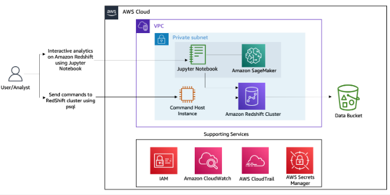
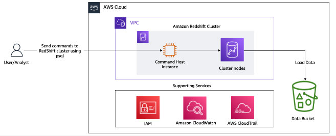
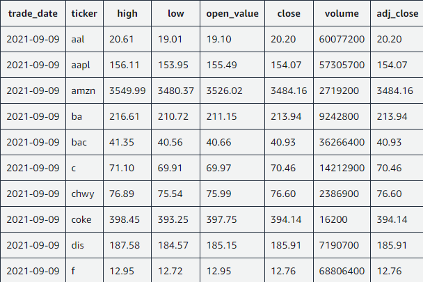
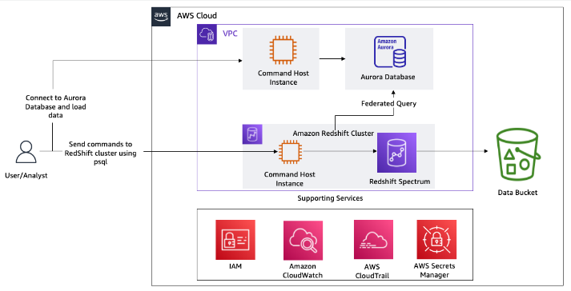
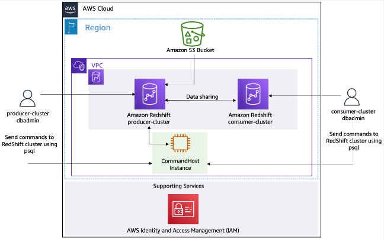

# AWS Partner: Building Data Analytics Solutions Using Amazon Redshift (Technical)

- 기간: 2024-02.27(7시간)
- 파트너 강의 <http://tinyurl.com/4bfx28vm>

## 이론

- 데이터 분석 3가지
  - 배치 데이터
  - 스트리밍 데이터
  - 데이터 웨어하우스
- OLTP(Online Transaction Processing)
  - 실시간으로 트랜잭션을 처리하는 시스템을 의미
  - 비지니스용, 쇼핑몰, 은행 입출금, 등 빠르게 처리
  - 일관성, 빠른 처리 중요
  - 정규화 되어있는 데이터, 작은 단위의 트랜잭션 자주 처리
- OLAP(Online Analytical Processing)
  - 데이터를 분석하고 정보를 제공
  - 의사결정 지원, 다차원 분석 정보 추출
  - 분석성(많은 양의 데이터 수집, 정체, 조회), 복잡한 쿼리 사용
- Database, DataWarehose(DW) 사용
  - Database -> OLTP성
  - DataWarehouse -> OLAP성
- 최고의 DW란?
  - 모든 형태의 데이터를 어디서나 수집
  - 사용 간편, 시스템의 복잡성이 추상화
  - 필요에 따라 원활한 확장
  - 사용한 만큼만 지불, 가성비
  - 페타규모의 실시간 및 예측 분석

## Interactive Demos for Amazon Redshift Course



### Interactive Demo 1: Touring the Amazon Redshift console

- Open the running DC2 cluster
  - dd
- Identify the node types and number of worker nodes
  - Snapshots -> Cluster details(dc2.large, 1)
- Inspect the VPC configuration and its private subnet CIDR address
  - dd
- View the subnet and parameter groups
  - dd

### HALLENGE QUESTIONS

- What is the cluster endpoint URL?
- Is it a publicly accessible cluster?
- How can you integrate the Redshift cluster with partner systems?

### Interactive Demo 2: Connecting your Amazon Redshift cluster using a Jupyter notebook with Data API

### Interactive Demo 3: Applying mixed workload management on Amazon Redshift

### Interactive Demo 4: Amazon Redshift cluster resizing from the dc2.large to ra3.xlplus cluster

## Lab 1 - Load and Query Data in an Amazon Redshift Cluster



Lab 1 - OBJECTIVES

- Create an Amazon Redshift cluster.
- Load data into the cluster.
- Use psql to query data in the cluster using the Command Host instance.

Lab 1 - TECHNICAL KNOWLEDGE PREREQUISITES

- Experience with Cloud platforms.
- Basic navigation of the AWS Management Console.
- Basic knowledge of Amazon Redshift.

### Lab 1 - Task 1: Explore the lab environment

S3에 저장된 데이터 확인하기

- [stock_prices.csv](./stock_prices.csv) 데이터 확인하기

    

### Lab 1 - Task 2: Set up a subnet group and parameter group

- CREATE A CLUSTER SUBNET GROUP
  - Amazon Redshift -> Configurations -> Subnet groups -> Create cluster subnet group
- CREATE A CLUSTER PARAMETER GROUP
  - Workload management -> Create
  - edit parameters -> to set statement_timeout to 60,000ms(1min)

### Lab 1 - Task 3: Create an Amazon Redshift cluster

- Create Redshift cluster
  - dc2.large, 1 node
- Network settings
  - VPC, Security groups, Database configurations

### Lab 1 - Task 4: Load data to the Amazon Redshift cluster

- DIRECTIONS FOR CONNECTING TO THE COMMAND HOST TO USE PSQL

    ```bash
    cd ~
    export PGPASSWORD='********'
    psql -U dbadmin -h '<INSERT_REDSHIFT_CLUSTER_ENDPOINT>' -d dev -p 5439
    ```

- CREATE A TABLE

    ```sql
    CREATE TABLE IF NOT EXISTS stocksummary (
        Trade_Date VARCHAR(15),
        Ticker VARCHAR(5),
        High DECIMAL(8,2),
        Low DECIMAL(8,2),
        Open_value DECIMAL(8,2),
        Close DECIMAL(8,2),
        Volume DECIMAL(15),
        Adj_Close DECIMAL(8,2)
        );
    ```

- IMPORT DATA FROM AMAZON S3 TO THE AMAZON REDSHIFT TABLE

    ```bash
    COPY stocksummary
    FROM 's3://labstack-5cf6a346-26b4-40d9-a7b3-f311d9-databucket-lx2yb0jbizso/data/stock_prices.csv'
    iam_role 'arn:aws:iam::847881009550:role/RedshiftAccessRole'
    CSV IGNOREHEADER 1;
    ```

- VALIDATE THE DATA LOADING

    ```sql
    // 2020-01-03 주식 가격 확인
    SELECT * FROM stocksummary WHERE Trade_Date LIKE '2020-01-03' ORDER BY Ticker
    ;

    // 회사별 가장 높은 주식
    select a.ticker, a.trade_date, '$'||a.adj_close as highest_stock_price
    from stocksummary a,
        (select ticker, max(adj_close) adj_close
        from stocksummary x
        group by ticker
        ) b
    where a.ticker = b.ticker
    and a.adj_close = b.adj_close
    order by a.ticker
    ;
    ```

## Lab 2 - Data Analytics Using Amazon Redshift Spectrum



OBJECTIVES

- Use Amazon Redshift Spectrum to create an external table.
- Query data stored in Amazon S3.
- Query Amazon Aurora data from the Amazon Redshift query editor with federated query access.
- Use the UNLOAD command to save query results to Amazon S3.
- Use Data API to interact with the cluster.

TECHNICAL KNOWLEDGE PREREQUISITES

- Experience with Cloud platforms.
- Basic navigation of the AWS Management Console.
- Basic knowledge of Amazon Redshift.

### Lab 2 - Task 1: Explore the lab environment

REVIEW THE FOLDERS IN THE AMAZON S3 BUCKET

LOAD DATA INTO THE AURORA DATABASE

```sh
# Get Aurora database cluster endpoint and export to the Environment.
export HOST=$(aws rds describe-db-clusters | jq '.DBClusters[0].Endpoint' | tr -d '"')

# Get Aurora username and export to the Environment
export username=$(aws rds describe-db-clusters | jq '.DBClusters[0].MasterUsername' | tr -d '"')

# Get Database name and export to the environment
export dbname=$(aws rds describe-db-clusters | jq '.DBClusters[0].DatabaseName' | tr -d '"')

# Connect to the Aurora cluster using psql, the db.sql script creates a schema, creates a stocks table, and loads the data.
psql -h $HOST -U $username -d $dbname -password $PGPassword -p 5432 -f /home/ec2-user/db.sql

# Copy data to stocks table
psql -h $HOST -U $username -d $dbname -password $PGPassword -p 5432 -c '\COPY stocks FROM ''/home/ec2-user/stocks.csv'' CSV HEADER'

# Connect to database to validate the data with a simple SQL query
psql -h $HOST -U $username -d $dbname -password $PGPassword -p 5432

-- Validate the data by querying all stack values on January 3, 2019
SELECT * FROM stocks WHERE Trade_Date LIKE '2019-01-03' ORDER BY Ticker;

# Quit the psql shell
\q
```

### Lab 2 - Task 2: Use Redshift Spectrum to analyze data in the Amazon S3 bucket

DIRECTIONS FOR CONNECTING TO THE COMMAND HOST TO USE PSQL

```sh
cd ~
psql -U dbadmin -h '<INSERT_REDSHIFT_CLUSTER_ENDPOINT>' -d lab -p 5439
```

CREATE AN EXTERNAL SCHEMA AND TABLE

```sql
CREATE EXTERNAL SCHEMA spectrum
FROM DATA CATALOG
DATABASE 'spectrumdb'
IAM_ROLE 'INSERT_REDSHIFT_ROLE'
CREATE EXTERNAL DATABASE IF NOT EXISTS;

DROP TABLE IF EXISTS spectrum.stocksummary;
CREATE EXTERNAL TABLE spectrum.stocksummary(
    Trade_Date VARCHAR(15),
    Ticker VARCHAR(5),
    High DECIMAL(8,2),
    Low DECIMAL(8,2),
    Open_value DECIMAL(8,2),
    Close DECIMAL(8,2),
    Volume DECIMAL(15),
    Adj_Close DECIMAL(8,2)
)
ROW FORMAT DELIMITED
FIELDS TERMINATED BY ','
STORED AS TEXTFILE
LOCATION 's3://INSERT_DATA_BUCKET_NAME/data/';
```

VALIDATE THE DATA FROM QUERY EDITOR

```sql
SELECT * FROM spectrum.stocksummary WHERE Trade_Date LIKE '2021-09-09' ORDER BY Ticker;
```

### Lab 2 - Task 3: Analyze data stored in Aurora using federated queries

CREATE AN EXTERNAL SCHEMA FOR FEDERATED QUERY OPERATIONS

```sql
CREATE EXTERNAL SCHEMA federated
FROM POSTGRES
DATABASE 'stocksummary'
URI 'INSERT_AURORA_ENDPOINT_URI'
IAM_ROLE 'INSERT_REDSHIFT_ROLE'
SECRET_ARN 'INSERT_AURORA_SECRET_ARN';

```

VALIDATE DATA ACCESS FROM THE AURORA DATABASE

```sql
SELECT * FROM federated.stocks WHERE Trade_Date LIKE '2021-09-09' ORDER BY Ticker;
```

### Lab 2 - Task 4: Unload analyzed data to Amazon S3

UNLOAD THE QUERY RESULTS TO AMAZON S3

VERIFY DATA IN THE AMAZON S3 DATA BUCKET

## Lab 3 - Data Transformation and Querying in Amazon Redshift



OBJECTIVES

- Perform an ELT operation with materialized views and stored procedures.
- Use Amazon Redshift scheduled queries.
- Query data directly from the source using Amazon Redshift data sharing.

TECHNICAL KNOWLEDGE PREREQUISITES

- Experience with Cloud platforms.
- Basic navigation of the AWS Management Console.
- Basic knowledge of Amazon Redshift.

### Lab 3 - Task 1: Explore the lab environment

### Lab 3 - Task 2: Create an external table

### Lab 3 - Task 3: Create and query a materialized view

### Lab 3 - Task 4: Use Amazon Redshift data sharing for faster data access between clusters
