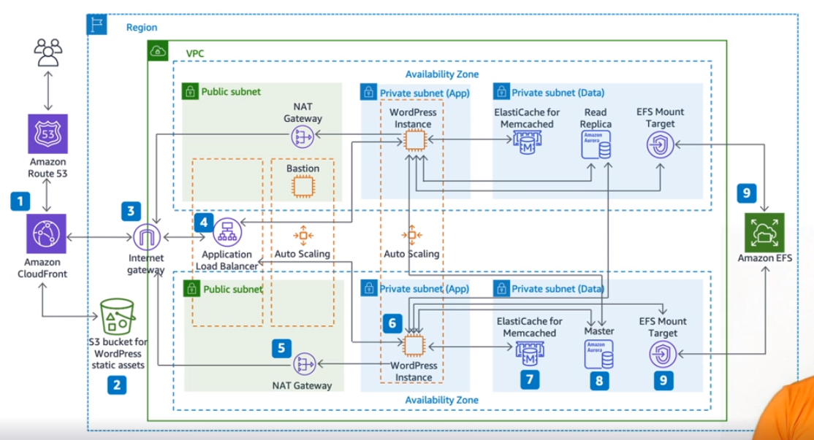

# Introduction to AWS

- 21-07-18 ~ 21-07-19

[링크](https://learn.acloud.guru/course/intro-to-aws/dashboard)

## 1. Introduction

수업 다들으면 아래 목록들을 배울 수 있음! Nick 선생님

## 2. Overview of AWS

### 2-1. What is AWS?

Cloud is Not only someone else's computer but also **a collection of services** that create a platform.

AWS는 **클라우드 서비스**입니다.

람다의 요금은 마이크로 초마다 요금이 계산되요!~ 놀라운 기능입니다~

AWS는 **32%의 점유율**을 가지고 있어요! 업계 1위죠

### 2-2. A Brief History of AWS

Benjamin Black and Chris Pinkham이 그들의 인프라를 **효율적으로 스케일 업** 하기 위해 고민했습니다.

서버 트레픽 문제를 해결하기 위해서 **인프라를 서비스(IaaS)**하기 시작했습니다.

- 2006년 3월 S3
- 2006년 6월 SQS
- 2006년 8월 **EC2가 처음으로 선보인 AWS 상품**입니다.

그리고 정말 많은 기능들이 생겼습니다. 우리는 천천히 공부해 볼께요~

### 2-3. The 10,000 Foot Overview

간단히 AWS 사용법을 배워볼께요~ 목록을 볼께요. 진하게 한것은 우리가 배워요!~

- **Compute**: EC2(Server) Lambda(Serverless)
- **Storage**: S3, EFS, Storage Gateway
- **Database**: RDS(Relational Database), DynamoDB(Non Relational Database)
- Migration & Transfer: easier to move to AWS from your traditional server room
- **Networking & Content Delivery**: VPC(a cornerstone of network)
- Developer Tools: Host your programming code, automatically install, build, etc
- Robotics: Help with robotics application development
- Customer Enablement: Migrate and build faster in the cloud
- Blockchain: AWS managed Blockchain for all your cryptocurrency
- Satelite: Ground Station(a fully managed service that lets you control satellite communications)
- Quantum Technologies: Provide a development environment to design quantum algorithms
- **Management & Governance**: Help you manage all of your AWS and even on-premises infrastructure
- Media Services: Related to media streaming, processing, and transcoding
- **Machine learning**: Implement machine learning
- Analytics: Redshift, Athena
- **Security, Identity & Compliance**: AWS help with authentication, storing passwords, etc
- Front-end Web & Mobile: Help out people making websites and mobile apps
- AR & VR: Create 3D AR and VR app
- Application Integration: SQS, Help your AWS services and app work together
- AWS Cost Management: Cost Explorer and AWS Budgets
- Customer Engagement: Connet your customers
- End-User Computing: Give you a complete virtual desktop
- Internet of Things: Build and maintain your internet of things devices
- Game Development: dedicated a game server hosting solution
- Containers: 80% of all containers in the cloud run on AWS

### 2-4. Regions and Availability Zones

지역(Regions)은 **물리적 공간을 의미**해요. 캘리포니아, 파리, 바레인, 캐이프타운, 싱가폴, 시드니, **서울 등** 에 있어요.

**진짜 서버가 있는 곳**이라고 생각하면 되요!~ 지역마다는 **가용 영역(Availability Zones)이 2개 이상으로 나눠**져 있어요!

시드니 같은 경우 North, West, South로 3개로 나눠져 있어요. **나눠진 이유는 redundancy(여유분) 때문**이에요.

## 3. Security and Identity

### 3-1. Security and Identity

중요한 서비스 중 하나에요! **앱을 빌딩할 때 중요한게 보안**이에요.

누가 여러분의 서버에 접속할 수 있을지 **권한을 주는게 Identity**에요.

- 데이터 보안
  - **Amazon Macie**: 민감 데이터 보호 및 감지
  - **AWS key Management Service**: 암호키 관리 및 저장
  - **AWS CloudHSM**: 키 저장소 기반 하드웨어
  - **ASW Certificate Manager**: SSL, TLS 보안 인증 배포, provision, 관리
  - **AWS Secrets Manager**: 시크릿을 Rotate, 관리, retrieve
- 인프라 보안
  - **AWS Shield**: 서비스 거부 보호
  - **AWS Web Application Firewall**: 앱 방화벽
  - **AWS firewall Manager**: 방화벽 규칙 중앙화 관리
- 위협 감지
  - **Amazon GuardDuty**: 자동으로 위협 감지
  - **Amazon Inspector**: 앱 보안 분석
  - **AWS Config**: AWS 자원들 평가 구성 및 기록
  - **AWS CloudTrail**: API 사용 활동과 사용 추적
- 권한 관리
  - **AWS IAM**: 아마존 계정과 자원 접근 관리
  - **AWS Single Sign-on**: 1회용 로그인 생성
  - **Amazon Cognito**: 앱 내부의 ID 관리
  - **AWS Directory SErvice(for MS AD)**: MS AD 관리 및 생성
  - **AWS Organizations**: 한 곳에서 AWS 다양한 계정 관리 및 중앙화

### 3-2. Illustrating IAM

IAM: **Identity and Access Management**

- **여러분의 계정에 누가 접속할 수 있는지 관리**하는 거에요.
- **유저**와 **그룹**을 만들어서 관리해요.
- **정책**에 따라 권한을 허락하거나 거부해요.

아마존 아이디를 만들면 **루트 유저**가 생기고 **IAM유저**를 만들 수 있어요.

Policy를 **JSON**으로 쉽게 만들 수 있어요.

**IAM Roles은 Policy로 구성**되어 쉽게 권한을 할당할 수 있어요.

### 3-3. Summarizing Secrets Manager

웹이나 앱을 만들면 **데이터 베이스에 접근하려면 비밀번호를 입력해야 하는데 보안상 좋지 않습**니다.

#### AWS Secrets Manager

- 여러분의 자원의 접근할 때 요구되는 **비밀들을 보호**합니다.
- **자동적으로 바꿉**니다.
- **비밀번호, 키, 토큰 등을 저장**합니다.
- **시간을 절약**하고 **보안을 강화**합니다.

### 3-4. Demonstrating Directory Service

사용자의 계정 관리는 어떻게 할까요? **diretory service로 하는데 MS의 AD가 유명**해요.

MS가 세계의 77%의 OS를 장악하고 있어요. MS는 **directory service(MS AD)를 제공**해요.

20년 동안 AD를 서비스하면서 많은 사람들이 이를 사용해요. 그래서 AWS도 이를 적용해서 여러분들 도와주려고 해요.

#### AWS Directory Service

- **MS AD를 관리**해요.
- **Simple AD를 관리**해요.
- **AD 커넥터를 이용해서 회사의 유저가 AWS로 로그인 가능**하게 해요.
- 이 서비스가 오류가 나면 자동으로 다른 서비스로 교체됩니다.
- **AWS의 Directory Services를 제공**합니다.

## 4. Compute

### 4-1. Considering Compute

컴퓨트에는 인스턴스, 컨테이너, 서버리스 등이 있어요.

- Instance
  - **EC2**: 보안과 유연한 가상 머신
  - **EC2 Spot**: 90%정도 저렴한 EC2 Spot
  - **EC2 Auto Scaling**: 자동적으로 스케일을 조절하는 EC2
  - **Lightsail**: 앱 웹을 쉽게 클라우드에서 사용할 수 있는 인스턴스
- Containers
  - **ECS**: 보안, 유연성, 신뢰성이 높은 컨테이너 서비스
  - **ECR**: Elastic Container Registry, 컨테이너 이미지 관리, 저장, 배포
  - **EKS**: Elastic Kubernetes Service
- Serverless
  - **Lambda**: 서버없이 동작하는 환경
- Edge
  - **Outposts**: 온프레미스를 AWS서비스에서 돌릴 수 있음
  - **Snow Family**: 데이터를 AWS로 불러올 수 있음
  - **Wavelength**: 5G 네트워크를 사용해 AWS 를 사용
  - **VMWare Cloud on AWS**: VMware 작업을 마이그레이션 함
  - **AWS Local Zones**: 엔드 유저와 가까운 곳에 latency sensitive applications(예, 비디오 스트리밍)를 돌림

### 4-2. Exploring EC2

#### Elastic Compute Cloud

- **가상 컴퓨터를 빌리는 거**에요.
- 다양한 **CPU, RAM, storage를 선택**할 수 있어요.
- 사용자에 맞게 **optimization이 가능**해요.
- 시간, 초당 지불을 할 수 있어요. 이는 엄청난 강점이에요.
- CPU나 RAM을 바꿔서 시간당 가격을 조정하기 때문에 가격에서 강점이 있어요.

### 4-3. Clarifying Containers

- 라이브러리의 **버전들이 달라지면서 불편함을 컨테이너가 해결**해줘요.
- **컨테이너를 사용하면 환경에 대한 종속성을 없엘 수 있**어요.
- **프로그램 + 라이브러리를 컨테이너로 만들**어서 컨테이너를 통째로 돌리는 거에요.

### 4-4. Learning Lambda

- 비트코인 가격을 하루에 1번만 받으려고 하는 경우가 예시에요.
- 이벤트가 발생할 때 이때만 실행을 하면 돼요!~
- EC2를 빌리면 과하게 빌리는거 같은 경우에 람다를 사용한다고 생각하면 좋아요.

AWS Lambda

- 람다는 **서버리스 컴퓨트 서비스**에요.
- **이벤트 발생 시 여러분의 코드를 돌리는 거**에요.
- **언제 어디서든 여러분의 코드를 돌릴 수 있**어요.
- 람다에 저장된 코드는 **요청시에 요금이 들어**요.
- 이미지 변환 작업만 하려고 하면 람다를 사용하면 좋아요!, S3를 사용할 필요가 없어요.
- 요금은 밀리세컨으로 발생해요.
  - RAM 사용량에 따라 요금이 결정되요
  - 300만번 triger per month * 128MB RAM을 사용하면 11.63달러가 소요되요!

## 5. Storage

### 5-1. Studying Storage

Type of Storage

- File-based Storage: 전통적인 방법, 큰 파일을 다루기 힘듬
  - **Amazon EFS**: Elastic File System, 네트워크 파일 시스템
  - **Amazon FSx**: for windows File Server
- Block Storage: 같은 사이즈로 블록화하여 관리, OS에서 쓰임
  - **EBS**: Elastic Block Storage, EC2에서 저장은 이곳에 함
- Object Storage: Flat memory model(해쉬와 비슷)
  - **Amazon S3**: 언제 어디서나 사용 가능
- Backup
  - **AWS Backup**: AWS 서비스들을 자동적으로 중앙화 백업하고 관리
- Data Tranfer
  - **AWS Storage Gateway**: 사내에서 무제한 클라우드 저장공간 접근 제공
  - **AWS dataSync**: 10배까지 빠르게 AWS에 data 이동
  - **AWS Transfer Family**: S3에 SFTP, FTP, FTPS를 이용해 파일 이동

### 5-2. Selecting S3 and S3 Glacier

#### S3

- **오브젝트 스토리지 서비스** 입니다.
- object ID로 검색해서 파일을 부를 수 있어요.
- 견고함이 큰 장점이에요. 11 9's(99.999999999%) 만큼의 안정성이 있어요.

#### S3 Glacier

- S3는 빈번히 데이터를 부를 때 사용하는 반면 Glacier는 **아카이브나 백업 용**으로 만들어졌어요.
- 1$, TB/month
- 회수에는 3가지 옵션이 있어요.
  - 기본: 적은 비용(typically complete within 3–5 hours)
  - Bulk retrieval: 많은 양을 부를 때(use to retrieve large amounts, even petabytes)
  - Expedited: 급하게 회수 할 때(quickly access your data)

### 5-3. Explaining EFS

#### EFS(Elastic File system)

- EFS는 NFS shared file system storage인데 EC2의 **가상머신을 위한 파일 공유 시스템**이에요.
- NFS라는 **리눅스의 네트워크 파일 시스템**이라고 있어요.
- 장점들은 아래와 같아요.
  - 여러분 컴퓨터에 파일이 있지 않고 네트워크에 접속만 되면 파일을 접근할 수 있어요.
  - 서버 저장소 같은 역할을 해서 **여러 컴퓨터에서 동시에 접근이 가능**해요.
- 스탠다드와 infrequent 클래스가 있는데 빈번히 엑세스하지 않으면 뒤에껄 추천해요.

### 5-4. Solving Storage Gateway

**무제한으로 클라우드 스토리지에 연결**할 수 있게 합니다. 근데 **회사에서만 가능**합니다.

3가지의 다른 버전의 스토리지 게이트웨이가 있어요.

- **File Gateway**
  - SMB, FSF 인터페이스를 제공해 리눅스나 윈도우에서 S3로 접속해 다른 기능들을 사용할 수 있습니다.
- **Tape Gateway**
  - 태이프의 백업은 여러 단점이 존재해 VTL이라는 기술이 생겼습니다.
  - VTL을 통해서 S3 Glacier 등에 저장할 수 있습니다.
  - vender like commvault, veeam, veritas와 같은 메이저 백업 소프트웨어 기능이 제공됩니다.
- **Volume Gateway**
  - iSCSI 블록 스토리지 볼륨을 사용합니다.
    - iSCSI는 인터넷 프로토콜(IP) 기반의 저장 네트워킹 표준입니다.
    - Ip 주소 기반으로 데이터 전송 방식인 SCSI를 이용해 데이터를 옮긴다고 이해했습니다.
  - Store 모드와 Cache 모드가 있습니다.
    - Cache 모드: your primary data is stored in S3 and the most frequently accessed data is stored locally for low latency access.
    - Store 모드: all of the data is stored locally while also being backed up to S3 asynchronously.

## 6. Databases

### 6-1. Defining Databases

Databases

데이터가 전자적으로 데이터베이스에 저장이 됩니다. AWS는 15개가 넘는 데이터베이스가 있습니다.

- Relational
  - **Amazon Aurora**(MySQL and PostgreSQL), **Amazon RDS**(Easily set up, use and scale multiple DB engines), **Redshift**(cloud DB warehouse)
- Key-value
  - **Amazon DynamoDB**(a very fast and flexible NoSQL DB for any scale)
- In-memory
  - **Amazon ElastiCache**(for Redis and Memcached, used for caching, session management, gaming leaderboards ..)
- Document
  - **Amazon DocumentDB**(MongoDB compatible fast, scalable, highly available document DB)
- Graph
- Time series
- Wide column
- Ledger

### 6-2. Reviewing RDS

Relational Database Service는 관계형 DB는 서로의 자료가 연결되어 있습니다.

ID에 이름, 전화번호 등으로 연결되어 있고 SQL로 데이터를 불러옵니다.

#### Amazon RDS

- RDS는 6개의 다른 DB엔진이 있습니다.
- **MySQL, MariaDB, SQL Server, PostgreSQL, Oracle, Amazon Aurora**
- 쉽게 세팅이 가능하고 **완전 관리된 상태**입니다.
- **스케일어블하며 자동 백업을 지원**합니다.
- **자동적으로 호스트를 교체**합니다.
- 가격이 효율적입니다.

### 6-3. Discussing DynamoDB

noSQL은 관계형 디비와 다르게 SQL이 필요 없지만 일부 디비는 SQL같은 언어를 지원합니다.

#### DynamoDB

- **키 벨류, 다큐멘트로 구성**됩니다.
- 스케일에 관계없이 **싱글 벨류로 작동**합니다.
- **데이터를 유연하며 쉽게 다룰 수 있습**니다.
- **다양한 리전에서 사용 가능**하며 보안이나 백업이 구성되어 있습니다.
- 초당 2억의 요청을 처리할 수 있습니다.
- 람다와 다이나모디비는 서로 훌륭하게 작업이 가능합니다.
- 모바일 앱 데이터에 적합합니다.

### 6-4. Evaluating ElastiCache

**엘라스틱 케쉬**는 **인메모리 데이터 저장소** 입니다.

인기있는 웹 사이트가 있다고 가정하면 빠른 웹사이트 구축해야 한다면 caching을 사용하면 좋습니다.

caching data는 **RAM이나 In-memory에 저장을 해야 하는데 엘라스틱 캐쉬가 이를 지원**합니다.

**low latency and real-time processing** 에 적합합니다.

엘라스틱 케쉬는 2개의 다른 엔진이 있습니다. 하난 **레디스(Redis)와 밈캐쉬(Memcached)입**니다.

hardware provisioning이나 software patching이 필요 없이 편하게 쓰시면 됩니다.

모니터링을 하며 scale up/down 을 쉽게 할 수 있습니다. Peloton, Airbnb, Duolingo 등이 고객입니다.

## 7. Networking

### 7-1. Negotiating Networking

네트워킹이란 쉽게 컴퓨터들을 연결을 의미합니다.

네트워크를 구성하려면 여러 기술들이 필요한데 AWS는 이를 지원합니다.

이 뿐만 아니라 AWS에서는 **content delivery를 지원**하기 때문에 빠르게 동작합니다.

- Cloud Networks
  - **Amazon VPC**: Define and provision an isolated network for your AWS resources
  - **AWS Transit Gateway**: Connect VPCs and on-premises networks
  - **AWS Privatelink**: Provide private connectivity between VPCs and on-premises applications
  - **Amazon Route 53**: Host your own managed DNS
- Network Scaling
  - **Elastic load Balancing**: Automatically distribute network traffic across a pool of resources
  - **AWS Global Accelerator**: Direct traffic through the AWS global network to improve global application performance
- Content Delivery
  - **Amazon CloudFront**: Securely deliver data, videos, and apps to customers globally with low latency and high transfer speeds

### 7-2. Valuing VPC

#### Virtual Private Cloud

네트워크 인터페이스가 있어야 컴퓨터와 기술들로 인터넷에 연결이 가능합니다.

IP Addressing을 해야 인터넷 연결에 가능합니다. **AWS는 가상 네트워크 상에서 IP 주소를 할당**해 줍니다.

VPC란 여러분의 **AWS 서비스들을 사용할 수 있게 하는 통로**입니다.

- **VPC안의 구성된 서버들끼리는 통신이 가능**합니다.
- **NAT gateway를 통해 가상 머신을 인터넷에 접속**하게 할 수 있습니다.
- **Internet gateway를 통해 인터넷에서 EC2 인스턴스에 접속**할 수 있습니다.
- **Network ACL(access control list): VPC 네트워크에서 어떤것이 들어가고 나갈 지 결정**할 수 있습니다.

### 7-3. Choosing CloudFront

Elastic cashe처럼 동작하지만 차이점은 **여러분의 웹 사이트와 클라이언트의 요청을 캐시로 남깁**니다.

빠르게 동작하는 이유는 **엣지 로케이션**이 존재하는데 이 곳에 **데이터를 보관해서 빠르게 넘겨주기 때문**입니다.

클라우드 프론트에서 엣지 로케이션에 접속하여 캐시를 확인하고 없으면 웹 서버를 확인해 엣지에 데이터를 추가합니다.

- **보안이 좋아집**니다.(네트워크 길이가 짧아지기 때문에)
- **트래픽 급증으로부터 보호**합니다.
- **람다@엣지가 퍼포먼스를 올려줍**니다.
- **실시간으로 데이터 정보를 측정**합니다.
- 최저 요금 없이 **사용한 만큼 지불해 비용이 저렴**합니다.

### 7-4. Revising Route 53

acloud.guru를 접속하면 도메인 네임을 IP 주소로 바꿔야 합니다. 이를 DNS라고 합니다.

IP와 도메인 네임을 맵핑해야 하는데 DNS를 **Route53**이 도와줍니다.

다른 특징들

- Simple Routing Policy: **유저가 직접 도메인 네임을 IP로 연결**합니다.
- Weighted Policy: **다양한 IP를 두어 트래픽을 분산**시킵니다.
- Geolocation Policy: **지역에 따라 IP 주소를 다르게 배정**합니다.
- Latency Policy: **가장 적은 지연과 빠른 반응의 서버와 매칭**합니다.
- Failover Policy: **서버가 오류가 났을 때 적절한 에러를 잘 전송**하게 합니다.
- Multivalue Answer Policy: Failover에 더 나아가 **로드벨런서를 대체하진 못하지만 로드밸런싱을 개선하고 도와줍**니다.

## 8. Management and Governance

### 8-1. Memorizing Management and Governance

클라우드 환경의 모든 구성 요소를 프로비저닝, 모니터링, 자동화할 수 있는 관리 도구 집합을 제공

- Account Management Services
  - **AWS Control Tower**: 멀티 계정 AWS 환경 설정을 자동화할 수 있음
  - **AWS Organizations**: 중앙화하여 멀티 계정을 관리
  - **AWS budgets**: 가격 조정 가능
- Provisioning Services
  - **AWS CloudFormation**: 코드로 자원을 모델링, 구축
  - **AWS Service Catalog**: AWS 제품의 큐레이트한 카탈로그를 생성하고 관리
  - **AWS Opsworks**: Chef 및 Puppet의 관리형 인스턴스(서버 구성 자동화)를 제공하는 구성 관리 서비스
  - **AWS Marketplace**: AWS에서 작동되는 소프트웨어를 찾고 테스트하고 배포하고 살 수 있음
- Operation SErvices
  - **Amazon CloudWatch**: 로깅이나 추적을 통해 관찰함
  - **AWS Config**: AWS 자원의 환경을 평가하고 기록함
  - **AWS CloudTrail**: 모든 유저의 활동을 추적
  - **AWS Systems Manager**: 대량의 시스템을 관리할 때 보안이나 퍼포먼스 최적화
  - **Amazon X-ray**: 제품을 디버그나 분석함

### 8-2. Composing CloudFormation

**CloudFormation**은 **텍스트로 쉽게 인프라를 구축**할 수 있습니다.

**json이나 yaml 파일로 템플릿을 만들어**서 클라우드 포매이션에 실행하면 **자동으로 인프라를 만들어 줍**니다.

이 인프라(리소스들의 모음)들을 **스택**이라고 불러요.

- Version control: **버전 컨트롤을 통해 무엇이 바뀐지 쉽게 알 수 있음**
- Automation: **자동화를 통해 DevOps를 쉽게 적용** 가능
- Scale: 확장성이 좋음, 템플릿만 있으면 쉽게 구축 가능

### 8-3. Collecting CloudWatch

CloudWatch는 **AWS를 모니터링하고 관찰하는 역할**을 합니다.

- **서비스들로 정보 측정 및 모음**
- 70개가 넘는 AWS 서비스 통합
- 미리 정의된 측정 가능
- 로그 파일을 저장 가능

### 8-4. Applying Auto Scaling

**오토 스케일링을 통해 EC2의 자원들을 쉽게 조절 가능**하게 해서 가격을 적절히 유지하도록 합니다.

## 9. Machine Learning

### 9-1. Managing Machine Learning

머신러닝은 많이 쓰이는데 AWS에서 쓰이는 걸 알아봐요!

- Machine Learning AI
  - **Amazon Kendra**: 인공지능 검색
  - **Amazon Personalize**: 개인 맞춤화 추천
- Machine Learning Business Metrics
  - **Amazon Lookout for Metrics**: 예상치 못한 변화 감지, 예) 고객 유지나 매출 상황, 근본 원인 파악
  - **Amazon Forecast**: 정확한 예측 모델을 구축
  - **Amazon Fraud Detector**: 잠재적으로 거짓인 온라인 행동 파악
- Machine Learning Vision
  - **Amazon Rekognition**: 사물 인식 및 의미 추출
- Machine Learning Language Services
  - **Amazon Polly**: 텍스트 투 스피치
  - **Amazon Transcribe**: 스피치 투 텍스트
  - **Amazon Lex**: 챗봇이나 대화 서비스 구축

### 9-2. Recognizing Rekognition

자동적으로 이미지를 판별하고 텍스트 추출도 가능해요!~ PPE(Personal Protective Equipment) 감지도 가능

### 9-3. Driving DeepRacer

자율주행 자동차인데 강화학습으로 적용했어요.

### 9-4. Compare Codeguru

코드 리뷰 해줌, 치명적인 이슈를 찾아줌, 보안 취약점을 찾아줌, 코드에서 CPU가 많이 돌아가는 부분을 찾아줘요

## 10. Conclusion

### 10-1. Completing Case Studies and AWS Architecture

1. 제일 간단한 웹 사이트(**S3**)
2. 간단한 웹 사이트(**VPC**, **EC2**)
3. 블로그(VPC, EC2, **RDS**)
4. 블로그 + 로드 밸런서 (VPC, **ELB**, EC2, RDS)
5. 블로그 + 로드 밸런서 + 캐시 (VPC, ELB EC2, **ElastiCache**, RDS)
6. 블로그 + 로드 밸런서 + 캐시 + CDN (**CloudFront**, VPC, ELB EC2, **ElastiCache**, RDS)

더 심화하면 아래처럼 만들 수 있습니다.

### 10-2. Summary and Further Learning

Security and Identify, Compute, Storage, Databases Networking, Management and Governace, Machine Learning 을 배웠어요!

다음 강의는 Partitioner 추천합니다.

## Finished 😊
