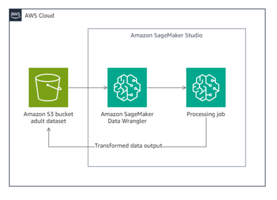
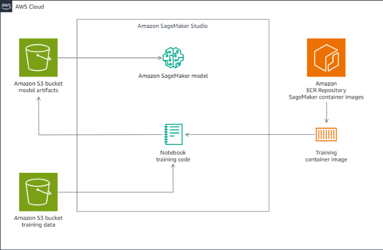
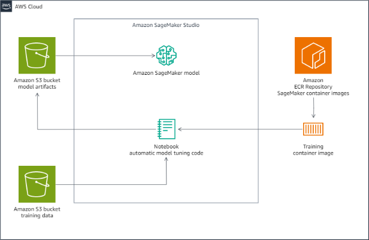
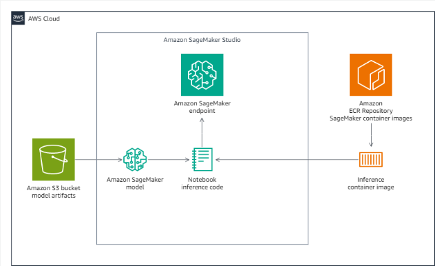
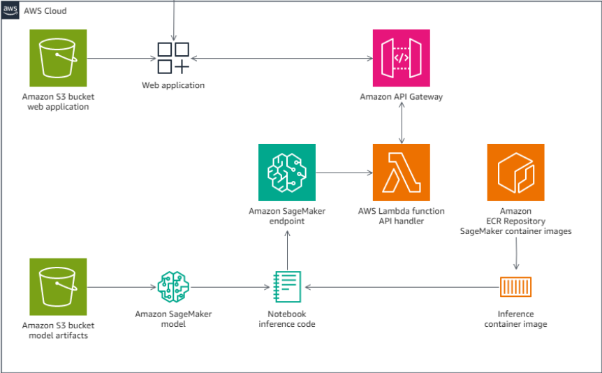

# AWS Partner: Practical Data Science with Amazon SageMaker

- 기간: 2024-02.20(7시간)
- 파트너 강의 <https://tinyurl.com/2r9d9ezc>

## AWS AL Curriculum

## AWS AL/ML Stack

## 이론

- 머신러닝 준비
  - 데이터준비, 분석 및 추론, 모델, 결과 분석
- 회귀, 분류
- 지도 학습, 비지도 학습
- [알고리즘](https://docs.aws.amazon.com/ko_kr/sagemaker/latest/dg/algos.html)
  - K-Meanings
  - xgboost(앙상블)
  - 결정 트리
- 행렬 오차
  - TP(병 있음)
  - TN(병 없음)
  - FP(병 있는데 없음) 1종 오류
  - FN(병 없는데 있음) 2종 오류
  - 정밀도(Precision): TP / TP + FP
  - 재현율(Recall): TP / TP + FN
  - 정확도(Accuracy): TP + TN / TP + TN + FP + FN
  - F1(F1 Score): 정밀도와 재현율의 조화 평균
- 회기 문제 지표
  - 회기 문제에서 오차 측정, 성능 평가
  - 평균 절대 오차(MAE, Mean Absolute Error)
  - 평균 제곱 오차(MSE, Mean Squared Error)
  - 평균 제곱근 오차(RMSE, Root Mean Squared Error)
  - 결정 계수(R^2, R-squared)
- 데이터 세트
  - Training, Test, Validation 0.7/0.2/0.1
- 하이퍼 파라미터

## Lab 1: Data preparation with SageMaker Data Wrangler

### Lab 1 OBJECTIVES

- Launch SageMaker Data Wrangler in Amazon SageMaker Studio
- Import data from an Amazon S3 bucket into SageMaker Data Wrangler
- Create a SageMaker Data Wrangler flow
- Use SageMaker Data Wrangler to transform, analyze, and visualize data

### Task 1.1: Import, visualize, and perform a preliminary analysis of the data with SageMaker Data Wrangler

#### TASK 1.1.1: ACCESS AND CREATE A SAGEMAKER DATA WRANGLER DATA FLOW IN SAGEMAKER STUDIO

- 프로젝트 생성하기 `Amazon SageMaker Studio Classic`
- data prepartaion steps, go to `SageMaker Studio Url`
- In the left navi section, locate the Applications pane
- choose `Studio Classic`
- click `+ Create Data Wrangler flow`

#### TASK 1.1.2: LOAD THE DATA FROM AMAZON S3 INTO SAGEMAKER DATA WRANGLER

- 데이터 가져오기 `Data sources`

#### TASK 1.1.3: GET INSIGHTS ON THE DATA STRUCTURE AND QUALITY

- 데이터 분석 `Analysis: Data Quality And Insights Report`
- 구조와 퀄리티 인사이트 얻기

### Task 1.2: Analyze and visualize the data

#### TASK 1.2.1: TARGET LEAKAGE

- 데이터(타겟) 누수 `Target Leakage`

#### TASK 1.2.2: GENERATING A HISTOGRAM

- 히스토그램 분석 `Histogram`

### Task 1.3: Perform data transformations and export the datasets

#### TASK 1.3.1: DROP COLUMNS AND HANDLE MISSING AND DUPLICATE VALUES

- 컬럼 삭제 `Manage columns`
- 중복 제거 `Manage rows`
- 띄어쓰기 제거 `Format string`

#### TASK 1.3.2: TRANSFORM THE TARGET COLUMN

- 타겟 칼럼 변환 `Search and edit`

#### TASK 1.3.3: HANDLE OUTLIERS

- 아웃라이어 제거 `Handle outliers`

#### TASK 1.3.4: PERFORM ORDINAL ENCODING

- 범주형 인코딩 `Encode categorical`

#### TASK 1.3.5: PERFORM ONE-HOT ENCODING

- 원핫 인코딩 `Encode categorical`

#### TASK 1.3.6: MOVE THE TARGET COLUMN

- 타겟 컬럼 이동 `Manage columns`

#### TASK 1.3.7: EXPLORE THE DESTINATION AND EXPORT FEATURES

- S3에 저장 `Add destination`

#### TASK 1.3.8: EXPORT THE DATA TO AN S3 BUCKET

- 데이터 플로우 검증 `Run validation`
- Training, Validation, Test 세트 데이터 `Split data`
- job 만들기 `Create job`

### Lab 1: Conclusion

- Launched SageMaker Data Wrangler in SageMaker Studio
- Imported data from an S3 bucket into SageMaker Data Wrangler
- Created a SageMaker Data Wrangler flow
- Used SageMaker Data Wrangler to transform, analyze, and visualize data

## Lab 2: Training a model with Amazon SageMaker

### Lab 2: OBJECTIVES

- Use a SageMaker Python SDK to configure the hyperparameters for a training job
- Use an Amazon SageMaker Studio notebook to train an ML model
- Validate that a model is trained successfully
- Review the objective metrics to evaluate a model
- Validate that the model artifacts are created successfully

### Task 2.1: Set up the environment

- 깃 프로젝트 불러오기 [깃주소](https://git-codecommit.us-west-2.amazonaws.com/v1/repos/Lab2Repository)

### Task 2.2: Train a model

[lab2](./lab2.ipynb) 바로가기

### Lab 2: Conclusion

- Used a SageMaker Python SDK to configure the hyperparameters for a training job
- Used a SageMaker Studio notebook to train an ML model
- Validated that a model is trained successfully
- Reviewed the objective metrics to evaluate a model
- Validated that the model artifacts are created successfully

## Lab 3: Model Tuning and Hyperparameter Optimization with Amazon SageMaker

### Lab 3: OBJECTIVES

- Configure hyperparameter tuning for an XGBoost model
- Run a hyperparameter optimization tuning job

### Task 3.1: Set up the environment

- 깃 프로젝트 불러오기 [깃주소](https://git-codecommit.us-west-2.amazonaws.com/v1/repos/Lab3Repository)

### Task 3.2: Tune a model

[lab3](./lab3.ipynb) 바로가기

### Lab 3: Conclusion

- Configured hyperparameter tuning for an XGBoost model
- Ran a hyperparameter optimization tuning job

## Lab 4: Deploy a Model with SageMaker Studio

## Lab 4: Lab overview

- Configure a real-time endpoint, generate predictions, and evaluate the model’s prediction accuracy

### Task 4.1: Set up the environment

- 깃 프로젝트 불러오기 [깃주소](https://git-codecommit.us-west-2.amazonaws.com/v1/repos/Lab4Repository)

### Task 4.2: Deploy a model for real-time inference

[lab4](./lab4.ipynb) 바로가기

### Lab 4: Conclusion

- Configured a real-time endpoint, generated predictions, and evaluated the model’s prediction accuracy

## Lab 5: Integrating a Web Application with an Amazon SageMaker Model Endpoint

### Lab 5: OBJECTIVES

- Integrate an application with an Amazon SageMaker endpoint

### Task 5.1: Review and test the web application from Amazon S3 and Amazon API Gateway

### Task 5.2: Connect the application to a SageMaker endpoint

### Task 5.3: Get inference on new data records from the application

## Finished
