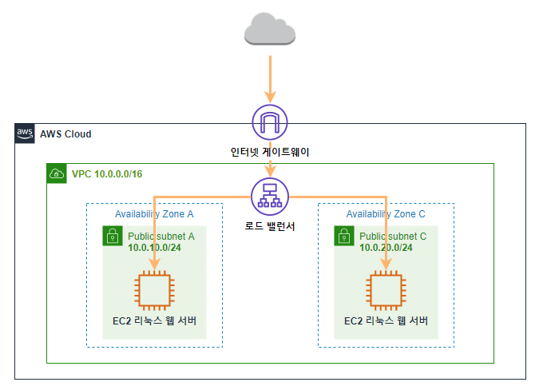

# AWS Builders 프로그램 온라인 정기 세미나

- 2021-06-21 ~

Link -> [https://aws.amazon.com/ko/events/seminars/aws-builders/](https://aws.amazon.com/ko/events/seminars/aws-builders/)

# [210623] AWS Amplify와 AWS AppSync로 사진 공유 웹 어플리케이션 구현

Link -> [https://awskrug.github.io/amplify-photo-gallery-workshop/20_getting_started.html](https://awskrug.github.io/amplify-photo-gallery-workshop/20_getting_started.html)

일정 때문에 수업을 못 들음

# [210622] Amazon EKS 기반 DevOps 환경 구축하기

Link -> [https://main.dfdgsw33yvsy6.amplifyapp.com/ko/](https://main.dfdgsw33yvsy6.amplifyapp.com/ko/)

목표: Amazon EKS를 기반으로 하여 DevOps 환경 구축에 필수적인 1) Observability 구성 2) GitOps 방식의 배포 방식 구성을 목표

## 0. 용어 알아두기

IaC 란?
- Infrastructure as Code의 약자
- AWS의 환경이나 OS등의 인프라를 구성할 때 코드 기반으로 작성하여 관리하거나 갱신하는 방식

CloudFormation 이란?
- Amazon Web Services(AWS) 리소스를 자동으로 생성해 주는 서비스임
- 사용하려는 AWS 리소스를 템플릿 파일로 작성하면, CloudFormation이 이를 분석해서 AWS 리소스를 생성함
- 이렇게 생성된 리소스를 스택이라고 함

Cloud9 이란?
- 브라우저만으로 코드를 작성, 실행 및 디버깅할 수 있는 클라우드 기반 통합 개발 환경(IDE)

EKS란?

CloudWatch란?

Helm 이란?

ArgoCD 란?

## 1. 환경 설정

### 1-1. CloudFormation 스택을 생성 [링크](https://ap-northeast-2.console.aws.amazon.com/cloudformation/home?region=ap-northeast-2#/stacks/new?stackName=eks-devops&templateURL=https://jiwony-seoul-public.s3.ap-northeast-2.amazonaws.com/eks-c9.yaml)
- 실습 환경(AWS Cloud9 환경: EC2 인스턴스로 구동)을 배포하려고
### 1-2. AWS Cloud9 인스턴스에 IAM Role을 부여
- Instances에서 Actions -> Security -> Modify IAM role
- 앞서 생성한 CloudFormation을 통해 배포된 IAM Role을 선택
### 1-3. Cloud9 콘솔로 이동, Open IDE 클릭
### 1-4. 2번에서 설정해준 IAM Role을 사용하기 위해 Cloud9의 임시 자격 증명 설정을 해제
- 화면 우측 상단의 톱니바퀴를 클릭합니다.
- 설정 창의 AWS Settings 메뉴를 클릭합니다.
- AWS managed temporary credentials 를 클릭하여 캡쳐처럼 X 표시가 되도록 합니다.
### 1-5. 해당 파일을 잘 실행해준다.
```bash
sh init/init.sh  # init.sh 파일 실행
source ~/.bash_profile  # 수정값 적용하기
```
`init/init.sh`를 보면 아래와 같다.

```bash
# env configuration
echo '============================================'
echo 'Configuring the environment'
echo '============================================'
sudo yum -y install jq

export ACCOUNT_ID=$(aws sts get-caller-identity --output text --query Account)
export AWS_REGION=$(curl -s 169.254.169.254/latest/dynamic/instance-identity/document | jq -r '.region')
export AZS=($(aws ec2 describe-availability-zones --query 'AvailabilityZones[].ZoneName' --output text --region $AWS_REGION))

echo "export ACCOUNT_ID=${ACCOUNT_ID}" | tee -a ~/.bash_profile
echo "export AWS_REGION=${AWS_REGION}" | tee -a ~/.bash_profile
echo "export AZS=(${AZS[@]})" | tee -a ~/.bash_profile
aws configure set default.region ${AWS_REGION}
aws configure get default.region
source ~/.bash_profile

# kubectl
sh ~/environment/init/resize.sh 60
echo '============================================'
echo 'Installing kubectl'
echo '============================================'

curl -o kubectl https://amazon-eks.s3.us-west-2.amazonaws.com/1.18.9/2020-11-02/bin/linux/amd64/kubectl
chmod +x ./kubectl
mkdir -p $HOME/bin && cp ./kubectl $HOME/bin/kubectl && export PATH=$PATH:$HOME/bin
echo 'export PATH=$PATH:$HOME/bin' >> ~/.bashrc


# AWS tools
echo '============================================'
echo 'Installing other tools'
echo '============================================'
sudo pip install --upgrade awscli && hash -r
sudo yum -y install gettext bash-completion moreutils
echo 'yq() {
  docker run --rm -i -v "${PWD}":/workdir mikefarah/yq "$@"
}' | tee -a ~/.bashrc && source ~/.bashrc
curl -sSL https://raw.githubusercontent.com/helm/helm/master/scripts/get-helm-3 | bash


# eksctl prereqs
echo '============================================'
echo 'Configuring prerequisites for EKS cluster'
echo '============================================'
ssh-keygen -q -t rsa -N '' -f ~/.ssh/id_rsa <<<y 2>&1 >/dev/null
aws ec2 import-key-pair --key-name "eksworkshop" --public-key-material file://~/.ssh/id_rsa.pub
aws kms create-alias --alias-name alias/eksworkshop --target-key-id $(aws kms create-key --query KeyMetadata.Arn --output text)
export MASTER_ARN=$(aws kms describe-key --key-id alias/eksworkshop --query KeyMetadata.Arn --output text)
echo "export MASTER_ARN=${MASTER_ARN}" | tee -a ~/.bash_profile
source ~/.bash_profile

# eksctl
echo '============================================'
echo 'Install eksctl'
echo '============================================'
curl --silent --location "https://github.com/weaveworks/eksctl/releases/latest/download/eksctl_$(uname -s)_amd64.tar.gz" | tar xz -C /tmp
sudo mv -v /tmp/eksctl /usr/local/bin

echo '============================================'
echo 'Validate'
echo '============================================'
test -n "$ACCOUNT_ID" && echo ACCOUNT_ID is "$ACCOUNT_ID" || echo ACCOUNT_ID is not set
test -n "$AWS_REGION" && echo AWS_REGION is "$AWS_REGION" || echo AWS_REGION is not set
test -n "$AZS" && echo AZS is "$AZS" || echo AZS is not set
test -n "$MASTER_ARN" && echo MASTER_ARN is "$MASTER_ARN" || echo MASTER_ARN is not set

aws sts get-caller-identity --query Arn | grep -q Cloud9InstanceRole && echo "IAM role valid" || echo "IAM role NOT valid"
echo 'kubectl version is' $(kubectl version --client --short)
echo 'eksctl version is' $(eksctl version)

# ============================================
# Validate
# ============================================
# ACCOUNT_ID is NNNNNNNNNN
# AWS_REGION is ap-northeast-2
# AZS is ap-northeast-2a
# MASTER_ARN is arn:aws:kms:ap-northeast-2:NNNNNNNNNN:key/79f529b9-4d2b-4ed4-a9d2-e9ca28b395c2
# IAM role valid
# kubectl version is Client Version: v1.18.9-eks-d1db3c
# eksctl version is 0.52.0
```

## 2. Launch using eksctl

목표: EKS Cluster that is ready to use!

### 2-1. EKS cluster yaml 파일 만들기

```bash
cat << EOF > eksworkshop.yaml
---
apiVersion: eksctl.io/v1alpha5
kind: ClusterConfig

metadata:
  name: eksworkshop-eksctl
  region: ${AWS_REGION}
  version: "1.17"

availabilityZones: ["${AZS[0]}", "${AZS[1]}", "${AZS[2]}"]

managedNodeGroups:
- name: nodegroup
  desiredCapacity: 3
  instanceType: t3.small
  ssh:
    enableSsm: true

# To enable all of the control plane logs, uncomment below:
# cloudWatch:
#  clusterLogging:
#    enableTypes: ["*"]

secretsEncryption:
  keyARN: ${MASTER_ARN}
EOF
```

### 3-2. EKS cluster yaml 파일 실행

```bash
eksctl create cluster -f eksworkshop.yaml
# 파일이 잘 실행되지 않으면 다음 명령어를 입력
source ~/.bash_profile  # 수정값 적용하기
```

### 3-3. TEST THE CLUSTER

```bash
kubectl get nodes # if we see our 3 nodes, we know we have authenticated correctly

# Export the Worker Role Name for use throughout the workshop:
STACK_NAME=$(eksctl get nodegroup --cluster eksworkshop-eksctl -o json | jq -r '.[].StackName')
ROLE_NAME=$(aws cloudformation describe-stack-resources --stack-name $STACK_NAME | jq -r '.StackResources[] | select(.ResourceType=="AWS::IAM::Role") | .PhysicalResourceId')
echo "export ROLE_NAME=${ROLE_NAME}" | tee -a ~/.bash_profile
```

## 3. Helm

- Helm is a **package manager** and application management tool for Kubernetes that packages multiple Kubernetes resources into a single logical deployment unit called a Chart.
  - Achieve a simple (one command) and repeatable deployment
  - Manage application dependency, using specific versions of other application and services
  - Manage multiple deployment configurations: test, staging, production and others
  - Execute post/pre deployment jobs during application deployment
  - Update/rollback and test application deployments

- 헬름은 여러 쿠버네티스 자원들을 단일 논리적 배포 단위로 패키징하는 패키지 관리자임 
  - 명령어 한번으로 단순하고 반복작인 배포 가능
  - 앱 종속성을 관리, 특별한 버전의 다른 앱이나 서비스를 사용함으로써
  - 여러 배포 구성을 관리: 테스트, 스테이징, 완성본 등
  - 배포 중에 배포 전/후 작업을 실행
  - 업데이트, 롤백, 테스트로 앱 배포

### 3-1. INSTALL HELM CLI

Verify the version

```bash
helm version --short
```

Download the stable repository so we have something to start with

```bash
helm repo add stable https://charts.helm.sh/stable
```

Finally, let’s configure Bash completion for the helm command

```bash
helm completion bash >> ~/.bash_completion
. /etc/profile.d/bash_completion.sh
. ~/.bash_completion
source <(helm completion bash)
```

### 3-2. DEPLOY NGINX WITH HELM

Helm uses a packaging format called **Charts**. A Chart is **a collection of files and templates** that describes Kubernetes resources.

Charts can be simple, describing something like a standalone web server (which is what we are going to create), but they can also be more complex, for example, a chart that **represents a full web application stack, including web servers, databases, proxies, etc.**

Instead of installing Kubernetes resources manually via kubectl, one **can use Helm to install pre-defined Charts faster, with less chance of typos or other operator errors**.

Chart repositories change frequently due to updates and new additions. To keep Helm’s local list updated with all these changes, **we need to occasionally run the repository update command**.

```bash
# first, add the default repository, then update
helm repo add stable https://charts.helm.sh/stable
helm repo update

# then you can see below

# Hang tight while we grab the latest from your chart repositories...
# ...Successfully got an update from the "stable" chart repository
# Update Complete. ⎈ Happy Helming!⎈
```

Now that our repository Chart list has been updated, we can search for Charts.

```bash
# To list all Charts
helm search repo
# we’ll search just for nginx
helm search repo nginx
```

The nginx standalone web server is not one of them.

We discover that there is a Chart for the nginx standalone web server available via the Bitnami Chart repository.

```bash
helm repo add bitnami https://charts.bitnami.com/bitnami
helm search repo bitnami
helm search repo nginx
helm search repo bitnami/nginx
# That’s the one we’re looking for
```

### 3-3. INSTALL BITNAMI/NGINX

How can you use Helm to deploy the bitnami/nginx chart?

```bash
helm install mywebserver bitnami/nginx
```

In order to review the underlying Kubernetes services, pods and deployments, run:

```bash
kubectl get svc,po,deploy
```

The first object shown in this output is a Deployment. A Deployment object manages rollouts (and rollbacks) of different versions of an application.

You can inspect this Deployment object in more detail by running the following command:

```bash
kubectl describe deployment mywebserver
```

The next object shown created by the Chart is a Pod. A Pod is a group of one or more containers.

To verify the Pod object was successfully deployed, we can run the following command:

```bash
kubectl get pods -l app.kubernetes.io/name=nginx
```

The third object that this Chart creates for us is a Service. A Service enables us to contact this nginx web server from the Internet, via an Elastic Load Balancer (ELB).

To get the complete URL of this Service, run:

```bash
kubectl get service mywebserver-nginx -o wide
```

### 3-4. Uninstall / Delete / Clean Up

we can verify what we have running via the Helm list command:

```bash
helm list
```


```bash
helm uninstall mywebserver
```


```bash
kubectl get pods -l app.kubernetes.io/name=nginx
kubectl get service mywebserver-nginx -o wide
```

## 4. EKS CLOUDWATCH CONTAINER INSIGHTS

Update later

---

# [210621] AWS BUILDERS 100 HANDS ON LAB

Link -> [https://aws-builders-kr.workshop.aws/ko/10-intro.html](https://aws-builders-kr.workshop.aws/ko/10-intro.html)



웹 서버를 구축

|AWS가 없다면?|AWS로 구현|
|:---:|:---:|
|서버 컴퓨터 구매|EC2|
|OS(Windows Server, Linux)|AMI|
|CPU, Memory, Storage|Instance, Storage|
|네트워크 장비 구매|VPC|
|방화벽 장비 구매|Security Group|
|로드벨런서 장비 구매|Load Balancer|

AWS 가입, 한글로 설정, Seoul Region으로 설정

## 3. 네트워크 구성하기

VPC(Virtual Private Cloud)란?
- 사용자가 정의한 가상의 네트워크 공간 안에서 AWS 리소스를 시작
- AWS의 확장 가능한 인프라를 사용한다는 이점과 함께 고객의 데이터 센터에서 운영하는 기존 네트워크와 매우 유사

### 3-1. VPC 생성하기

**VPC 마법사 시작**을 하면 단일 퍼블릭 서브넷이 있는 VPC로 가능

CIDR이란?
- CIDR(Classless Inter-Domain Routing)로 네트워크의 주소와 크기를 표현하는 방식
- 예를 들어 10.0.0.0/16 은 10.0.0.0 + /16 으로 구성
- 네트워크 고정 범위 + 호스트 주소(가변 범위)
- CIDR 블록 서브넷에는 5개의 IP 주소가 예약
  - 0: 네트워크
  - 1: AWS에서 VPC라우터용으로 예약
  - 2: DNS 서버 주소
  - 3: AWS에서 나중에 사용하려고 예약
  - 255: 브로드캐스트 주소

### 3-2. 추가 서브넷 생성하기

서브넷을 하는 이유?
- 고가용성을 확보하기 위해, 다중 가용 역역(AZ)에 서비스를 배포해야 함
- 가용 영역 A 외의 C 영역에 서브넷을 생성

### 3-3. 라우팅 테이블 편집하기

VPC 라우팅 테이블 개념
- 서브넷 또는 게이트 웨이의 네트워크 트래픽이 전송되는 위치를 결정하는데 사용되는 라우팅이라는 규칙 집합이 포함
- **기본 라우팅 테이블**은 VPC와 함께 자동으로 생성되는 라우팅 테이블
  - 명시적으로 연결되지 않은 모든 서브넷의 라우팅을 제어하는 역할
- **사용자 지정 라우팅 테이블**은 기본 라우팅 테이블 외에 사용자가 생성한 라우팅 테이블

### 3-4. 보안 그룹 생성하기

보안 그룹의 역할
- 인스턴스에 대한 인바운드 및 아웃바운드 트래픽을 제어하는 가상 방화벽 역할

## 4. 웹 서버 생성하기

EC2(Elastic Compute Cloud) 이해
- 확장 가능한 컴퓨팅 용량
- 하드웨어 선투자할 필요가 없어 더 빠르게 애플리케이션을 개발하고 배포
- 원하는 만큼 가상 서버를 구축하고 보안 및 네트워크 구성과 스토리지 관리가 가능
- 신속하게 규모를 확장하거나 축소할 수 있어 서버 트래픽 예측 필요성이 줄어듬

### 4-1. 웹 서버 인스턴스 생성하기

쉘 스크립트를 작성하여 인스턴스 생성과 동시에 쉘 스크립트 실행

```bash
#!/bin/sh
yum -y install httpd php mysql php-mysql
chkconfig httpd on
systemctl start httpd
if [ ! -f /var/www/html/immersion-day-app.tar.gz ]; then
   cd /var/www/html
   wget https://kr-id-general.workshop.aws/sh/immersion-day-app.tar.gz
   tar xvfz immersion-day-app.tar.gz
   chown apache:root /var/www/html/rds.conf.php
fi
yum -y update
```

### 4-2. AMI 생성하기

Amazon Machine Image(AMI)란?
- 동일한 구성의 인스턴스가 여러 개 필요할 때는 한 AMI를 사용하여 여러 인스턴스를 시작할 수 있음

### 4-3. AMI 기반 인스턴스 생성하기

AMI 기반 인스턴스 생성하면 편하게 Instance를 복붙 가능

## 5. 로드밸런서 구성하기

ELB(Elastic Load Balancing)란?
- 애플리케이션 트래픽을 Amazon EC2 인스턴스, 컨테이너, IP 주소, Lambda 함수, 가상 어플라이언스와 같은 여러 대상에 자동으로 분산
- 단일 가용 영역 또는 여러 가용 영역에서 다양한 애플리케이션 부하를 처리
- Elastic Load Balancing이 제공하는 네 가지 로드 밸런서는 모두 애플리케이션의 내결함성에 필요한 고가용성, 자동 조정, 강력한 보안기능 제공
  - Application Load Balancer(L7)
  - Network Load Balancer(L4)
  - Gateway Load Balancer
  - Classic Load Balancer
