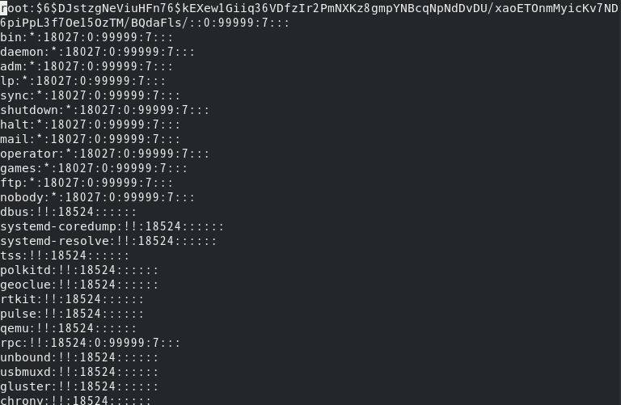
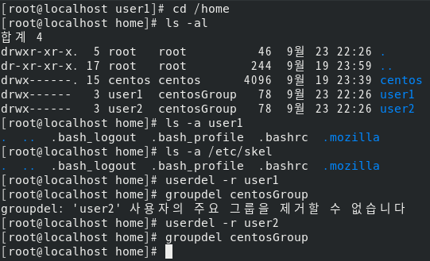

## 04-05 필수개념과 명령어-사용자와 그룹 관리

### 사용자와 그룹

리눅스는 기본적으로 Multi-User System임

root라는 사용자가 기본적으로 있고 super user라고 불림

모든 사용자는 하나 이상의 그룹에 속해 있음

1. 사용자 정의 파일 열어보기: ```vi  /etc/passwd```

   다음과 같은 형식으로 저장되어 있음

   **user_name** : **hashed password** : **user_id** : **group** : **full_name** : **home_diretory** : **base_shell**

   

2. 사용자 비밀번호 파일 열어보기: ```vi  /etc/shadow```

   **group_name** : **hashed password** : **group_id** : **users_in_group**

   

3. 사용자 그룹 관련 명령어

   - ```user add <username>```: 사용자 추가하기
   - ```passwd <username>```: 사용자 비밀번호 지정 또는 변경
   - ```usermod -g root newuser```: 사용자의 속성을 변경
   - ```userdel <username>```: 사용자를 삭제
   - ```change -m 2 <username>```: 사용자의 암호를 2달 간격으로 변경하게 설정
   - ```groups```: 현재 사용자가 속한 그룹을 보여줌
   - ```groupadd <groupname>```: 새로운 그룹을 생성
   - ```groupmod -n <groupname> <othergroupname>```: 그룹 속성 변경

4. [실습7] 사용자와 그룹 관리 연습

   - 사용자와 그룹의 Create / Update / Delete 명령어 연습 
   - 사용자와 그룹의 관련 파일들을 파악(Read)한다.

   사용자 만들고 읽고 삭제하기

      - Create user1: ```useradd user1```
      - Read users: ```tail -5 /etc/passwd```
      - Read groups: ```tail -5 /etc/group```
      - Delete user1: ```userdel  -r  user1```

   

   사용자 그룹 만들고 읽고 사용자 패스워드 설정 및 읽기

      - Create group: ```groupadd <groupname>```
      - Read groups: ```tail -5 /etc/group```
      - Creat user1 in groupname: ```useradd -g <groupname> user1```
      - Set user1 password: ```passwd user1```

   

   그룹 만들기, 그룹에 속한 유저 만들기, 유저 비밀번호 설정

      - Read users list: ```cd /home``` -> ```ls -al```
      - How to create user: 유저는 ```/etc/skel``` 에 있는 파일들이 복사가 되서 만들어 집니다.
      - Delete group: ```groupdel <groupname>``` 으로 삭제하는데 그 그룹에 속한 유저가 없어야 합니다.

   
