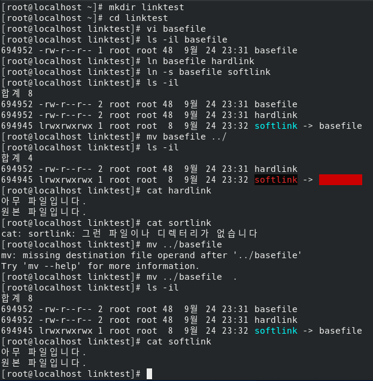

## 04-06 필수개념과 명령어-파일의 허가권 및 소유권, 링크

### 파일 디렉터리의 소유와 허가권

- ```ls -l``` 명령어를 쳤을 때 나오는 글 읽는 법

    1. 파일 유형
       - ```-```: normal file
       - ```d```: directory
       - ```l```: link
       - ```b```: block device
       - ```c```: character device
    1. 파일 허가권
       - 3개씩 끊어서 읽고 소유자(User)의 권한, 그룹(Group) 권한, 그 외 사용자(Other) 권한으로 나뉨
       - r은 read, w는 write, x는 execute
       - ex) ```rwxrw-r-x```이면 User는 ```rwx```로 rwx 전부 가능, Group은 ```rw-```로 rw만 가능, Other은 ```r-x```로 rx만 가능
       - 8진수로도 표현함(4, 2, 1의 합으로 표현)
    1. 링크 수: 보통 파일을 새로 만들면 1개로 되어 있음
    2. 파일 소유자 이름
    3. 파일 소유그룹 이름
    4. 파일 크기
    5. 마지막 변경 날짜/시간
    6. 파일 이름

- 파일 허가권 변경: ```# chmod 777 <file_name>```
- 파일 소유권을 유저와 그룹 모두 변경: ```# chown <user>.<group> <file_name>```

[실습8] 파일의 허가권 및 소유권 연습

``` shell
touch test
ls -l
vi test
<!-- m
아무거나 입력
ls /var
:wq -->
ls -l test
whoami  # 현재 사용자를 알려줌
./test
chmod 755 test  # 755 로 모드 변경
./test  # 모드 변경 후 실행 가능
touch test2
ls -l test*
chmod u+x test2  # test2 파일을 user에게 실행 권한을 +(줌)
ls -l test*
chmod g+x test2  # test2 파일을 group에게 실행 권한을 +
chmod o+x test2  # test2 파일을 other에게 실행 권한을 +
ls -l test*
chmod ugo-x test2  # # test2 파일을 user에게 실행 권한을 -(없엠)
ls -l test*
chmod ug-rw test2
ls -l test*
chown centos test
chgrp centos test
pwd
su - centos  # 사용자를 centos로 변경
whoami
pwd
ls -l /root
ls -ld /root # ld옵션: 디렉토리만 표시
exit
whoami
ls -l test
mv test ~centos  # ~사용자는 사용자 계정의 디렉토리를 뜻함
ls -l test
su - centos
pwd
ls -l
./test
chown root.root test
exit
```


### 링크

파일의 링크는 하드(Hard) 링크와 심볼릭(Symbolic)(소프트(Soft)) 링크로 2가지가 있음

- 하드링크 생성: ```ln <링크대상파일이름> <링크파일이름>``` 하드링크파일만 하나 생성되며 같은 inode1을 사용
- 소프트링크 생성: ```ln -s <링크대상파일이름> <링크파일이름>``` 새로운 inode2를 만들고 데이터는 원본 파일을 연결한 효과

[실습9] 링크 파일 연결 살펴보기

``` bash
mkdir linktest
cd linktest/
ls
vi basefile
ls -il basefile
ln basefile hardlink
ln -s basefile softlink
ls -il
mv basefile ../ .
ls -il
```


