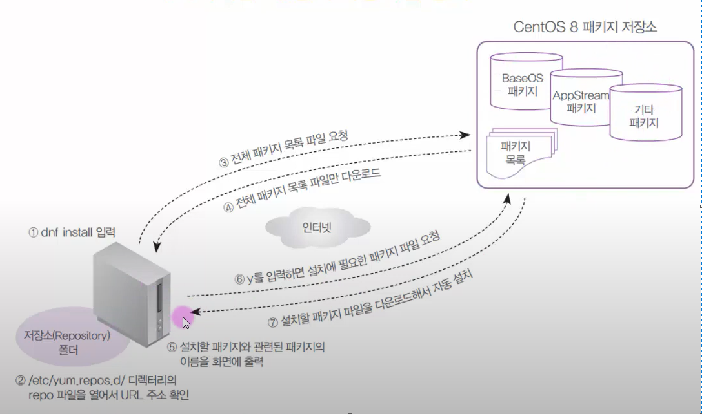
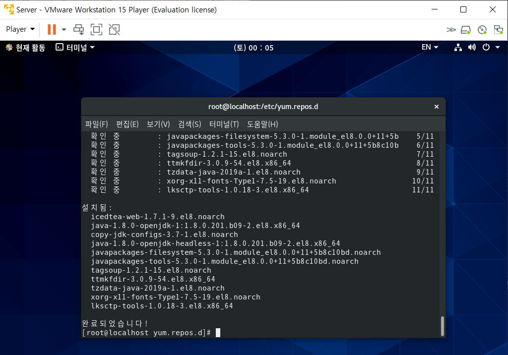

## 04-08 필수 개념과 명령어-편리한 설치를 위한 DNF

### 편리한 설치를 위한 DNF

DNF 란?

- rpm 명령의 패키지 의존성 문제를 해결
- 인터넷을 통해 필요한 파일을 저장소(Reository)에서 자동으로 모두 다운
  - 파일 저장소 URL 은 ```etc/yum.ropos.d/``` 에 있음
- CentOS7은 기본적으로 YUM, CentOS8은 YUM이 개선된 DNF 명령어를 사용

DNF 기본적인 사용법

- ```dnf -y install <package_name>```: 패키지 설치
- ```dnf install <rpmfile_name>.rpm```: rmp파일 다운
- ```dnf remove <package_name>```: 삭제
- ```dnf check-update```: 체크 가능 업데이트 보기
- ```dnf update <package_name>```: 패키지 업데이트 하기
- ```dnf info <package_name>```: 패키지 정보 확인



[실습11] dnf 기본연습

``` bash
dnf info mysql-errmsg
dnf -y install mysql-errmsg
dnf -y install mc
def -y remove mc
```

dnf 고급 사용법

- ```dnf groupinstall <package_group_name>```: 패키지 그룹으로 한번에 설치
- ```dnf list <package_name>```: 패키지 리스트 보기
- ```dnf provides <file_name>```: 특정 파일이 속한 패키지 이름 확인
- ```dnf install --nogpgcheck <rpm_file_name>.rpm```: 인증 안된 파일 다운
- ```dnf clean all```: 기존 저장소 목록 지우기

[실습12] dnf 고급실습

- 네트워크와 DVD 동시에 사용하는 방법을 익힌다

``` bash
umount /dev/cdrom
umount /dev/cdrom
mkdir /media/cdrom
mount /dev/cdrom /media/cdrom/
ls /media/cdrom/
cd /etc/yum.repos.d/  # 서버연결 파일 확인하기
mv This.repo backup/  # 초기에 만든 this.repo를 옮기고
vi dvd.repo  # 서버 연결 파일

[DVD-BaseOS]  # 식별자, 주석같은 느낌
name=CentOS DVD BaseOS  # 이름
baseurl=file:///media/cdrom/BaseOS/  # 주소
gpgcheck=0

[DVD-AppStream]
name=CentOS DVD AppStream
baseurl=file:///media/cdrom/AppStream/
gpgcheck=0

ifdown ens160  # 인터넷 끄기
dnf -y install mariadb  # 인터넷이 안되도 다운 가능(DVD로 연결해서)
dnf -y install help2man  # 다운 불가능(DVD에 없는 파일)

cd /etc/yum.repos.d/
vi dvd.repo  # 아래 내용 추가

[Network-PowerTools]
name=CentOS-$releasever - PowerTools
baseurl=http://mirror.centos.org/centos-8/8.0.1905/PowerTools/x86_64/os/
        http://vault.centos.org/8.0.1905/PowerTools/x86_64/os/
gpgcheck=0

dnf clean all
ifup ens160
dnf install mc help2man  # 설치 완료

# 패키지 그룹 설치하기
dnf grouplist  # 패키지 그룹 보기
dnf grouplist hidden  # 잘 안보이는거 까지 보기
dnf -y groupinstall "자바 플랫폼"  # 패키지 그룹(자바 플랫폼) 설치하기
```

실습결과

