# Chapter06 Summary 하드디스크 관리

## 06-01 IDE 및 SCSI 장치 개념, 하드디스크 1개 추가

### 하드디스크 연결 방식에 따른 분류

1. IDE(Intergrated Drive Electronics)
   - PATA(Parallel Advanced Tachnology Attachment) 라고도 불림
   - 병렬로 데이터를 전송
   - 옛날 규격
2. SATA(Serial Advanced Technology Attachment)
3. SCSI(Small Computer System Interface)
4. SAS(Serial Attached SCSI)
5. HDD -> SSD(Solid State Drive(Disk))

### IDE 장치와 SCSI 장치의 구성

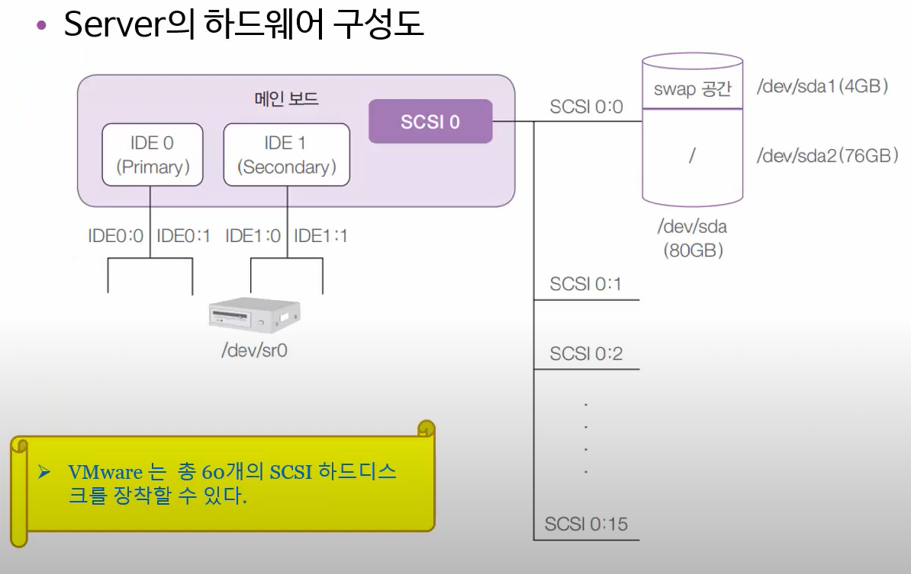

- IDE는 옛날 방식으로 2개씩 장착 할 수 있음
- 요즘은 SATA 방식으로 장착
- SCSI 하드를 사용한다면
  - SCSI 는 4개를 사용하고
  - 0 ~ 15 까지 16개 중에 7번은 예약이 되어 있어 15개를 사용 가능
  - 4 * 15개 60개를 사용할 수 있음
- 하드 디스크를 물리적으로는 `/dev/sda`, `/dev/sdb`, `/dev/sdc` ... 로 부름
- 디스크 파티션이 나눠진 것을 논리적으로는 `/dev/sda1`, `/dev/sda2`, `/dev/sda3`,` /dv/sdb1`, `/dev/sdb2` ... 로 부름

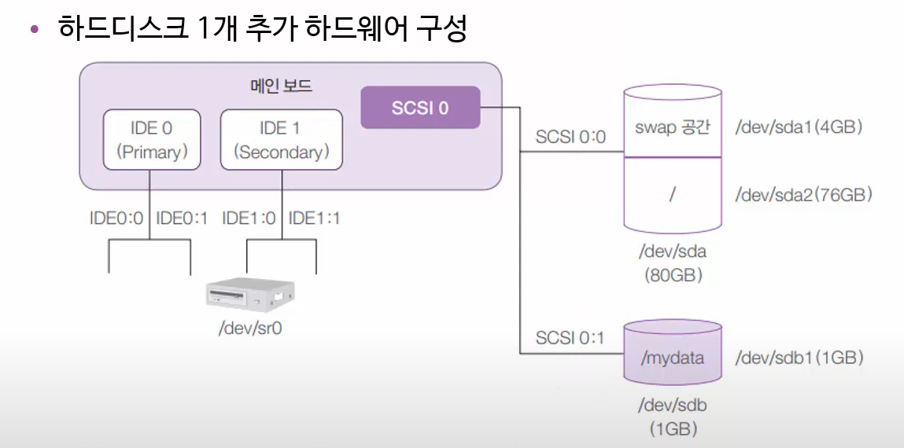

- 장착된 디스크의 이름은 /dev/sdb
- 논리적인 파티션의 이름은 /dev/sdb1
- 파티션을 그냥 사용할 수 없으며 반드시 특정한 디렉토리에 마운트 시켜야 함

### [실습1] 하드디스크 1개 장착

개념도

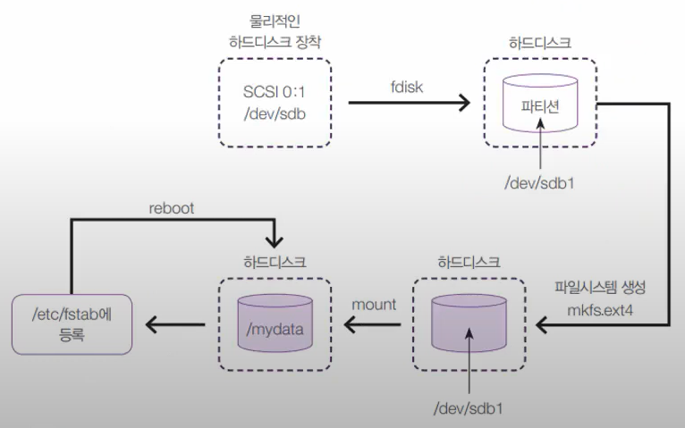

1. 물리적인 하드디스크 장착하기
   - `Add` -> `SCSI` -> `New` -> `1GB`, `Single` -> `Finish`
2. root로 로그인 후 -> Terminal
   ```bash
   fdisk
   ls -l /dev/sd*
   fdisk /dev/sdb  # 하드디스크 들어가기
   m  # 도움말
   n  # new (파티션 만들기)
   # p 주 파티션
   # e 확장 파티션
   p  # primary 파티션 만들기
   p  # default
   1  # default
   `enter`  # 처음부터 끝까지 잡기
   `enter`  # 처음부터 끝까지 잡기
   p  # print info
   w  # write
   ```
3. format 하기, mount 하기
   ```bash
   mkfs.ext4 /dev/sdb1
   
   mkdir /mydata  # scsi0:0 /dev/sdb1 으로 연결할 폴더 생성
   # 사실 현재 /dev/sda2에 연결한거나 마찬가지
   mount /dev/sdb1 /mydata/  # 연결
   mount
   cp anaconda~ /mydata/test1  # 아나콘다 파일을 scsi0:1로 보냄
   # 사실 scsi0:1은 scsi0:0의 /dev/sda2로 연결되어 있는 상태
   umount /dev/sdb1
   ls -l /mydata  # umount 한 상태이기 때문에 데이터가 없음
   ```
 

## 06-02 하드디스크 관리-RAID 개념1(Linear, RAID0, RAID1)
## 06-03 하드디스크 관리-RAID 개념2(RAID5, RAID6, RAID 10)

### RAID 정의 및 개념

RAID 정의
- RAID: Redundant Array of Inexpensive Disks
- 여러 개의 디스크를 하나의 디스크처럼 사용함
- 비용 절감 + 신뢰성 향상 + 성능 향상의 효과를 냄

Hardware RAID
- 하드웨어 제조업체에서 여러 개의 하드디스크를 가지고 장지를 만들어서 그 자체를 공급
- 좀 더 안정적이지만 비쌈

Software RAID
- 고가의 하드웨어 RAID의 대안
- 운영체제에서 지원하는 방식
- 저렴한 비용으로 좀 더 안전한 데이터의 저장이 가능
- 우리가 공부하는 것은 software RAID 임

### RAID 기술

- Striping: Share data
- Mirroring: Copy data
- Parity: Check error

### RAID 방식의 비교

|                      | Linear RAID | RAID 0 | RAID 1       | RAID 5               | RIAD 6            | RAID 1+0                     |
| -------------------- | ----------- | ------ | ------------ | -------------------- | ----------------- | ---------------------------- |
| Minimum Drives       | 2           | 2      | 2            | 3                    | 4                 | 4                            |
| READ Performance     | -           | High   | High         | High                 | High              | High                         |
| WRITE Performance    | -           | High   | Medium       | Low                  | Low               | Medium                       |
| Capactiy Utilization | 100%        | 100%   | 50%          | 67 ~ 94%             | 50% ~ 88%         | 50%                          |
| Data Protection      | NO          | NO     | Single-drive | Single-drive faliure | Two-drive faliure | Up to 1 disk in each sub array |

### Linear RAID

- 갯수: 2개 이상
- 방식: 앞 디스크부터 차례로 저장
- 효율성: 100% 공간 효율성
- 신뢰성: 보통
- 특징: 2개 이상의 하드디스크를 1개의 볼륨으로 사용

### RAID 0

- 갯수: 2개 이상
- 방식: 모든 디스크에 동시에 저장됨
- 효율성: 100% 공강효율성
- 신뢰성: 낮음
- 특징: 빠른 성능, 하나만 고장나더라도 모두가 고장

### RAID 1

- 하드디스크 갯수: 2개 이상
- 방식: 미러링(Mirroring)
- 신뢰성: 높음
- 공간 효율성: 50%
- 특징: 결함 허용(Fault tolerance)

### RAID 5

- 갯수: 3개 이상
- 방식: RAID 1의 안정성 + RAID 0의 공간 효율성 + Parity
- 효율성: 디스크 갯수 - 1
- 신뢰성: 약간 높음
- 특징: 오류 발생시 Parity bit로 오류 복구, 2개 이상 고장시 복구 못함

### RAID 6

- 갯수: 3개 이상
- 방식: RAID 5 개선, 2개의 Parity
- 효율성: 디스크 갯수 - 2
- 신뢰성: 약간 높음
- 특징: 오류 발생시 Parity bit로 오류 복구, 3개 이상 고장시 복구 못함
- 속도: RAID 5 보다 약간 떨어짐
 
### RAID 1+0

RAID 1 + RAID 0 한 것으로 신뢰성과 성능이 동시에 뛰어남

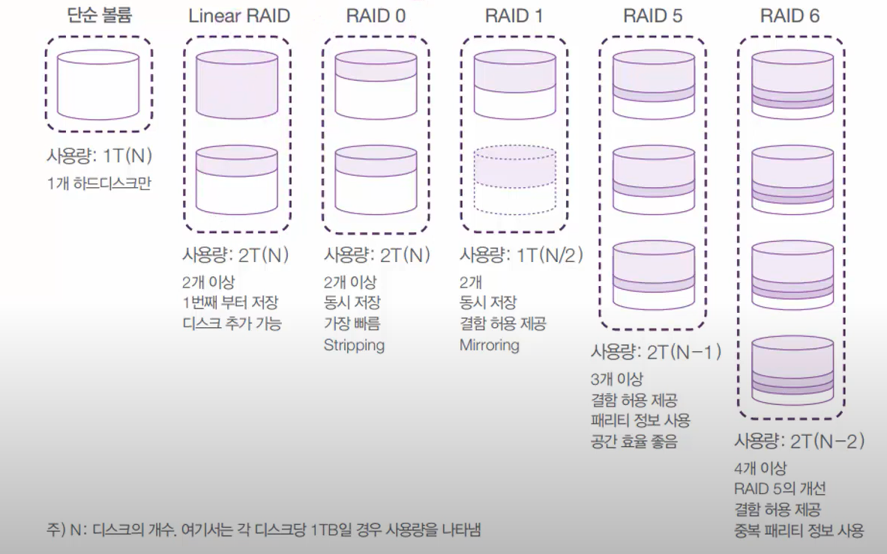

### RAID 표 참고

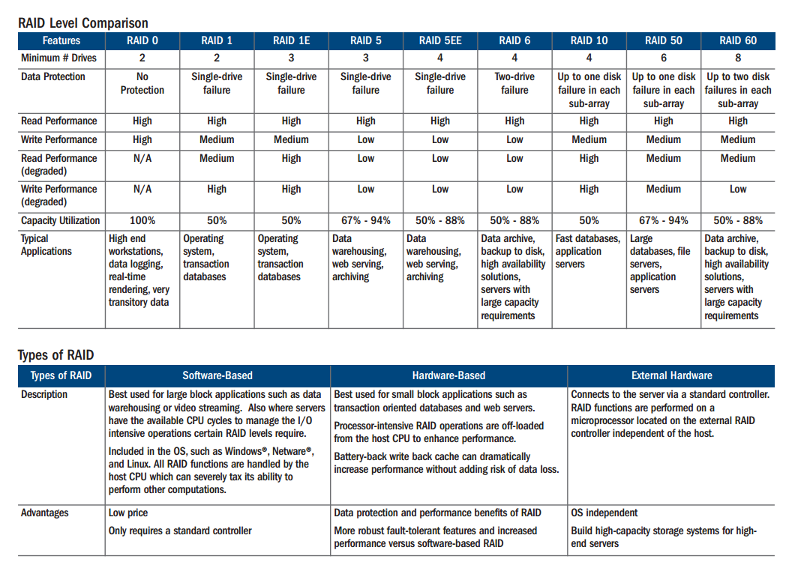

## 06-04 하드디스크 관리-RAID용 디스크 9개 장착

### Linear RAID, RAID0, RAID1, RAID5 구현

### [실습2] 하드디스크 9개 준비

실습 목표: 하드 9개를 장착하고, fdisk로 파티셔닝 한다.

1. 하드디스크 장착하기
   - Server 설정 창에서 -> `add` -> `hard disk` -> `scsi` -> `create a new` ~ ->`2, single` -> `finish` -> `Advenced`를 눌러 확인
2. Terminal 에서
   1. dev/sdb 설정하기
      ```bash
      ls -l /dev/sd*
      fdisk /dev/sdb
         n -> p -> 1 -> enter -> enter
         p -> Type이 리눅스
         l -> 83(Linux), fd(Linux raid auto)
         t -> fd
         p -> Type이 Linux and autodetect
         w
      ls -l dev/sd*
      ```
   2. dev/sdc 설정 빠르게 하기
      ```bash
      fdisk /dev/sdc
      n -> p -> 1 -> enter -> enter -> t -> fd -> w
      ```
   3. dev/sdj 까지 위와 같이 실행하기
   4. `ls -l /dev/sd*` 로 확인 후 스냅샷

## 06-05 하드디스크 관리-Linear RAID 구축

### Linear RAID, RAID0, RAID1, RAID5 구현

### [실습3] Linear RAID 구축

실습 목표: Linear RAID 구축, mdadm 사용법을 익힌다.

실습 구성도


1. Terminal 에서
   ```bash
   # 1. 확인하기
   ls -l /dev/sd*  # 연결된 장치들 보기
   fdisk -l /dev/sdb  # sdb 정보 보기
   fdisk -l /dev/sdc  # sdc 정보 보기
   # 2. 논리 볼륨 만들기(껍데기 설정)
   mdadm --create /dev/md9 --level=linear --raid-devices=2 /dev/sdb1 /dev/sdc1
   # create at /dev/md9, linear by 2 devices(/dev/sdb1, /dev/sdc1)
   mdadm --detail --scan  # 확인하기
   # 3. 논리 볼륨 만들기(파일 시스템 생성)
   mkfs.ext4 /dev/md9  # format 하기
   # 4. mount 하기
   mkdir /raidLinear  # make folder
   mount /dev/md9 /raidLinear/  # monut
   df  # disk free
   # 5. mount 고정하기
   vi /etc/fstab
        /dev/md9 /raidLinear ext4 defaults 0 0
        :wq
   mdadm --detail /dev/md9
   ```

## 06-06 하드디스크 관리-RAID 0, 1, 5 구축

### [실습4] RAID0 구축

Linear RAID 구축과 비슷함, 옵션만 변경하면 사실상 같음

1. Terminal 에서
   ```bash
   # 1. 확인하기
   ls -l /dev/sd*  # 연결된 장치들 보기
   fdisk -l /dev/sdd  # sdd 정보 보기
   fdisk -l /dev/sde  # sde 정보 보기
   # 2. 논리 볼륨 만들기(껍데기 설정)
   mdadm --create /dev/md0 --level=0 --raid-devices=2 /dev/sdd1 /dev/sde1
   # create at /dev/md0, RAID0 by 2 devices(/dev/sdd1, /dev/sde1)
   mdadm --detail --scan  # 확인하기
   # 3. 논리 볼륨 만들기(파일 시스템 생성)
   mkfs.ext4 /dev/md0  # format 하기
   # 4. mount 하기
   mkdir /raid0  # make folder
   mount /dev/md0 /raid0/  # monut
   df  # disk free
   # 5. mount 고정하기
   vi /etc/fstab
        /dev/md0 /raid0 ext4 defaults 0 0
        :wq
   mdadm --detail /dev/md0
   ```

### [실습5] RAID1 구축

Linear RAID 구축과 비슷함, 옵션만 변경하면 사실상 같음

1. Terminal 에서
   ```bash
   mdadm --create /dev/md1 --level=1 --raid-devices=2 /dev/sdf1 /dev/sdg1
        y
   mkfs.ext4 /dev/md1
   mkdir /raid1
   mount /dev/md1 /raid1/
   df
   vi /etc/fstab
        /dev/md1 /raid1 ext4 defaults 0 0
        :wq
   mdadm --detail /dev/md1
   ```

### [실습6] RAID5 구축

Linear RAID 구축과 비슷함, devices를 3개로 설정

1. Terminal 에서
   ```bash
   mdadm --create /dev/md5 --level=5 --raid-devices=3 /dev/sdh1 /dev/sdi1 /dev/sdj1
   mkfs.ext4 /dev/md5
   mkdir /raid5
   mount /dev/md5 /raid5/
   df
   vi /etc/fstab
        /dev/md5 /raid5 ext4 defaults 0 0
        :wq
   mdadm --detail /dev/md5
   ```

## 06-07 하드디스크 관리-Linear RAID, RAID 0, 1, 5 문제 발생과 조치방법

- Linear RAID, RAID0 은 '결함 허용' 기능이 없음
- RAID1, RAID5는 '결함 허용' 기능이 있음

### [실습7] RAID의 하드디스크 고장

실습 목표: Linear RAID, RAID 0, 1, 5의 하드디스크가 고장 난 상황을 본다.

고장나면 /dev/sd **`알파벳`** 이 새로 부여된다.(실습 구성도 참고)

실습 구성도

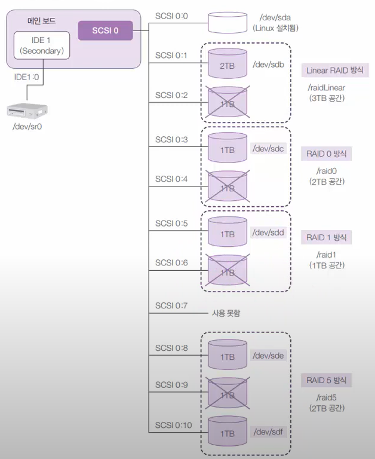

1. Terminal에서
   ```bash
   df  # 드라이브 확인하기
   # 파일 아무거나 복사해서 드라이브에 넣기
   cp /boot/vmlinuz-4* /raidLinear/testFile
   cp /boot/vmlinuz-4* /raid0/testFile
   cp /boot/vmlinuz-4* /raid1/testFile
   cp /boot/vmlinuz-4* /raid5/testFile
   # 컴퓨터 끄기
   halt -p
   ```
2. 연결된 드라이브 빼기
   - `SCSI0:2`, `SCSI0:4`, `SCSI0:6`, `SCSI0:9` `Remove` 하기

3. 컴퓨터 다시 켜기
   - 컴퓨터를 다시 키면 `응급모드`로 들어가진다.
   - root 의 비밀번호를 치고
   ```bash
   ls -l /dev/sd*  # 드라이브 목록 보기
   df
   ls -l /raid1 /raid5  # 안에 파일이 살아있는지 확인
   mdadm --detail /dev/md1  # 상세히 보기
   mdadm --detail /dev/md5  # 상세히 보기
   mdadm --run /dev/md9  # fail(작동 자체가 불가)
   mdadm --run /dev/md0  # fail(작동 자체가 불가)
   mdadm --stop /dev/md9  # Linear LAID 중단
   mdadm --stop /dev/md0  # LAID0 중단
   vi /etc/fstab
        /raid0, /raidLinear 주석 처리
   reboot  # 재시작
   ```

4. 컴퓨터 재시작 후
   - 정상 부팅 가능
   ```bash
   df
   ls -l /raid1  # 안에 파일이 살아있는지 확인
   ls -l /raid5  # 안에 파일이 살아있는지 확인
   ```

## 06-08 하드디스크 관리-Linear RAID, RAID0, 1, 5 원상 복구

### [실습8] RAID의 하드디스크 교체

실습 목표: Linear RAID, RAID0, RAID1, RAID5 의 장치의 고장 난 하드디스크를 새로운 하드디스크로 교체한다.

복구 전후의 내부적 변화

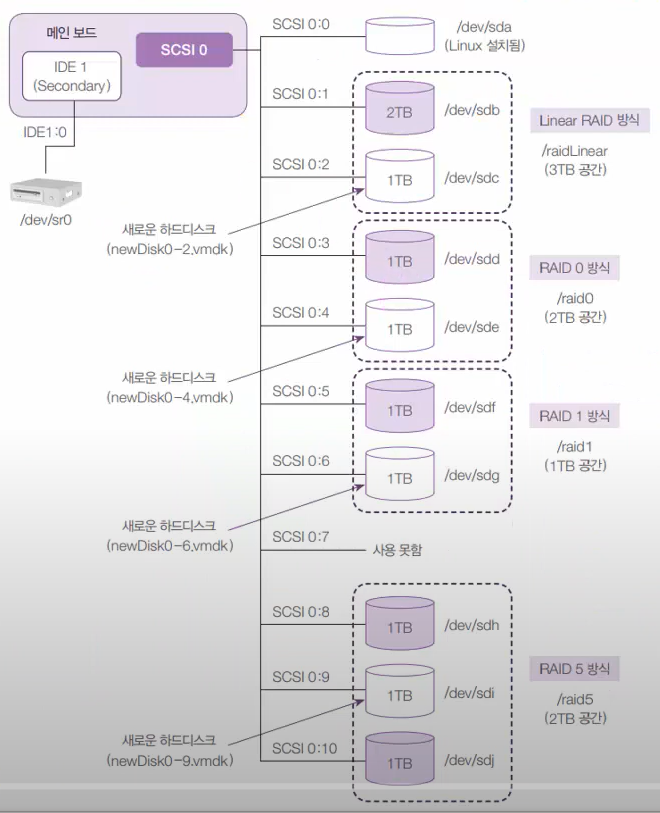

1. Server virtual machine settings
   - `Add` -> `SCSI` -> `Next` -> `1G, Single File` -> `Finish`
   - 4가지 모두 설정 후 부팅

2. Terminal 에서
   ```bash
   mdadm --detail /dev/md1
   # fdisk 로 파티셔닝을 해줘야 함
   fdisk /dev/sdc
        n -> p -> 1 -> enter -> enter -> t -> fd -> w
   fdisk /dev/sde
        n -> p -> 1 -> enter -> enter -> t -> fd -> w
   fdisk /dev/sdg
        n -> p -> 1 -> enter -> enter -> t -> fd -> w
   fdisk /dev/sdi
        n -> p -> 1 -> enter -> enter -> t -> fd -> w
   ls -l dev/sd*  # 파티셔닝 확인하기
   # 작동이 안됬기 때문에 중지 후 다시만들기
   mdadm --stop /dev/md9
   mdadm --create /dev/md9 --level=linear --raid-devices=2 /dev/sdb1 /dev/sdc1
        y
   mdadm --stop /dev/md0
   mdadm --create /dev/md0 --level=0 --raid-devices=2 /dev/sdd1 /dev/sde1
        y
   mdadm --detail /dev/md9
   mdadm --detail /dev/md0
   
   # 작동이 된 RAID1, RAID5는 add만 하면 저절로 작동이 됨
   mdadm /dev/md1 --add /dev/sdg1
   mdadm /dev/md5 --add /dev/sdi1

   mdadm --detail /dev/md1
   mdadm --detail /dev/md5

   vi etc/fstab
        주석처리 지우고 다시 시작
   
   # 재부팅 후 잘 작동하는지 확인하기
   reboot
   ls -l /raid0  # 50%만 남아있는 파일
   ls -l /raidLinear  # 저장 방식상 파일이 살아있음
   ```

## 06-09 하드디스크 관리-RAID 6, RAID0 10의 구축과 문제 발생

### RAID 6와 RAID 1+0 개념

RAID 6은 4개로 구성하게 되면 패리티를 2개 쓰기 때문에 효율이 안나옴,  
그래서 8개~10개 정도로 구성하는게 일반적  

RAID 1+0은 빠르면서 안정적임

### [실습9] RAID 6과 RAID 1+0

실습 목표: 고급 RAID 방식인 RAID 6과 RAID 1+0을 구성해 본다.

실습 구성도

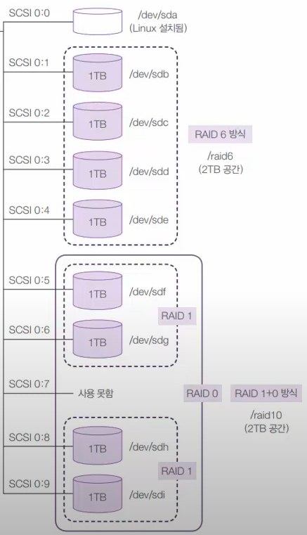

1. 실습 구성도처럼 8개 부착
2. Terminal 에서
   ```bash
   ls -l /dev/sd*
   fdisk /dev/sdb
        n -> p -> 1 -> enter -> enter -> t -> fd -> w
   # 8개 반복
   ls -l /dev/sd*

   mdadm --create /dev/md6 --level=6 --raid-devices=4 /dev/sdb1 /dev/sdc1 /dev/sdd1 /dev/sde1
   mdadm --detail /dev/md6

   mkfs.ext4 /dev/md6

   mkdir /raid6
   mount /dev/md6 /raid6/

   mdadm --create /dev/md2 --level=1 --raid-devices=2 /dev/sdf1 /dev/sdg2
   mdadm --create /dev/md3 --level=1 --raid-devices=2 /dev/sdh1 /dev/sdi2
   
   mdadm --create /dev/md10 --level=0 --raid-devices=2 /dev/md2 /dev/md3
   mkdir /raid10
   mount /dev/md10 /raid10/
   df

   cp /boot/vmliunz-4* /raid6/testFile
   cp /boot/vmliunz-4* /raid10/testFile

   vi /etc/fstab
          /dev/md6 /raid6 ext4 defaults 0 0
          /dev/md10 /raid10 ext4 defaults 0 0
          :wq
   
   ```

### [실습10] RAID 6과 RAID 1+0의 고장

실습 구성도

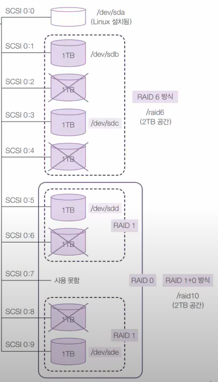

1. Server edit virtual machine settings에서
   - SCSI0:2, SCSI0:4, SCSI0:6, SCSI0:8 `remove` 하기

2. Terminal에서
   ```bash
   # 파일 확인
   ls -l /raid6
   ls -l /raid0

   # 작동 확인
   mdadm --detail /dev/md6
   mdadm --detail /dev/md10
   ```

## 06-10 하드디스크 관리-LVM 개념과 구현

### LVM 개념

LVM(Logical Volume Manage)

- Physical Volume: /dev/sda1, /dev/sdb1 등의 파티션
- Volume Group: 물리 볼륨을 합쳐서 1개의 물리 그룹으로 만드는 것
- Logical Volume: 볼륨 그룹을 1개 이상으로 나눠서 논리 그룹으로 나눈 것

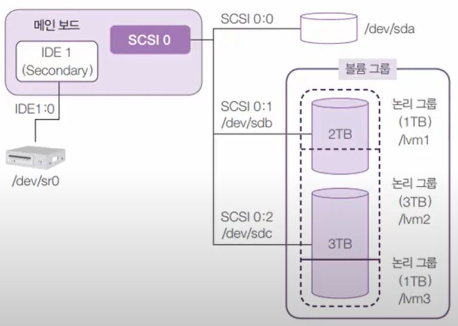

### [실습11] LVM 구성

실습 목표: LVM 구현, 관련 명령어 pvcreate, vgcreate, lvcreate를 익힌다.

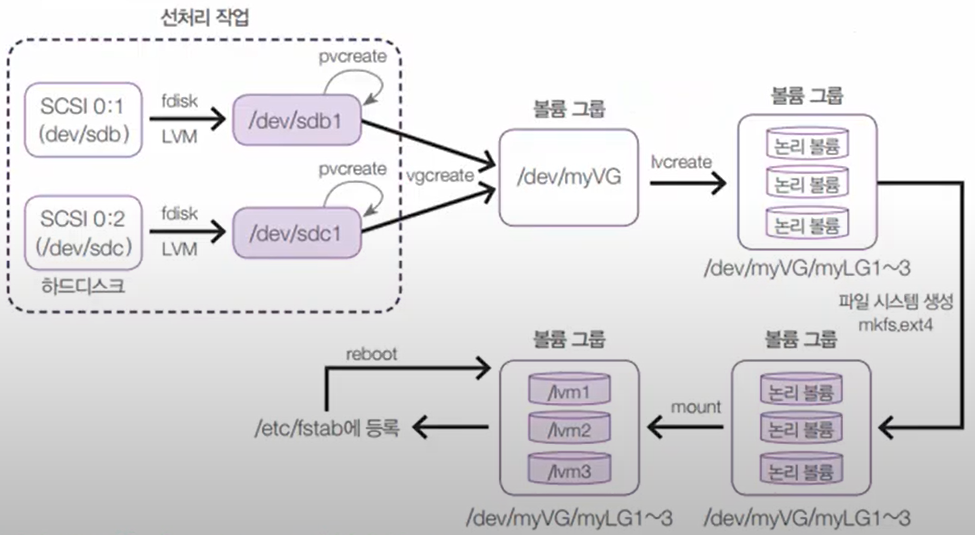

1. 디스크 2개 추가하기
   - SCSI 2G Single, SCSI 3G Single
2. Terminal에서
   ```bash
   # 디스크 껍데기 만들기
   fdisk /dev/sdb
        n -> p -> 1 -> enter -> enter -> t -> 8e
   fdisk /dev/sdb
        n -> p -> 1 -> enter -> enter -> t -> 8e
   
   # physical volume 만들기
   pvcreate /dev/sdb1
   pvcreate /dev/sdb1

   # volume group 만들기
   vgcreate /dev/myVG /dev/sdb1 /dev/sdc1
   
   # volume group 확인하기
   vgdisplay

   # volume group을 Logical volume으로 나누기
   lvcreate --size 1G --name myLG1 myVG
   lvcreate --size 3G --name myLG2 myVG
   lvcreate --extents 100%FREE --name myLG3 myVG  # 나머지 용량 쓰기
   
   # 확인하기
   ls -l /dev/myVG  # 링크 파일임을 확인

   # 포멧하기
   mkfs.ext4 /dev/myVG/myLG1
   mkfs.ext4 /dev/myVG/myLG2
   mkfs.ext4 /dev/myVG/myLG3

   # 마운트 하기
   mkdir /lvm1 /lvm2 /lvm3
   mount /dev/myVG/myLG1 /lvm1
   mount /dev/myVG/myLG2 /lvm2
   mount /dev/myVG/myLG3 /lvm3

   # f stab에 등록하기
   vi /etc/fstab
        /dev/myVG/myLG1   /lvm1   ext4   defaluts    0    0
        /dev/myVG/myLG2   /lvm2   ext4   defaluts    0    0
        /dev/myVG/myLG3   /lvm3   ext4   defaluts    0    0
   ```

## 06-11 하드디스크 관리-CentOS를 RAID에 설치

### RAID에 CentOS 설치하기

운영체제의 디스크가 고장나도 백업형태로 다른 디스크에 있는 운영체제를 불러 올 수 있다.

### [실습12] RAID1에 CentOS 설치

실습 목표: 2개의 80GB 하드디스크에서 RAID 1으로 안전하게 작동되는 CentOS를 새로 설치한다.

1. `Create a New Virtual Machine`

   `I will install ~` -> `Linux`, `Red Hat ~ Linux 8 ~` -> `Next` -> `Next` -> `Finish`
2. `Edit virtual Machine settings`
   1. `Add` -> `Hard disk` -> `SCSI` -> `80G`, `single` -> `Finish`
   2. `Add` -> `Hard disk` -> `SCSI` -> `80G`, `single` -> `Finish`
   3. 기존 하드디스크 `Remove`
   4. Centos 설치 파일 이미지 넣기
3. `Play ~`로 가상머신 설치 시작
   1. 한국어로 설치
   2. `시스템`에서 `설치 목적지` 클릭
      1. 하드디스크 두개 클릭 -> `custom`
      2. LVM -> `표준 파티션`
      3. `swap` -> `4G` -> `추가`, 장치유형 RAID -> RAID1 -> 설정 업데이트
      4. `+` -> `/` -> `추가`, 장치유형 RAID -> RAID1 -> 설정 업데이트
      5. `완료` -> `변경사항 저장`
4. 다 설치 후 Terminal에서
   ```bash
   mdadm --detail --scan
   # swap 파티션과 root 파티션이 두개 작동하는 것을 확인
   mdadm --detail /dev/md/root  # 작동 확인하기
   ```

5. 시스템 종료 후 디스크 하나 삭제 후
6. 다시 접속 후 Terminal에서 상황보기
   ```bash
   mdadm --detail /dev/md/root  # 작동 확인하기
   # 하나만 작동하는 것을 확인 가능
   ```

## 06-12 사용자별 공간할당-쿼터 개념과 실습

### 사용자별 공간 할당 - 쿼터

- 쿼터(Quota) 개념
  - 파일시스템마다 사용자나 그룹이 생성할 수 있는 파일의 용량 및 갯수를 제한
  - 파일시스템을 "/"로 지정하는 것보다는, 별도의 파일시스템을 지정해서 해당 부분을 쓰도록 하는 것이 좋음
  - "/"파일시스템을 많은 사용자가 동시에 사용하게 되면, CentOS 서버를 운영하기 위해서 디스크를 읽고 쓰는 작업과 일반 사용자가 디스크를 읽고 쓰는 작업이 동시에 발생하므로 전반적으로 시스템의 성능이 저하됨  

### [실습13] 쿼터 실습

실습 목표: 사용자를 만들고, 해당 사용자에게 공간을 할당하고 쿼터의 설정 및 작동에 대해 익힌다.

실습 순서: /edt/fstab 수정 -> 재부팅 or 리마운팅 -> 쿼터 DB 생성 -> 개인별 쿼터 설정

1. 10G 디스크 장착하기
   
   많이 해봐서 생략

2. Terminal에서
   ```bash
   # 10G 하드디스크를 쿼터용으로 만들기
   # 1. 하드디스크 연결하기 
   fdisk /dev/sdb
        n -> p -> 1 -> enter -> enter -> w
   mkfs.ext4 /dev/sdb1
   mkdir /userHome
   monut /dev/sdb1 /userHome/

   vi /etc/fstab
        /dev/sdb1   /userHome   ext4    defaults    0   0

   # 2. 사용자 2명 만들기
   useradd -d /userHome/john john
   useradd -d /userHome/bann bann

   passwd john
   passwd bann

   ls -l /userHome/

   # 3. 쿼터 추가하기(옵션을 quota로 설정하여서)
    vi /etc/fstab
        /dev/sdb1   /userHome   ext4    defaults,usrjquota=aquota.user,jqfmt=vfsv0    0   0

   # 4. monut 다시하기
   mount --options remount /userHome/

   # 5. mount 확인하기
   mount

   # 6. 쿼터 DB 생성하기
   cd /userHome/

   quotaoff -avug  # 쿼터 끄기
   quotacheck -augmn  # 쿼터 체크하기
   rm -rf aquota.*
   quotacheck -augmn  # 쿼터 체크하기
   touch aquota.user aquota.group
   chmod 600 aquota.*  # 일반 사용자는 볼 수 없게 설정
   quotacheck -augmn  # 쿼터 체크하기
   quotaon -avug  # 쿼터 켜기

   # 7. 쿼터 할당하기
   edquota -u john  # john 쿼터 설정하기, vieditor로 설정
   # soft가 경고 수준, hard는 아에 못만듬
   20480(20MB), 30720(30MB)
   
   su - john
   cp /boot/vmlinuz-4* test1
   cp /boot/vmlinuz-4* test2
   cp /boot/vmlinuz-4* test3  # 경고 출력
   cp /boot/vmlinuz-4* test3  # 오류 출력, 파일이 짤림
   
   quota  # 얼마나 사용할 수 있는지 확인 **가능**

   exit  # 루트로 돌아와서
   # 사용자별 할당량 보기
   repquota /userHome/

   # john에 설정된 내용을 bann에게도 똑같이 적용
   edquota -p john bann
   ```
