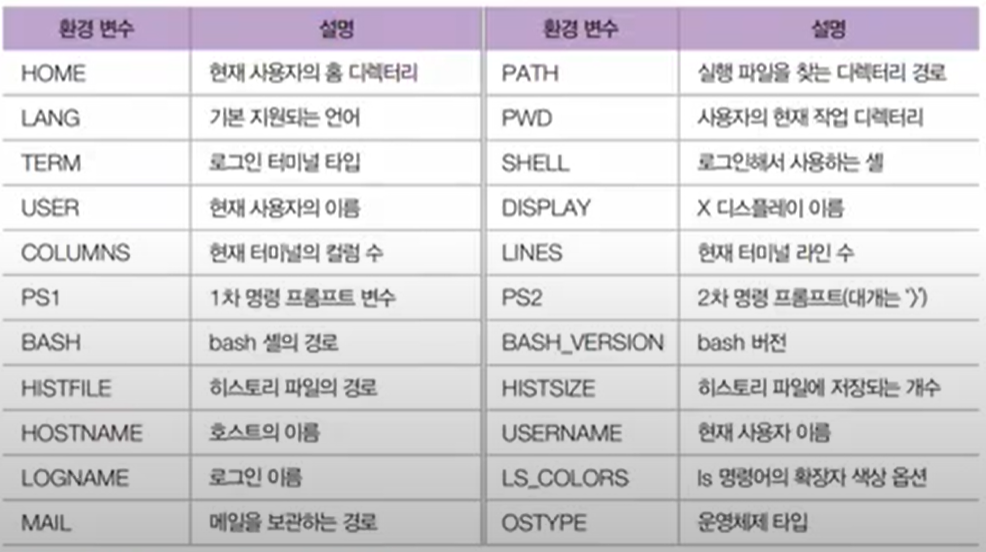
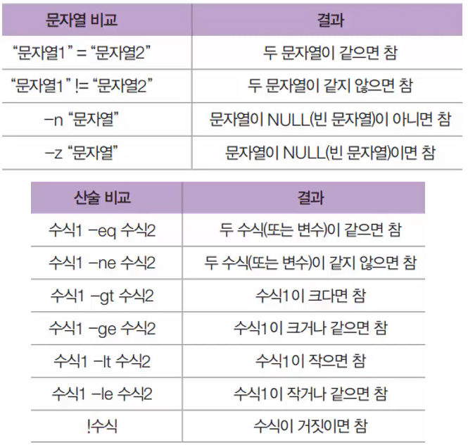
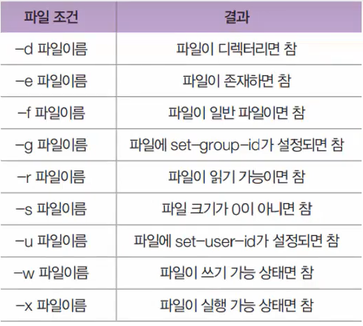

# Chapter07 Summary 셸스크립트

## 07-01 셸스크립트-셸 스크립트 개요, 작성법, 실행법, 변수

### CentOS의 bash 셸

기본 셸은 bash(Bourne Again SHell)

BASH 셸의 특징
- Alias(명령어 단축 기능)
- History(위/아래 화살표키)
- 연산
- Job Control
- 자동 이름 완성
- 프롬프트 제어
- 명령 편집

예전에는 여러가지 셸이 있었는데 요즘은 배쉬를 씀

### 환경 변수

환경변수 보기: `echo $환경변수이름`
환경변수 수정: `export 환경변수=값`

주요 환경변수



### 셸 스크립트 프로그래밍

C언어와 유사, 변수, 반복문, 제어문 사용, vi나 gedit으로 작성 가능, 리눅스의 많은 부분이 셸로 작성되어있음

셸 스크립트의 확장자는 `*.sh` 로 하는게 좋음

셸 파일 만들기

1. vi 로 작성
   파일 생성 후 다음과 같이 작성
   ```shell
   #!/bin/sh
   echo "사용자 이름" $USER
   echo "홈 폴더" $HOME
   exit 0
   ```

2. 실행 방법
   1. `sh <스크립트 파일>` 로 실행
   2. `chmod +x <스크립트 파일>` 명령으로 실행 가능 하게 하고 `./<스크립트 파일>`로 실행

### 변수의 기본

- 변수를 대입할 때 `=` 좌우에는 공백이 없어야 함
- 모든 변수는 문자열로 취급
- 변수 이름은 대소문자를 구분

### 변수의 입력과 출력

```sh
#!/bin/sh
myvar="Hi Woo"  # 변수 myvar 선언
echo $myvar  # myvar 출력
echo "$myvar"  # myvar 출력
echo '$myvar'  # $myvar 그대로 출력
echo \$myvar  # $myvar 그대로 출력
echo 값 입력:
read myvar  # 입력한 값을 myvar 변수에 저장
echo '$myvar' = $myvar  # 다음과 같이 출력
exit 0
```

### 숫자 계산

- 연산을 하려면 `expr`을 반드시 입력
  ```shell
  num1=100
  num3='expr\($num1 + 200\) \* 2'
  ```
- 괄호(`(`, `)`)나 곱하기(`*`)는 `\`를 반드시 붙여줘야 함

### 파라미터(Parameter) 변수

- 파라미터 변수는 `$0`, `$1`, `$2` ... 형태를 가짐
- 전체 파라미터는 `$*` 로 표현

paravar.sh 파일 만들기
```sh
#!/bin/sh
echo "실행파일은 이름은 <$0>이다"
echo "첫번째 파라미터는 <$1>이고, 두번째 파라미터는 <$2>다"
echo "전체 파라미터는 <$3>다"
exit 0
```

```bash
sh paravar.sh 값1 값2 값3
```

## 07-02 셸스크립트-다양한 프로그래밍 연습

### 기본 if 문

```sh
if [조건]
then
  참일경우 실행
else
  거짓일 경우 실행
fi
```

### 비교 연산자

비교 연산



파일 조건 연산



파일 조건 연산 응용 셸 파일

```sh
#!/bin/sh
fname = /lib/systemd/system/sshd.service
if [-f$fname]
then
  head -5 $fname
else
  echo "sshd 서버가 설치되지 않았습니다."
fi
exit 0
```

### case~esac문

c언어의 case문과 비슷

```sh
#!/bin/sh
case "$1"in
  start)
    echo"시작~~";;
  stop)
    echo"중지~~";;
  restart)
    echo"다시 시작~~";;
  *)
    echo"뭔지 모름~~";;
esac
exit 0
```

```sh
#!/bin/sh
read answer
case "$answer"in
  yes|y|Y|Yes|YES)
    echo"YES 입니다.";;
  [nN]*)
    echo"No 입니다";;
  *)
    echo"YES / NO 중 하나를 입력하세요";;
    exit 1;;
 esac
exit 0
```

### AND, OR 관계 연산자

- and: `-a` or `&&`
- or: `-o` or `||`

### 반복문 -for문, -while문

for문

```sh
for 변수 in 값1 값2 값3
do
  반복할 문장
done
```

```sh
for fname in $(ls *.sh)
do
  실행
done
exit 0
```

while문

while `[1]` 또는 `[:]` 이 오면 무한루프 생성

```sh
while [1]
do
  실행할 문장
done
exit 0
```

1에서 10까지 합계를 출력

```sh
#!/bin/sh
hap=0
i=1
while [$i -le 10]
do
  hap='expr $hap + $i'
  i='expr $i + 1'
done
echo "1부터 10까지의 합: "$hap
```

패스워드가 참일 때 까지 입력을 받기

```sh
#!/bin/sh
echo "비밀번호를 입력하세요."
read mypass
while [$mypass != "1234"]
do
  echo "wrong, retry"
  read mypass
done
echo "pass"
exit 0
```

### until문

while문과 동일하지만 조건이 참일 때까지 계속 반복

### break, continue, exit, return 문

```sh
break;;
continue;;
exit 1;;
```

### 사용자 정의 함수

```sh
함수이름 () {
  함수 내용
}
함수이름  # 함수 호출
```

### eval

문자열을 명령문으로 인식하고 실행

```sh
#!/bin/sh
str="ls-l eval.sh"
echo $str
eval $str
exit 0
```

### export

외부 변수를 선언, 선언한 변수를 다른 프로그램에서도 사용할 수 있도록 도와줌

### printf

C언어의 printf() 함수와 비슷하게 형식 지정 출력

### set과 $(명령어)

리눅스 명령어를 결과로 사용하기 위해서 `$(명령어)` 형식을 사용

결과를 파라미터로 사용하고자 할 때 set과 함께 사용

```sh
#!/bin/sh
echo "오늘 날짜는 $(date)입니다."
set $(date)
echo "오늘은 $4 요일 입니다."
exit 0
```

### shift

파라미터 변수를 왼쪽으로 한 단계씩 아래로 쉬프트 시킴

```sh
#!/bin/sh
myfunc() {
  str=""
  while ["$1"=""]; do
    str="$str $1"
    shift
  done
  echo $str
}
```
