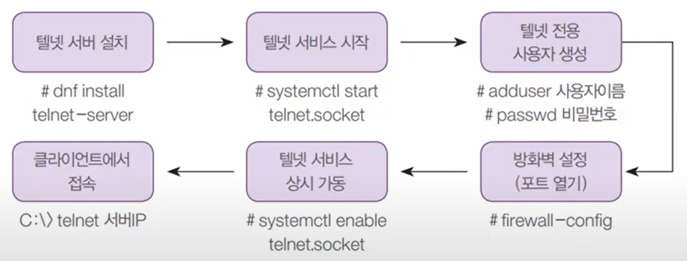
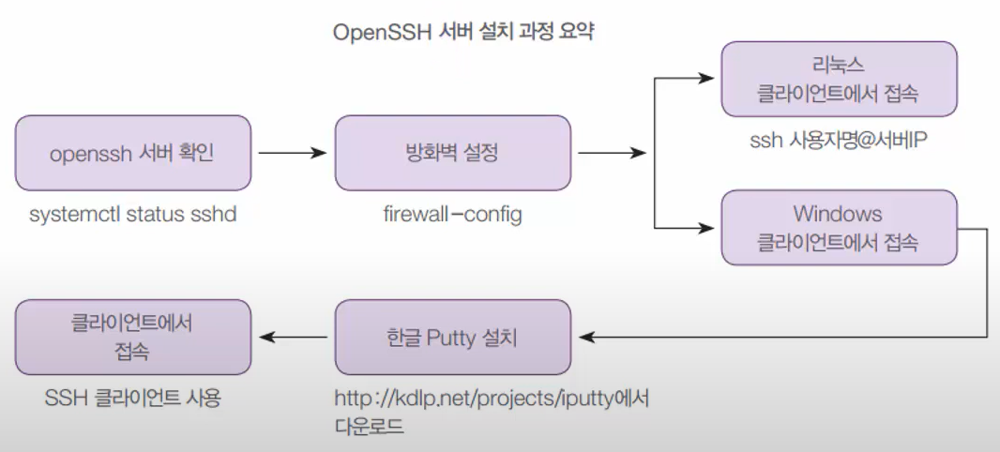
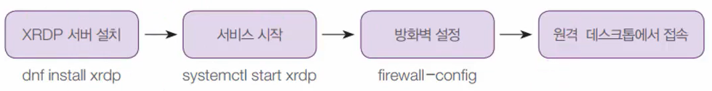
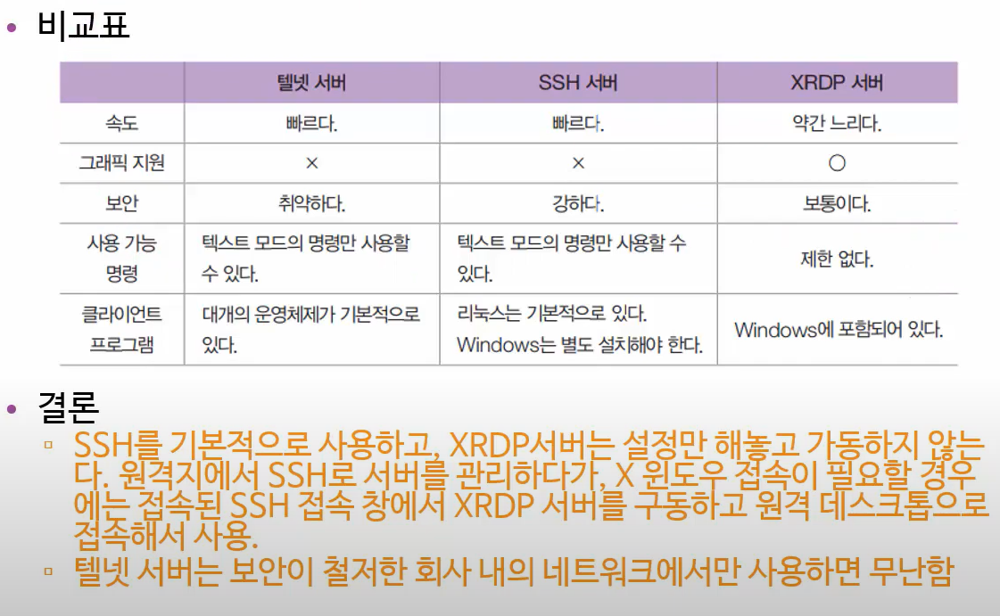

# Chapter08 Summary 원격지 시스템 관리

## 08-01 원격지 시스템 관리-텔넷 서버

### 텔넷 서버 개요

- 오랫동안 전통적으로 사용된 원격 접속 방법
- 보안 취약
- 리눅스 서버 -> 텔넷 서버 설치
- 리눅스 클라이언트 -> 텔넷 클라이언트 프로그램 필요
- 원격지의 PC에서 접속하면 서버 앞에 앉아서 텍스트 모드로 작업하는 것과 동일한 효과

- 텔넷 서버 설치 과정

 
### [실습1] 텔넷 서버 설치

실습목표
- 리눅스 텔넷 서버 설치 가동, 원격지의 Windows에서 접속해 리눅스 관리하기
- 기본적인 서버 구축 방법을 익힘

1. 텔넷 서버 설치 후 서버에서 접속 가능한지 확인 후 방화벽 포트 열기
    ``` bash
    $ dnf -y install telnet-server
    $ systemctl restart telnet.socket
    $ systemctl status telnet.socket
    $ adduser teluser
    $ passwd teluser
    $ telnet 192.168.111.100  # telnet 서버로 접속하기
    firewall-config  # 방화벽 포트 열기
    ```

    `영구적`으로 설정 -> public에 내리다 보면 `telnet` 체크 -> 상단에 `옵션` -> `Firewalld 다시 불러오기`

2. Windows 클라이언트로 들어가서 telnet 클라이언트를 설치하기

    `Windows` -> `앱 및 기능` -> `프로그램 및 기능`(`window` + `R` -> `appwiz.cpl`) -> `Windows 기능 켜기/끄기` -> `Telnet Client` 켜기 -> `다 시 시작`

3. Windows terminal에서
    ``` powershell
    ping 192.168.111.100  # 네트워크 확인
    telnet 192.168.111.100  # 네트워크 접속 확인
    ```

4. Server에서
    ``` bash
    systemctl enable telnet.socket  # 컴퓨터를 켜놓으면 자동으로 텔넷 운영 가능
    ```

## 08-02 원격지 시스템 관리-SSH 서버

### OpenSSH 서버

- 텔넷과 용도는 동일, 보안이 강화
- 텔넷과의 차이: 데이터 전송시 암호화를 함
- 현업에서 사용

### OpenSSH 서버 구축



1. SSH 서버 확인 및 방화벽 설정
    ``` bash
    $ rpm -qa openssh-server  # openssh-server 설치
    $ systemctl status sshd  # 작동 확인
    $ firewall-config  # 방화벽 ssh 서버 열기(자동으로 열려있는지 확인)
    ```

2. 리눅스 클라이언트에서 SSH 접속 확인하기
    클라이언트 컴퓨터로 로그인 후 터미널에서

    ``` bash
    $ ssh teluser@192.168.111.100
    $ ifconfig  # 접속 확인
    ```

3. 윈도우 클라이언트에서 SSH 접속 확인하기
    1. 한글 iPUTTY를 다운로드 링크 -> [https://github.com/iPuTTY/iPuTTY/releases](https://github.com/iPuTTY/iPuTTY/releases)
    2. `192.168.111.100/22` 로 접속 후 로그인

## 08-03 원격지 시스템 관리-XRDP 서버

### XRDP 서버

- X 윈도우 환경으로 원격접속을 사용하고 싶을 때
- 원격지로 그래픽 화면 전송, 속도가 느림

### XRDP 서버 구축



### [실습3] XRDP 서버 설치

실습 목표

- X 윈도우 접속이 가능한 XRDP 서버를 구축
- Windows에서 VNC 클라이언트 사용

1. 터미널에서 설치 후 방화벽 설정

    ``` bash
    dnf -y install epel-release  # 추가 패키지를 설치할 수 있는 저장소 설치(CentOS8에서 제공 안해서 다운)
    dnf -y install xrdp  # xrdp 서버 다운로드
    systemctl restart xrdp  # 재시작
    firewall-config  # 방화벽
    ```

    `영구적`으로 설정 후 -> `포트` -> `추가` -> `3389` -> 상단에 `옵션` -> `Firewalld 다시 불러오기`

2. Windows에서 `Window` + `R` -> `mstsc` -> 로그인 후 사용

### 3가지 원격 서버의 비교


