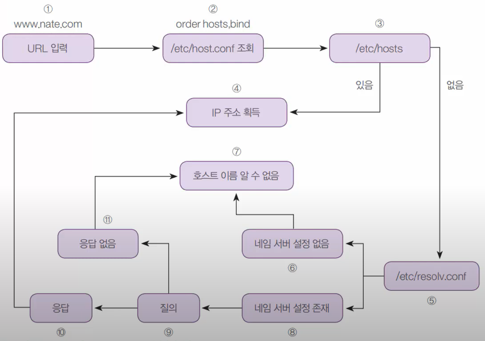
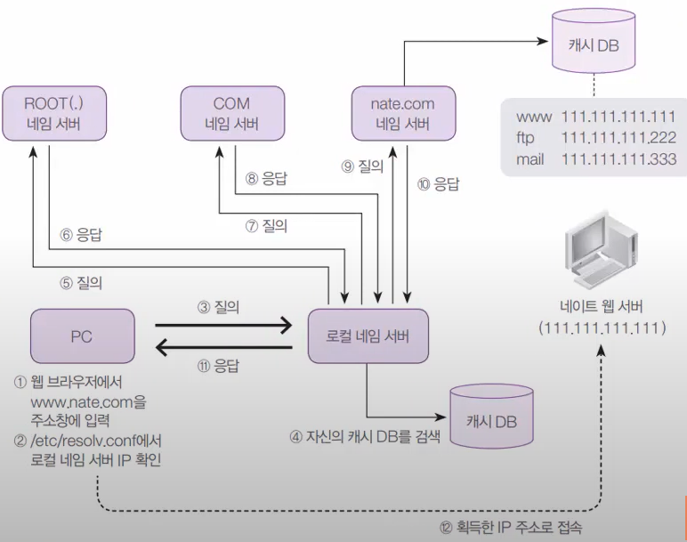
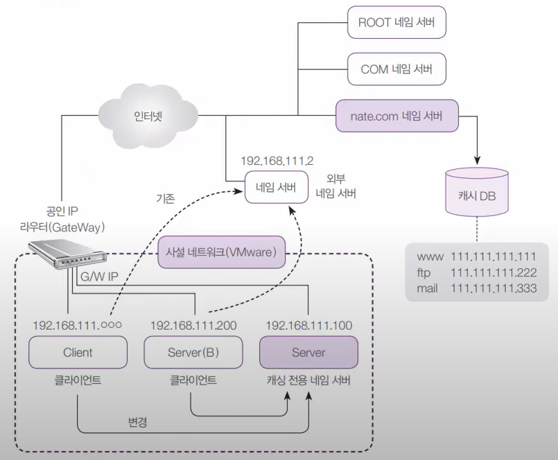
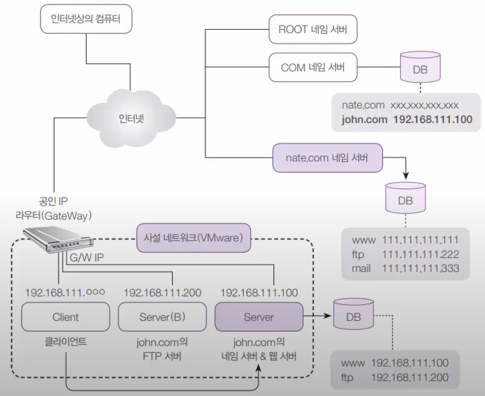
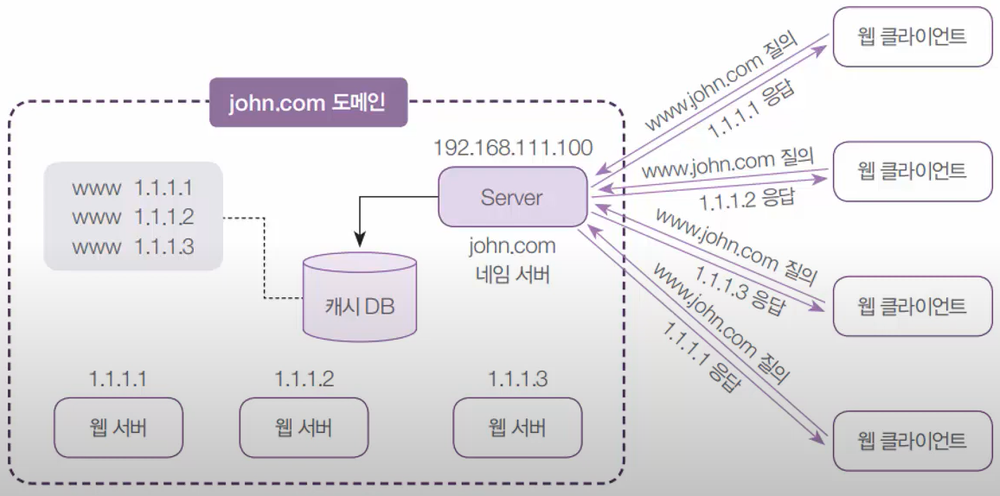

# Chapter09 Summary 네임 서버

## 09-01 네임 서버-네임서버 개념과 hosts 파일 역할

### 네임 서버 개요

- 네임 서버 = DNS(Domain Name System) 서버
- 도메인 이름을 IP 주소로 변환시켜주는 역할

1. IP 주소로 접근
   - 초창기에 네트워크 접속 방법
   - 핸드폰 전화번호를 바로 쳐서 들어가는 역할
2. hosts 파일을 이용하여 네트워크 접속
   - hosts 파일에 URL과 IP주소를 기록해 놓은 방식 사용
   - linux: `/etc/hosts`
   - windows: `C:\Windows\system32\drivers\etc\hosts`
   - 핸드폰 연락처와 같은 역할
3. 네임 서버를 이용하여 네트워크 접속
   - 네트워크 상의 컴퓨터의 모든 IP 정보 파악 무리
   - 이름 해석(Name Resolution)을 전문적으로 해주는 서버 필요
   - 전화 안내 서비스인 114와 같은 역할

### [실습1] /etc/host 파일 설정 확인

실습목표
- /etc/hosts 파일의 작동을 이해
- 네임 서버가 하는 기본적인 역할을 이해
- IP 주소를 얻기 위해 어떤 순서로 작동하는지 확인

```bash
$ nslookup  # 특정 컴퓨터의 IP 주소를 확인하는 방법
    > server  # 192.168.111.2 출력
    > www.nate.com  # 120.50.132.112
    > www.hanbit.co.kr  # 218.38.58.195

$ cat /etc/resolv.conf  # 네임 서버 확인하기
$ nano /etc/resolv.conf  # vi 상위호환 버전
    # nameserver  # nameserver 주석 처리 후 Ctrl+x후 y로 저장, 엔터

$ nano /etc/hosts  # 연락처 열기
    218.38.58.195  www.hanbit.co.kr  # 연락처에 추가
    163.239.1.17  www.nate.com  # 서강대 IP를 네이트로 저장, 네이트 접속 시 서강대로 들어가짐
```

## 09-02 네임 서버-IP획득과정, DNS개념, 캐싱전용네임서버 구축

### IP 주소를 얻는 내부 흐름



### 도메인 이름 체계

- 초창기 인터넷에는 1대의 네임 서버만으로 충분
- 인터넷이 많아짐으로 몇 대의 네임 서버로 실시간으로 인터넷 상의 수많은 컴퓨터 관리를 하기 힘듬
- 그래서 트리 구조와 같은 도메인 이름 체계를 고안
    - Root(.)도메인 -> net, com, org, edu, kr, fr, sp ...
    - kr -> co, or ...
    - co -> samsung, lg ...

### 로컬 네임 서버가 작동하는 순서



### 캐싱 전용 네임 서버

- PC에서 URL로 IP주소를 얻고자 할 때, 해당 URL의 IP 주소를 알려주는 네임 서버



### [실습2] 캐싱 전용 네임 서버 구축

실습목표
- Server 가상머신을 캐싱 전용 네임 서버로 만듬
- 네임서버와관련된 패키지를 설치, 설정파일을 수정

1. 캐싱 전용 네임 서버 구축하기

    ```bash
    $ dnf -y install bind-chroot  # 네임 서버 관련 패키지 설치
    $ vi /etc/named.conf
        :set nu  # 행번호 보기
        11행(listen-on): 127.0.0.1; -> any;
        12행(listen-on-v6): ::1; -> none;
        19행(allow-query): localhost; -> any;
        34행(dnssec-validation): yes; -> no;
        :wq
    systemctl restart named  # 재시작
    systemctl enable named  # 활성화
    systemctl status named  # 작동 확인
    firewall-config  # 방화벽
    ```
    `영구적` -> `dns` 체크 -> 상단에 `옵션` -> firewalld 다시 불러오기

    ``` bash
    $ dig @192.168.111.100 www.nate.com  # 서버 내부에서 테스트 하기
    $ nslookup
        > server  # 192.168.111.2 로 설정되어 있음
        > server 192.168.111.100  # 192.168.111.100 로 바꾸기
        > www.nate.com
    ```

2. 리눅스 클라이언트에서 DNS 주소 설정하기

    ```bash
    $ nslookup
        > server
        > exit
    whoami
    su -c 'gedit /etc/resolv.conf'
        nameserver 192.168.111.100
    $ nslookup
        > server  # 변경사항 확인    
    ```

3. 서버B에서 DNS 주소 설정하기

    ``` bash
    $ vi /etc/resolv.conf
        nameserver 192.168.111.100
    $ nslookup
        > server
        > www.nate.com
    $ dnf -y install elinks  # 텍스트로 웹브라우저 보기
    $ elinks
        www.kernel.org  # 웹브라우저 사용 가능  
    ```

4. 윈도우 클라이언트에서 DNS 주소 설정하기

    제어판 -> 네트워크 상태 및 공유 센터 -> `Ethernet0` -> `속성` -> `IPv4` -> `속성` -> 다음 DNS 서버 주소 사용 -> `192.168.111.100` -> `확인`

    DNS 초기화하기

    powershell 관리자권한으로 실행
    ```powershell
    ipconfig
    netsh interface ip set dns "Ethernet0" dhcp  # dhcp로 바꾸기
    ```

## 09-03 네임 서버-마스터네임서버 구축

### 마스터 네임 서버

- 도메인에 속해 있는 컴퓨터들의 이름을 관리
- 외부에 해당 컴퓨터의 IP주소를 알려주는 역할

 

 ### [실습3] 마스터 네임 서버 구축

실습목표
- john.com의 '마스터 네임 서버'를 설치하고 운영하자
- 간단한 웹 서비스/FTP 서비스를 제공해 봄
- 네임서버 관련 설정파일을 익힘

1. 서버A에서 웹 서버 만들고 웹페이지를 만듬

    ```bash
    $ rpm -qa httpd
    $ dnf -y install httpd  # 간단한 웹 서버 만들기
    $ systemctl start httpd
    $ firewall-config
    ```

    `영구적` -> `http`, `https` 체크 -> 상단에 `옵션` -> firewalld 다시 불러오기

    ``` bash
    $ gedit /var/www/html/index.html  # 웹 서버 초기 홈페이지
    <h1> CentOS 웹 서버 입니다.</h1>
    ```

2. 서버B에 ftp 서버 설치, FTP 서버로 설정

    ```bash
    $ dnf -y install vsftpd
    $ firewall-cmd --permanent --add-service=ftp  # ftp포트를 영구적으로 열어놓음
    $ firewall-cmd --reload  # 재시작
    $ cd /var/ftp/
    $ vi welcome.msg
    ###################################
    Welcome~~~ This is Linux FTP Server
    ###################################
    :wq
    $ vi /etc/vsftpd/vsftpd.conf
    banner_file=/var/ftp/welcome.msg  # 첫줄에 입력, # 접속 시 출력
    :wq
    $ systemctl restart vsftpd
    ```

3. 서버A 로 돌아와서

    ```bash
    $ vi /etc/named.conf

    # 제일 아래에 적어주기
    zone "john.com" IN {
            type master;
            file "john.com.db";
            allow-update { none; };
    };
    :wq

    $ cd /var/named/
    $ ls
    $ touch john.com.db
    $ vi john.com.db

    $TTL 3H
    @               SOA     @       root. ( 2 1D 1H 1W 1H )
                    IN      NS      @
                    IN      A       192.168.111.100

    www             IN      A       192.168.111.100
    ftp             IN      A       192.168.111.200
    :wq

    named-checkconf  # named.conf 파일 설정이 잘 됐는지 확인
    named-checkzone john.com john.com.db  # john.com, john.com.db 설정 확인

    systemctl restart named
    systemctl status named
    ```

4. linux 클라이언트로 가서 잘 되는지 확인

    ```bash
    $ su -c 'dnf -y install ftp'
    $ cat /etc/resolv.conf  # 네임서버가 192.168.111.100 인지 확인
    $ ftp ftp.john.com
    ```
    `www.john.com` 들어가서 확인하기

5. windows 클라이언트로 가서 잘 되는지 확인

    ```powershell
    netsh interface ip set dns "Ethernet0" static 192.168.111.100
    ```

    `www.john.com` 들어가서 확인하기

## 09-04 네임 서버-라운드로빈 네임서버

### 라운드 로빈(Round Robin)방식의 네임 서버

- 여러 대의 웹 서버를 운영, 웹 클라이언트가 서비스를 요청할 경우 교대로 서비스를 실시하도록 하는 방식



### [실습4] 라운드 로빈 방식의 네임서버 구현

실습목표
- 외부 사이트 3개를 이용해 라운드 로빈 방식으로 www.john.com 을 구현

1. 서버 터미널에서 수정

    ```bash
    $ nslookup
    > www.danawa.com  # 119.205.194.11
    > www.nate.com  # 120.50.132.112
    > www.hanbit.com  # 218.38.58.195

    $ vi /var/named/john.com.db
    www             IN      CNAME   webserver.john.com.  # 이렇게 수정
    # 아래 추가(라운드 로빈 방식으로 웹을 불러옴)
    webserver 100   IN      A       119.205.194.11
            200   IN      A       120.50.132.112
            300   IN      A       218.38.58.195

    :wq

    systemctl restart named
    systemctl status named
    ```

2. 클라이언트에서 www.john.com 을 여러번 들어가서 바뀌는지 확인
