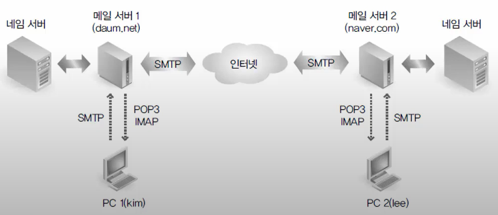
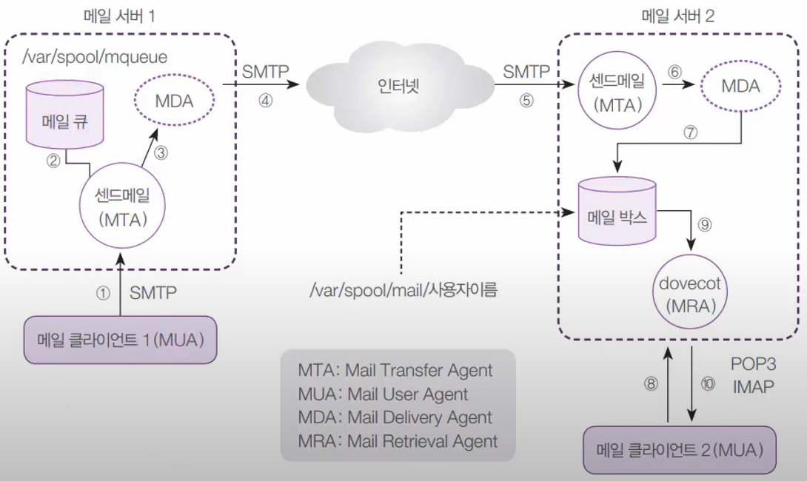
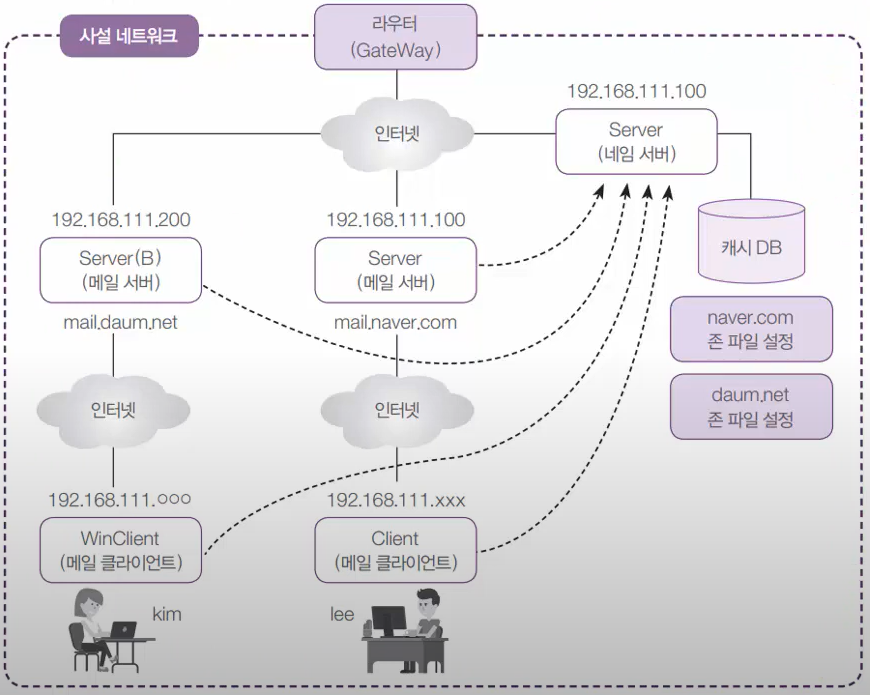
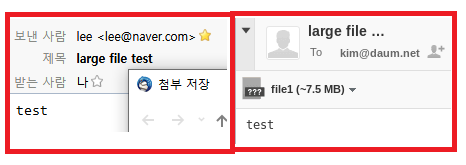

# Chapter10 Summary 메일 서버

## 10-01 메일 서버-메일서버 개념과 네임서버 구축(1)

### 메일 서버 개념



- E-Mail의 송수신에서 사용되는 프로토콜
  - SMTP(Simple Mail Transfer Protocol): 클라이언트가 메일을 보내거나 메일 서버끼리 메일을 주고 받을 때
  - POP3(Post Office Protocol): 메일 서버에서 도착되어 있는 메일을 클라이언트로 가져올 때
  - IMAP(Internet Mail Access Protocol): POP3와 같음

### 센드메일 서버의 자세한 작동 원리



### 센드메일 서버 구성도



## 10-02 메일 서버-메일서버 개념과 네임서버 구축(2)

### [실습1] 메일서버 구현을 위한 네임서버 구현

실습목표
- 메일 서버 환경을 구축하기 위해서 우선 naver.com 및 daum.net의 도메인을 관리하는 네임 서버를 구축

1. 서버A에서 메일 서버 설정

    ```bash
    $ dnf -y install sendmail  # 메일 보내기 다운
    $ nano /etc/hostname
    localhost.localdomain -> mail.naver.com  # 이걸로 수정 후 Ctrl + X(나가기) 후 Y(저장) 후 Enter
    $ nano /etc/hosts
    192.168.111.100   mail.naver.com  # 제일 아래에 추가하기
    $ nano /etc/mail/local-host-names
    mail.naver.com  # 추가
    $ nano /etc/sysconfig/network
    HOSTNAME=mail.naver.com  # 추가
    # 재부팅 후 호스트 네임이 mail.naver.com 인지 확인
    reboot
    hostname
    ```

2. 서버B에서 메일 서버 설정
    
    ```bash
    $ dnf -y install sendmail
    $ vi /etc/hostname
    localhost.localdomain -> mail.daum.net
    :wq
    $ vi /etc/hosts
    192.168.111.200   mail.daum.net  # 제일 아래에 추가
    :wq
    $ vi /etc/mail/local-host-names
    mail.daum.net  # 추가
    :wq
    $ vi /etc/sysconfig/network
    HOSTNAME=mail.daum.net
    :wq
    # 재부팅 후 호스트 네임이 mail.daum.net 인지 확인
    reboot
    $ hostname
    ```


3. 서버A를 완전한 네임 서버로 구현

    ```bash
    dnf -y install bind bind-chroot
    vi /etc/named.conf
    :set nu  # 행번호 보기
    11행(listen-on): 127.0.0.1; -> any;
    12행(listen-on-v6): ::1; -> none;
    19행(allow-query): localhost; -> any;
    34행(dnssec-validation): yes; -> no;

    # 제일 아래에
    zone "naver.com" IN {
            type master;
            file "naver.com.db";
            allow-update { none; };
    };

    zone "daum.net" IN {
            type master;
            file "daum.net.db";
            allow-update { none; };
    };
    :wq

    $ cd /var/named/
    $ ls
    $ touch naver.com.db daum.net.db
    $ vi naver.com.db

    $TTL 3H
    @               SOA     @       root. ( 2 1D 1H 1W 1H )
                    IN      NS      @
                    IN      A       192.168.111.100
                    IN      MX      10  mail.naver.com.

    mail            IN      A       192.168.111.100
    # IN MX mail.naver.com. 이부분은 메일이 오면 여기로 보내라 라는 의미
    :wq

    $ vi daum.net.db
    $TTL 3H
    @               SOA     @       root. ( 2 1D 1H 1W 1H )
                    IN      NS      @
                    IN      A       192.168.111.200
                    IN      MX      10  mail.daum.net.

    mail            IN      A       192.168.111.200
    :wq

    $ named-checkconf
    $ named-checkzone naver.com naver.com.db
    $ named-checkzone daum.net daum.net.db
    $ systemctl restart named
    $ systemctl enable named
    $ systemctl status named
    $ systemctl stop firewalld
    $ systemctl disable firewalld
    # 네임 서버가 잘 작동하는지 확인
    $ nslookup
    > server 192.158.111.100
    > mail.naver.com
    > mail.daum.net
    > exit

    # 네임 서버를 영구적으로 168.111.100번으로 지정하기
    $ vi /etc/sysconfig/network-scripts/ifcfg-ens160
    DNS1="192.168.111.100"
    :wq
    $ vi /etc/resolv.conf
    nameserver 192.168.111.100
    $ reboot  # 확실하게 하기 위해 재부팅
    ```

4. 나머지 3개의 컴퓨터에서 네임 서버를 192.168.111.100 으로 바꾸기

    서버B 터미널에서 설정

    ```bash
    $ vi /etc/sysconfig/network-scripts/ifcfg-ens160
    DNS1=192.168.111.100
    :wq
    $ vi /etc/resolv.conf
    nameserver 192.168.111.100
    :wq
    $ reboot  # 확실하게 하기 위해 재부팅
    ```

    리눅스 클라이언트 터미널에서 설정

    ```bash
    $ su -c 'gedit /etc/resolv.conf'
    nameserver 192.168.111.100
    $ nslookup
    > server  # 192.168.111.100
    > mail.naver.com  # 192.168.111.100
    > mail.daum.net  # 192.168.111.200
    ```

    윈도우 클라이언트에서 관리자 권한으로 파워쉘 접속해 설정

    ```powershell
    C:\Windows\system32> netsh interface ip set dns "Ethernet0" static 192.168.111.100
    C:\Windows\system32> nslookup
    > mail.naver.com
    > mail.daum.net
    ```

## 10-04 메일 서버-웹 메일 구축

### 웹 메일의 설치 및 사용

이전까지의 실습은 예전의 방식이고 요즘은 웹 메일의 개념으로 메일을 사용함 

- 웹 메일: 웹 브라우저에서 메일을 사용
- 라운드 큐브는 PHP로 작성, Sendmail 및 IMAP 서버(Dovecot)를 기반으로 하는 웹 메일 프로그램
- 아파치 웹 서버(httpd) 및 PHP가 설치되어야 함

### [실습3] 라운드 큐브 메일 설치

실습목표
- naver.com 메일 서버에 라운드 큐브(Roundcube)를 설치, 운영

실무에서 메일 서버를 구축하면 웹메일도 구축합니다.

1. 터미널에서 라운트큐브 설치 및 기본 설정
    
    ```bash
    # 라운드 큐브는 CentOS8 에서 제공x
    # 현재 메일 서버가 APM 웹 서버가 되어야 라운트 큐브가 가능
    # 따라서 다음 파일들을 다운로드해서 APM 웹 서버로 구현
    $ dnf -y install httpd mariadb-server php php-mysqlnd php-gd php-mbstring php-pecl-zip php-xml php-json php-intl
    $ systemctl restart httpd
    $ systemctl restart mariadb
    $ systemctl enable httpd
    $ systemctl enable mariadb

    # 라운트 큐브(1.3.10) 다운로드
    $ wget https://github.com/roundcube/roundcubemail/releases/download/1.3.10/roundcubemail-1.3.10-complete.tar.gz
    $ ls -l
    $ tar xfz roundcubemail-1.3.10-complete.tar.gz
    $ mv roundcubemail-1.3.10 roundcube
    $ mv roundcube /var/www/html/
    $ cd /var/www/html/
    $ ls -l

    # 외부에서도 사용이 가능해야돼 권한 변경
    $ chmod 777 roundcube/temp/
    $ chmod 777 roundcube/logs/

    $ mysql
    # email DB 만들기
    > CREATE DATABASE emailDB;
    # email 사용자 만들기
    > GRANT ALL ON emailDB.* TO 'emailAdmin'@'localhost' IDENTIFIED BY '1234';
    # 적용
    > FLUSH PRIVILEGES;
    > exit
    ```

2. 라운트 큐브 웹에서 기본 설정

    웹에서 mail.naver.com/roundcube/installer 들어가기(웹 메일 설정하기)

    - 제일 아래로 내려서 `NEXT`
    - product_name -> This is Linux
    - Database setup -> 디비 서버: `naver`, 디비이름: `emailDB`, 아이디: `emailAdmin`, 비번: `1234`
    - 제일 아래 `CREATE CONFIG`
    - `Download` -> `Save` 하기

3. 기본 설정값 파일 옮기기

    ```bash
    $ mv /root/다운로드/config.inc.php /var/www/html/roundcube/config/
    $ chmod 707 /var/www/html/roundcube/config/config.inc.php
    ```

4. 웹으로 돌아가서 더 설정하기

   - 약간만 내려서 `CONTINUE` 하고 DSN OK를 확인
   - `Initialize database` 클릭(데이터베이스 설정 완료)
   - Sender: `lee@naver.com`
   - Recipient: `lee@naver.com`
   - `Test` 버튼으로 확인
   - Username: `lee`, pw: `lee`로 설정 후 `Check login` 클릭
5. 웹서버에서 첨부파일 크기 조절하기

    ```bash
    $ vi /etc/php.ini
    :set nu
    383행(max_execution): 30 -> 300 으로 변경
    672행(post_max_size): 500M 로 변경
    825행(upload_max_filesize): 500M 로 변경
    :wq

    $ reboot
    # 재부팅 후
    $ cp /boot/vmlinuz-4.18~ file1
    $ ls -l
    ```

6. 웹으로 가서 첨부해서 보내보기

    mail.naver.com/roundcube/ 들어가서 로그인 후 
    `Settings` -> `Identities` -> Email을 lee@naver.com으로 바꾸기
    보내보기


