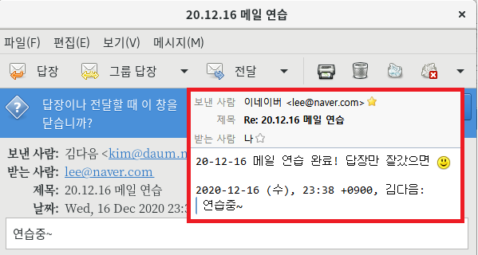

## 10-03 메일 서버-메일 서버 구축

### [실습2] 메일서버 구현

실습목표
- naver.com 메일 서버와 daum.net 메일 서버를 구축
- sendmail, dovecot 패키지의 설치 및 설정을 알아 봄
- 메일 클라이언트 사용법을 익힘

우선 sendmail과 dovecot를 서버A, B 각각에 설치해야 함

설치 내용은 전반적으로 같고, 주소와 아이피만 다르게 설정

1. 서버A 설정

    ```bash
    # sendmail과 dovecot 설치
    $ dnf -y install sendmail-cf dovecot
    # 1. sendmail 설정하기
    $ vi /etc/mail/sendmail.cf  # sendmail 설정하기
    :set nu
    85행(Cwlocalhost): Cwlocalhost -> Cwnaver.com
    267행(O Daemon): Addr=127.0.0.1, -> 삭제
    :wq
    $ vi /etc/mail/access  # 메일을 전달하는 기능 아래에 추가
    naver.com       RELAY
    daum.net        RELAY
    192.168.111     RELAY
    :wq
    $ makemap hash /etc/mail/access < /etc/mail/access  # 설정한 내용 적용하기
    # 2. dovecot 설정하기
    # 서버 설정이 목표기 때문에 설명 생략, 이 파일은 복잡함
    # 메일 서버는 설정할게 정말 많음, 글자 틀리는거 주의하기 바람
    $ vi /etc/dovecot/dovecot.conf
    :set nu
    24행(protocol): 주석 해제
    30행(listen): 주석 해제
    33행(base_dir): 주석 해제
    :wq
    $ vi /etc/dovecot/conf.d/10-ssl.conf
    8행(ssl): ssl = yes 로 수정
    :wq
    $ vi /etc/dovecot/conf.d/10-mail.conf
    :set nu
    25행(mail_location): 주석 제거 
    121행(mail_access_groups): 주석 제거 후 뒤에 mail 추가
    166행(lock_method): 주석 제거
    :wq
    # 3. 사용자 계정 만들기(회원가입으로 생각)
    $ useradd lee
    $ passwd lee
    # 4. 서비스 재시작 및 활성화
    $ systemctl restart sendmail
    $ systemctl enable sendmail
    $ systemctl restart dovecot
    $ systemctl enable dovecot
    ```

2. 서버B 설정

    ```bash
    # sendmail과 dovecot 설치
    $ dnf -y install sendmail-cf dovecot
    # 1. sendmail 설정하기
    $ vi /etc/mail/sendmail.cf  # sendmail 설정하기
    :set nu
    85행(Cwlocalhost): Cwlocalhost -> Cwdaum.net
    267행(O Daemon): Addr=127.0.0.1, -> 삭제
    :wq
    $ vi /etc/mail/access  # 메일을 전달하는 기능 아래에 추가
    naver.com       RELAY
    daum.net        RELAY
    192.168.111     RELAY
    :wq
    $ makemap hash /etc/mail/access < /etc/mail/access  # 설정한 내용 적용하기
    # 2. dovecot 설정하기
    # 서버 설정이 목표기 때문에 설명 생략, 이 파일은 복잡함
    # 메일 서버는 설정할게 정말 많음, 글자 틀리는거 주의하기 바람
    $ vi /etc/dovecot/dovecot.conf
    :set nu
    24행(protocol): 주석 해제
    30행(listen): 주석 해제
    33행(base_dir): 주석 해제
    :wq
    $ vi /etc/dovecot/conf.d/10-ssl.conf
    8행(ssl): ssl = yes 로 수정
    :wq
    $ vi /etc/dovecot/conf.d/10-mail.conf
    :set nu
    25행(mail_location): 주석 제거 
    121행(mail_access_groups): 주석 제거 후 뒤에 mail 추가
    166행(lock_method): 주석 제거
    :wq
    # 3. 사용자 계정 만들기(회원가입으로 생각)
    $ useradd kim
    $ passwd kim
    # 4. 서비스 재시작 및 활성화
    $ systemctl restart sendmail
    $ systemctl enable sendmail
    $ systemctl restart dovecot
    $ systemctl enable dovecot
    # 5. 방화벽 끄기
    $ systemctl stop firewalld
    $ systemctl disable firewalld
    ```

3. 리눅스 클라이언트에서 접속

    에볼루션 설정

    1. 환영합니다.
        다음
    2. 백업에서 복구
        다음
    3. 신상 정보(계정 생성)
        전체 이름: `이네이버`, 전자메일 주소: `lee@naver.com`, 다음
    4. 메일 받기
        서버 종류: `POP` -> 서버: `mail.naver.com`, 사용자 이름: `lee`, 암호화 방식: `TLS(특정 포트 사용)`, 다음 -> 다음
    5. 메일 보내기
        서버: `mail.naver.com`
    6. 계정 요약
        다음
    7. 완료
        적용

4. 윈도우 클라이언트에서 접속

    썬더버드 다운 링크 -> [https://download-installer.cdn.mozilla.net/pub/thunderbird/releases/52.8.0/win32/ko/Thunderbird%20Setup%2052.8.0.exe](https://download-installer.cdn.mozilla.net/pub/thunderbird/releases/52.8.0/win32/ko/Thunderbird%20Setup%2052.8.0.exe)

    1. 새 계정 만들기 (메일) -> 건너뛰기
    2. 메일 계정 설정 이름: `김다음`, 메일 주소: `kim@daum.net`, 암호: `kim`, 계속
    3. `POP3`, 완료
    4. `mail.daum.net110` 보안 예외 확인
    5. 계정 위에 마우스 오른쪽 버튼 -> 설정 -> 보내는 서버 -> 편집 -> 보안 연결 없음 -> 인증 방식 없음 -> 확인

    5. 메일 주고 받아보기 결과

    