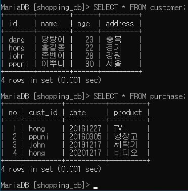
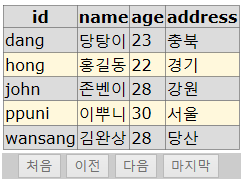
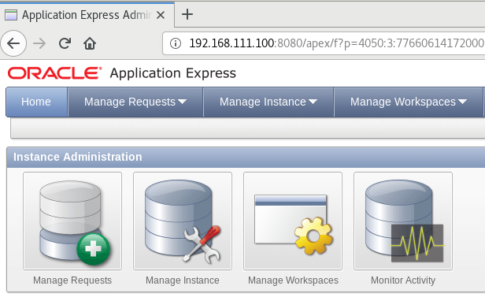
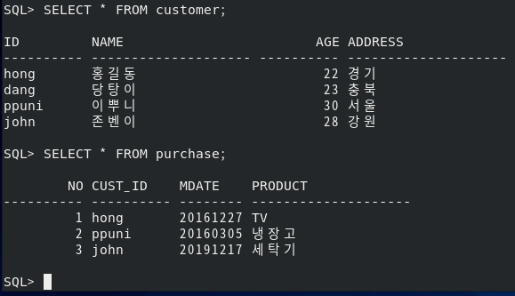

# Chapter11 Summary 데이터베이스 서버

## 11-01 데이터베이스 서버-DBMS 개념과 SQL문

### DBMS 개념

- Data: 자료
- Table: 데이터를 표 형식으로 표현
- Database: 테이블의 집합, 테이블을 저장하는 저장 공간
- DBMS: DataBase Management System
- RDBMS: Relational DBMS
- Record or Row: 행
- Field or Column: 열
- Data Type: 각 필드에 입력할 값의 타입(정수, 문자, 날짜 등)
- Field name: 각 필드(열)의 이름
- SQL(Structured Query Language): 구조화된 질의 언어

### 필수 SQL 구문

1. DB 관련
   - DB 이름 조회: `SHOW DATABASES;`
   - 사용할 DB: `USE db_name;`
   - DB 생성: `CREATE DATABASE db_name`
   - DB 삭제: `DROP DATABASE db_name`
2. 테이블 관련
   - 테이블 이름 조회: `SHOW TABLES`
   - 테이블 구조 조회: `EXPLAIN table_name`, `DESC table_name`
   - 테이블 생성: `CREATE TABLE table_name (field_name1, field_type1, ...)`
   - 테이블 삭제: `DROP TABLE table_name`
   - 테이블 수정: `ALTER TABLE table_name <option>`
     - `MODIFY name CHAR(20)`: 필드 타입 바꾸기
     - `CHANGE name fullname CHAR(10)`: 필드 바꾸기
     - `ADD phone VARCHAR(20) AFTER name;`: 필드 추가
     - `DROP age`: 필드 삭제 
3. 레코드 관련
   - `INSERT INTO table_name VALUES (값1, 값2, ...);`: 레코드 삽입
   - `DELETE FROM table_name WHERE 조건;`: 레코드 삭제
   - `UPDATE table_name SET 필드이름1=수정할값1, ... WHERE 조건;`: 레코드 수정
4. 테이블 조회
   - `SELECT 필드이름1, 필드이름2, ... FROM 테이블이름 WHERE 조건;`

## 11-02 데이터베이스 서버-MariaDB 설치

### [실습1] MariaDB 운영

실습목표
- Server 가상머신을 DBMS 전용 서버로 운영
- MariaDB 최신 버전을 별로로 다운해 설치

서버A 초기화 이후 인터넷에서 마리아(10.4.10) 다운로드

파일 4개 다운로드 링크 ->
- MariaDB/Galera [http://dw.hanbit.co.kr/centos/8/galera-4-26.4.3-1.rhel8.0.el8.x86_64.rpm](http://dw.hanbit.co.kr/centos/8/galera-4-26.4.3-1.rhel8.0.el8.x86_64.rpm)
- MariaDB/client [http://dw.hanbit.co.kr/centos/8/MariaDB-client-10.4.10-1.el8.x86_64.rpm](http://dw.hanbit.co.kr/centos/8/MariaDB-client-10.4.10-1.el8.x86_64.rpm)
- MariaDB/common [http://dw.hanbit.co.kr/centos/8/MariaDB-common-10.4.10-1.el8.x86_64.rpm](http://dw.hanbit.co.kr/centos/8/MariaDB-common-10.4.10-1.el8.x86_64.rpm)
- MariaDB/server [http://dw.hanbit.co.kr/centos/8/MariaDB-server-10.4.10-1.el8.x86_64.rpm](http://dw.hanbit.co.kr/centos/8/MariaDB-server-10.4.10-1.el8.x86_64.rpm)

다운로드 후 터미널에서

```bash
$ cd 다운로드/
$ ls -l
$ dnf -y install ga*.rpm
$ dnf -y install Maria*.rpm
$ systemctl restart mariadb
$ systemctl enable mariadb
$ systemctl status mariadb
$ firewall-config  # 영구적으로 mysql 포트 열어주기
$ mysql  # 잘 동작하는지 확인
> exit  # Bye 메시지 출력
```

## 11-03 데이터베이스 서버-Windows에서 접속

### [실습2] Windows에서 MariaDB로 접속

실습목표
- MariaDB의 기본적인 보안을 설정, Windows에서 리눅스의 MariaDB 서버에 접속해 사용해 봄
- MariaDB의 보안에 대해 이해

```bash
# mysql 패스워드 설정
$ mysql -h localhost -u root -p  # 패스워드 없이 잘 들어가짐
$ mysqladmin -u root password '1234'  # 패스워드 설정
$ mysql -h localhost -u root -p  # 패스워드 입력
```

윈도우 클라이언트에서
마리아DB 클라이언트(10.5.8) 다운로드 링크 -> [https://downloads.mariadb.org/interstitial/mariadb-10.5.8/win32-packages/mariadb-10.5.8-win32.msi/from/https%3A//mirror.yongbok.net/mariadb/](https://downloads.mariadb.org/interstitial/mariadb-10.5.8/win32-packages/mariadb-10.5.8-win32.msi/from/https%3A//mirror.yongbok.net/mariadb/)

프로그램 설치 시 Client Programs 만 설치

파워쉘에서

```powershell
$ cd "c:\Program Files\MariaDB 10.5\bin"
$ dir mysql.exe
$ .\mysql  # 접속 불가, 자기 자신에 접속하려고 해서
$ .\mysql -h 192.168.111.100 -u root -p  # 접속 불가
# 사실 root 뒤에 @ 하고 local 호스트라고 적혀있다.(root@localhost)
```

서버 터미널에서

```bash
> GRANT ALL ON *.* TO winuser@'192.168.111.%' IDENTIFIED BY '4321';
# %는 모든 번호가 가능하다는 의미
```

다시 파워쉘에서

```powershell
$ .\mysql -h 192.168.111.100 -u winuser -p  # 4321 입력하면 접속 완료
```

## 11-04 데이터베이스 서버-데이터베이스 생성과 운영

### [실습3] 쇼핑몰 DB 구축

실습목표
- 쇼핑몰 DB를 MariaDB 서버에 구축
- SQL 구문이 익숙해지도록 연습

cmd 창에서

```powershell
$ cd "\Program Files\MariaDB 10.5\bin"
$ mysql -h 192.168.111.100 -u winuser -p
```

```sql
CREATE DATABASE shopping_db;
USE shopping_db;
DROP DATABASE shopping_db;
CREATE DATABASE shopping_db CHARACTER SET utf8;
USE shopping_db;

CREATE TABLE customer ( id VARCHAR(10) NOT NULL PRIMARY KEY, name VARCHAR(5), age INT, address VARCHAR(5) );

CREATE TABLE purchase ( no INT NOT NULL PRIMARY KEY AUTO_INCREMENT, cust_id VARCHAR(10), date CHAR(8), product VARCHAR(5) );

DESC customer;
DESC purchase;

INSERT INTO customer VALUES ('hong', '홍길동', 22, '경기');
INSERT INTO customer VALUES ('dang', '당탕이', 23, '충북');
INSERT INTO customer VALUES ('ppuni', '이뿌니', 30, '서울');
INSERT INTO customer VALUES ('john', '존벤이', 28, '강원');

INSERT INTO purchase VALUES (null, 'hong', 20161227, 'TV');
INSERT INTO purchase VALUES (null, 'ppuni', 20160305, '냉장고');
INSERT INTO purchase VALUES (null, 'john', 20191217, '세탁기');
INSERT INTO purchase VALUES (null, 'hong', 20201217, '비디오');

SELECT * FROM customer;
SELECT * FROM purchase;
```



## 11-05 데이터베이스 서버-Visual Studio와 MariaDB 연동

### [실습4] Visual Studio와 MariaDB 연동

실습목표
- Windows의 Visual Studio와 리눅스 MariaDB를 연동하는 방법을 확인
- 무료 프로그램인 Visual Studio 2015의 기본적 사용법을 익힘
- ODBC 설정 방법을 알아봄

구성도
- 웹(외부 PC) <-> Window(비주얼 스튜디오 <-> ODBC) <-> Linux(MariaDB <-> DB)

Windows 클라이언트에서

Visual Studio 2015 다운로드 링크 -> [http://download.hanbit.co.kr/centos/8/ko_visual_studio_community_2015_with_update_3.exe](http://download.hanbit.co.kr/centos/8/ko_visual_studio_community_2015_with_update_3.exe)

    사용자 지정 설치 -> Web Developer Tool 만 다운로드(오래 걸림 15분 이상)

MySQL Connetor ODBC(8.0.22) 다운로드 링크 -> [https://dev.mysql.com/get/Downloads/Connector-ODBC/8.0/mysql-connector-odbc-8.0.22-win32.msi](https://dev.mysql.com/get/Downloads/Connector-ODBC/8.0/mysql-connector-odbc-8.0.22-win32.msi)

    설치 후 -> 시작 검색에 ODBC 데이터 원본 -> 시스템 DSN 클릭 -> 추가 -> MySQL ODBC Unicode Driver -> 이름: Maria ODBC -> TCP서버: 192.168.111.100, 사용자: winuser, 비밀번호: 4321, DB: shopping_db -> OK

비주얼 스튜디오에서

    파일 -> 새로만들기 -> 웹 사이트 -> ASP.NET 빈 웹 사이트 -> 확인 

    오른쪽 사이드에 솔루션 탐색기 -> 웹사이트 오른쪽 클릭 -> 추가 -> 웹 폼 -> 확인

    웹 폼은 사용자가 사용할 수 있는 간단한 GUI 화면, 왼쪽 아래 디자인 클릭 ->

    도구상자 -> 데이터 -> 
    
    SqlDataSource(DB연결) -> '>' 클릭 후 데이터 소스 구성 -> 새 연결 -> Microsoft ODBC 데이터 소스 -> 사용자 또는 시스템 데이터 소스 이름 사용에 MariaODBC -> 로그인 정보 -> winuser, 비밀번호: 4321 -> 연결 테스트 -> 다음 -> 사용자 지정 SQL 또는 저장 프로시저 지정 -> SQL 문 SELECT * FROM customer -> 쿼리 테스트 -> 다음 -> 마침

    도구상자 -> 데이터 -> 

    ListView -> 데이터 소스 구성 -> SqlDataSource1 -> ListView 구성 -> 표, 전문가, 페이징 사용 -> 확인

    파일 -> 모두 저장, 파일 -> 브라우저에서 보기



## 11-06 데이터베이스 서버-Oralce 데이터베이스

### [실습5] Oracle Database Express 11g 설치

실습목표
- Server에 리눅스용 Oracle Database Express 11g를 설치

오라클 다운로드 링크 -> [http://download.hanbit.co.kr/centos/8/oracle-xe-11.2.0-1.0.x86_64.rpm.zip](http://download.hanbit.co.kr/centos/8/oracle-xe-11.2.0-1.0.x86_64.rpm.zip)


```bash
# 1. 오라클 설치 전 작업
dnf -y install libnsl

# 2. 오라클 다운로드된 곳에 가 오라클 설치
$ cd 다운로드/
$ ls -l
$ unzip oracle*
$ cd Disk1/
$ ls -l
$ dnf -y install oracle*.rpm
# 3. 오라클 설정
$ service oracle-xe configure
# 포트 8080, 1521 기억해두기
# 시스템 비밀번호 1234 지정 enter x2, then enter

# 4. 서비스 설정
$ systemctl restart oracle-xe
$ systemctl enable oracle-xe
$ systemctl status oracle-xe

$ . /u01/app/oracle/product/11.2.0/xe/bin/oracle_env.sh  # 이 파일을 실행해야 함
$ gedit /etc/bashrc  # 컴퓨터를 실행할 때 자동으로 실행해주기
# 제일 밑에 추가하기
> . /u01/app/oracle/product/11.2.0/xe/bin/oracle_env.sh

# 5. 방화벽 포트 열기
$ firewall-cmd --permanent --add-port=8080/tcp
$ firewall-cmd --permanent --add-port=1521/tcp
$ firewall-cmd --reload
```

웹에서 오라클 서버 들어가기 -> 192.168.111.100:8080/apex
- Workspace -> internal
- Username ADMIN
- Password -> 1234



### [실습6] Oracle에서 쇼핑몰 DB 구축

실습목표
- 쇼핑몰 DB를 Oracle에서 구축
- SQL*Plus 사용법을 익힘

Server 터미널에서

```bash
$ mkdir /oradata
$ chmod 777 /oradata/
$ sqlplus  # oracle 들어가기
> system
> 1234
```

```SQL
CREATE TABLESPACE shopping_db DATAFILE '/oradata/shop.dbf' SIZE 5M;
SELECT tablespace_name FROM DBA_DATA_FILES;
CREATE TABLE customer ( id VARCHAR(10) NOT NULL PRIMARY KEY, name NCHAR(5), age INT, address NCHAR(5) ) TABLESPACE shopping_db;
CREATE TABLE purchase ( no INT NOT NULL PRIMARY KEY, cust_id VARCHAR(10), mdate CHAR(8), product NCHAR(5) ) TABLESPACE shopping_db;

DESC customer;
DESC purchase;

INSERT INTO customer VALUES ('hong', '홍길동', 22, '경기');
INSERT INTO customer VALUES ('dang', '당탕이', 23, '충북');
INSERT INTO customer VALUES ('ppuni', '이뿌니', 30, '서울');
INSERT INTO customer VALUES ('john', '존벤이', 28, '강원');

INSERT INTO purchase VALUES (1, 'hong', 20161227, 'TV');
INSERT INTO purchase VALUES (2, 'ppuni', 20160305, '냉장고');
INSERT INTO purchase VALUES (3, 'john', 20191217, '세탁기');
INSERT INTO purchase VALUES (4, 'hong', 20201217, '비디오');

SELECT * FROM customer;
SELECT * FROM purchase;
```


