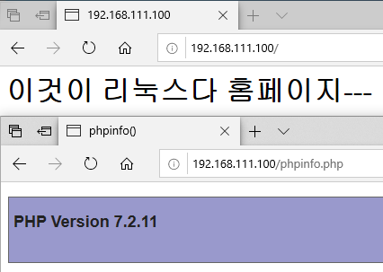
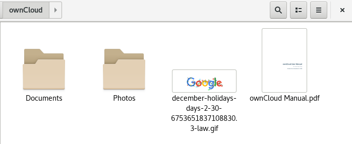

# Chapter12 Summary 웹 서버

## 12-01 웹 서버-dnf로 APM 설치

### APM 개요

- 리눅스를 가장 많이 활용하는 분야가 웹 서버
- 가장 안정적이고 유명한 Apache 웹 서버 
- APM = Apache 웹 서버 + 프로그래밍 언어 PHP + 데이터베이스 MariaDB
- 리눅스 환경에서 사용될 경우 LAPM(Linux, Apache, PHP, MariaDB)이라고도 부름
- APM이라는 소프트웨어는 존재하지 않으며 이 3가지가 서로 잘 연동되어 운영되도록 - 만든 환경을 APM이라고 부르는 것임
- CentOS는 DNF 명령으로 편리한 설치를 제공

### [실습1] dnf로 웹 서버 설치

실습목표
- 간단하게 dnf 명령으로 웹 서버를 설치
- 추가할 패키지 httpd php php-mysqlnd mariadb-server을 설치

서버 초기화 후 터미널에서

```bash
$ rpm -qa httpd php mariadb-server  # 설치 확인하기
$ dnf -y install httpd php php-mysqlnd mariadb-server  # 설치
$ rpm -qa httpd php mariadb-server  # 버전 확인하기
$ systemctl restart httpd
$ systemctl enable httpd
$ systemctl status httpd
$ systemctl restart mariadb
$ systemctl enable mariadb
$ systemctl status mariadb
# php는 서비스가 아니라 아파치에 포함된 기능이기 때문에 별도로 작동할게 없음
# amp 중에서 아파치와 마리아디비 마이에스큐엘만 작동시키면됨

# 웹 서버의 홈페이지 만들기
$ cd /var/www/html  # 웹 서버
$ nano index.html
> <h1>이것이 리눅스다 홈페이지---</h1>
# Ctrl+X, Y, Enter
```

웹에서 -> `localhost` 로 들어가서 잘 되는지 확인

```bash
$ nano phpinfo.php
> <?php phpinfo(); ?>
# Ctrl+X, Y, Enter
```

웹에서 -> `localhost/phpinfo.php` 로 들어가서 잘 되는지 확인, apm이 잘 작동

```bash
$ firewall-config  # 웹 서버 포트(http, https) 열기
$ firewall-cmd --permanent --add-service=http
$ firewall-cmd --permanent --add-service=https
$ firewall-cmd --reload
```

윈도우 클라이언트에서

- `192.168.111.100`으로 들어가서 잘 되는지 확인
- `192.168.111.100/phpinfo.php` 잘 되는지 확인



## 12-02 웹 서버-워드프레스 활용

### [실습2] 워드프레스 설치 및 운영

실습목표
- 오픈 소스 웹사이트 통합 구성 도구인, 워드프레스를 설치하여 운영
- 간단한 웹 사이트를 만드는 방법을 익힘

서버 터미널에서

```bash
$ mysql
```

```sql
CREATE DATABASE wpDB;
GRANT ALL PRIVILEGES ON wpDB.* TO wpUser@localhost IDENTIFIED BY '1234';
exit
```

```bash
# wordpress 다운로드
$ wget https://ko.wordpress.org/wordpress-4.9.6-ko_KR.tar.gz
$ ls -l word*
$ tar xfz word*
# 홈페이지로 옮기기
$ mv wordpress /var/www/html
$ cd /var/www/html/
$ ls -l
$ chmod 707 wordpress/  # 외부에서 접근 가능하도록 하기
$ chown -R apache.apache wordpress/  # 소유주 바꾸기
# 설정하기
$ cd wordpress/
$ ls
# 샘플로 제공하는 것을 복사해 수정하기
$ cp wp-config-sample.php wp-config.php
$ gedit wp-config.php
> 23행(define): 'database_name_here' -> 'wpDB' 수정
> 26행(define): 'username_here' -> 'wpUser' 수정
> 29행(define): 'password here' -> '1234' 수정

# 웹 서버 설정파일 편집
$ vi /etc/httpd/conf/httpd.conf
> :set number
> 122행(Document): '/var/www/html/wordpress' 로 수정
> 134행(<Directory): '/var/www/html/wordpress' 로 수정
> 154행(Allow): 'None' -> 'All' 로 수정
> :wq
$ systemctl restart httpd
```

웹에서 -> `localhost` 로 들어가서 설정

사용자명: wpAdmin, 비밀번호: 1234, 이메일 아무거나 쓰고 설정 완료 후 로그인

워드프로세스 자체 사용법 익히기

테마 변경 -> WordPress.org 테마 -> 사용자 정의하기 -> 공개

웹 껏다 켜서 `192.168.111.100`으로 접속해 확인하고 win 클라이언트에서도 확인

## 12-03 웹 서버-클라우드 서비스 활용

### 클라우드 서비스 구축

AWS, Azure, Google Drive 등의 서비스를 의미, 웹 하드 기능까지 포함

### [실습3] 클라우드 서비스 설치 및 운영

실습목표
- 클라우드 오픈소스인 ownCloud 커뮤니티 에디션을 설치 운영
- 리눅스, Windows, 스마트폰에서 접속해 사용

서버 초기화 후 터미널에서

```bash
$ dnf -y install httpd mariadb-server php php-mysqlnd php-gd php-mbstring php-pecl-zip php-xml php-json php-intl
$ systemctl restart mariadb
$ systemctl enable mariadb
$ mysql
```

```sql
GRANT ALL ON webDB.* TO webUser@localhost IDENTIFIED BY '1234';
exit
```

```bash
$ firewall-cmd --permanent --add-service=http
$ firewall-cmd --permanent --add-service=https
$ firewall-cmd --reload
$ cd /var/www/html/
$ pwd
$ wget http://download.hanbit.co.kr/centos/8/owncloud-10.3.1.zip  # 10.3.1 다운로드
$ unzip -q owncloud-10.3.1.zip
# 웹 서버 설정
$ mkdir owncloud/data
$ chown -R apache.apache owncloud  # apache 사용자, 그룹에 소유 넘기기
$ chmod -R 755 owncloud
$ systemctl restart httpd
$ systemctl enable httpd
```

윈도우 클라이언트에서

`192.168.111.100/owncloud/index.php` 들어가기

admin, 1234로 계정 생성, 데이터베이스: MySQL/MariaDB, 입력 정보들: webUser, 1234, webDB, localhost로 설정하고 설치 완료

오른쪽 admin으로 가서 사용자, 일반 사용자 계정 관리

사용자 만들기 thisUser, this@hanbit.co.kr, Users 그룹 만들고 그룹 설정, 만들기, 할당량 제한 가능

다시 웹 켜기 -> `192.168.111.100/owncloud` -> 로그인 하기

owncloud-client(2.7.4) 32bit 다운로드 링크 -> [https://download.owncloud.com/desktop/ownCloud/stable/2.7/win/ownCloud-2.7.4.2934.x86.msi](https://download.owncloud.com/desktop/ownCloud/stable/2.7/win/ownCloud-2.7.4.2934.x86.msi)

기본값으로 설정 후 저장, 재부팅 후 owncloud 실행

서버 주소 `http://192.168.111.100/owncloud/` 설정 다음 -> thisUser, 1234로 로그인 후 폴더 설정하기 -> 연결

동기화 후 ownclound 폴더 열고 확인

리눅스 클라이언트 터미널에서

```bash
$ su
$ cd /etc/yum.repos.d/
# 다운로드
$ wget https://download.opensuse.org/repositories/isv:ownCloud:desktop/CentOS_8/isv:ownCloud:desktop.repo
$ ls -l
$ dnf -y install owncloud-client
$ exit
$ owncloud &
```

서버 주소 `http://192.168.111.100/owncloud/` 설정 다음 -> thisUser, 1234로 로그인 후 폴더 설정하기 -> 연결

파일 -> onwcloud로 안에 파일들 확인


