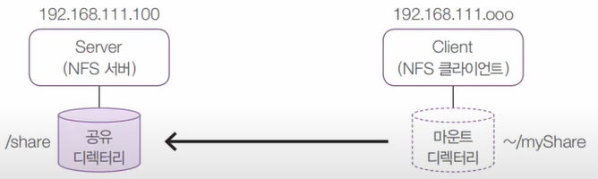
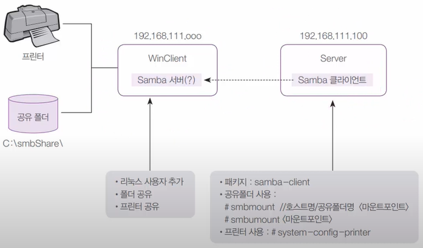
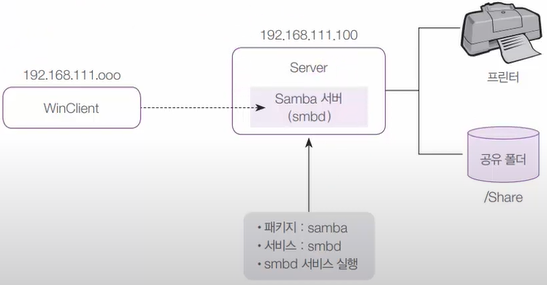
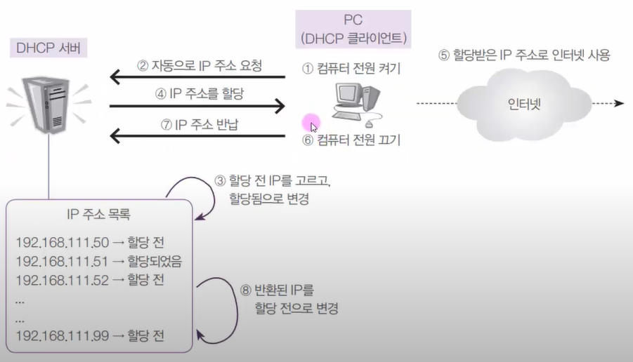
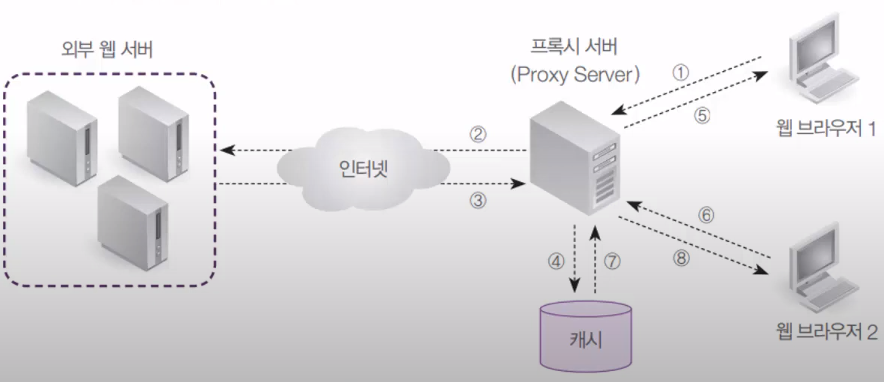
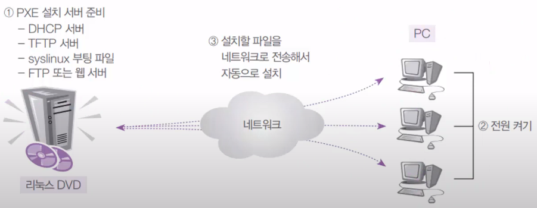

# Chapter13 ~ 19 Summary

## 13-01 FTP 서버-vsftpd, pure-ftpd 설치

### FTP 개요

- FTP(File Transfer Protocol)는 파일을 전송하기 위한 서비스
- 웹에서 FTP의 고유 기능인 파일 전송을 편리하게 할 수 있게 되어 예전보다 인기가 많이 떨어짐
- 파일 전송 자체를 위해서는 성능이 뛰어남
- vsftpd는 CentOS에서 제공
  - vsftpd(Very Secure FTPD)는 CentOS에서 기본적으로 제공
  - 유닉스, 리눅스 환경에서 보안성, 성능 우수한 FTP 서버로 인정
  - pure-ftpd도 많이 사용됨

### [실습1] vsftpd 설치 및 운영

실습목표
- vsFTPD(Very Secure FTPD)를 설치/운영
- 익명(anonymous)사용자도 업로드 되도록 설정
- vsftpd.conf 파일의 설정법을 익힘

서버 터미널에서

```bash
$ dnf -y install vsftpd  # vsftpd 설치
$ cd /var/ftp/
$ pwd
$ ls
$ cd pub  # 이 파일에 보통 파일 업로드, 다운로드를 함
$ ls
$ cp /boot/vmlinuz-4* file1
$ systemctl restart vsftpd
$ systemctl enable vsftpd
$ systemctl stop firewalld  # 방화벽 끄기
$ gedit /etc/vsftpd/vsftpd.conf
> 12행(anonymous): NO -> YES  # 익명 사용자 접속 허용
$ systemctl restart vsftpd
```

윈도우 클라이언트에서

FileZila FTP 클라이언트(3.33.0) 32bit 다운로드 링크 -> [http://download.hanbit.co.kr/fedora/28/FileZilla_3.33.0_win32-setup_bundled.exe](http://download.hanbit.co.kr/fedora/28/FileZilla_3.33.0_win32-setup_bundled.exe)

기본 값으로 설치 후 FileZilla 프로그램에서

호스트: `192.168.111.100` 사용자명: `anonymous` 비밀번호 `아무거나` -> 빠른 연결

윈도우에서 업로드 하면 실패, 보안상 업로드는 실패

서버로 돌아가서 설정 변경

```bash
$ vi /etc/vsftpd/vsftpd.conf
> :set nu
> 19행(wirte_enable): YES
> 29행(anon_upload): 주석 지우기
> 33행(anon_mkdir_write_enable): 주석 지우기
> :wq
$ cd ..
$ ls -l
$ chown ftp.ftp pub/
$ systemctl restart vsftpd
```

윈도우 클라이언트에서 업로드를 다시 해보면 잘 되는지 확인

서버B 에서 해보기

```bash
# ncftp 다운로드
$ wget http://dw.hanbit.co.kr/centos/8/ncftp-3.2.5-17.fc30.x86_64.rpm
$ ls
$ dnf -y install ncftp*.rpm  # Fedora 파일이지만 사용 가능
$ ncftp 192.168.111.100
> ls
> cd pub
> ls
> ls -l
> get file1  # file1 다운로드
> bye  # 종료
```

### vsftpd.conf 옵션

- anonymous_enable: 익명 사용자의 접속 허가 여부 설정
- local_enable: 로컬 사용자의 접속 허가 여부 설정
- write_enable: 로컬 사용자가 저장, 삭제, 디렉터리 생성 등의 명령 실행 여부 설정
- anon_upload_enable: 익명 사용자의 파일 업로드 허가 여부 설정
- dirlist_enable: 접속한 디렉터리의 파일 리스트를 보여줄지 설정
- download_enable: 다운로드의 허가 여부를 설정
- listen_port: FTP 서비스의 포트 번호를 설정(기본:21번)

### [실습2] Pure_FTPd 설치 및 운영

실습목표
- Pure_FTPd를 설치/운영

서버 A 터미널에서

```bash
dnf -y remove vsftpd
wget http://dw.hanbit.co.kr/centos/8/pure-ftpd-1.0.49-2.epel8.playground.x86_64.rpm
ls
dnf -y install pur*.rpm
vi /etc/pure-ftpd/pure-ftpd.conf
:set nu
77행(NoAnonymous) -> no
279행(AnonymousCantUpload) -> no
:wq
systemctl restart pure-ftpd
cd /var/ftp/
ls
rm -rf *
mkdir upload download
chmod 333 upload/
chown ftp.ftp upload download
ls -l
cp /boot/vmlinuz-4* download/file2
```

윈도우 클라이언트에 FileZilla에서 재접속 후

호스트: `192.168.111.100` 사용자명: `anonymous` 비밀번호 `아무거나` -> 빠른 연결

업로드 다운로드 해보기

## 14-01 NFS 서버-nfs 서버 설치와 운영

### NFS 서버 구현

리눅스 컴퓨터끼리 저장 공간을 공유할 수 있도록 해 주는 시스템 NFS(Network File System)

구현 개요도



### [실습1] NFS 서버 구축

서버 초기화 후 터미널에서

```bash
$ rpm -qa nfs-utils
$ vi /etc/exports
> /share      192.168.111.*(rw,sync)
> :wq
$ mkdir /share
$ chmod 707 /share/  # 일반 사용자 사용 가능
$ systemctl restart nfs-server
$ systemctl enable nfs-server
$ exportfs -v  # 공유 폴더들 목록 보기
$ systemctl stop firewalld
```

리눅스 클라이언트의 터미널에서

```bash
$ rpm -qa nfs-utils
$ showmount -e 192.168.111.100
$ pwd
$ mkdir myShare
$ su -c 'mount -t nfs 192.168.111.100:/share myShare'  # 마운트 시키기
$ mount  # monut로 확인
$ cp /boot/vmlinuz-4* ~/myShare/testFile  # 파일 옮겨서 확인해보기
# 재부팅 하여도 계속 마운트 되게 하기
$ su
$ gedit /etc/fstab
# 제일 아래에 적고 저장하기
> 192.168.111.100:/share  /home/centos/myShare    nfs defaults    0   0
# 재부팅하고 잘 되는지 확인하기(옵션)
```

서버 터미널로 돌아가서 확인해보기

```bash
ls -l /share/
```

윈도우 클라이언트에서(Enterprise Evaluation에서 가능)

검색 -> windows 기능 켜기/끄기 -> NFS용 서비스 -> NFS용 클라이언트 클릭 후 확인 후 cmd에서

```powershell
mount 192.168.111.100:/share *
```

파일 탐색기 열면 share가 추가되어서 공유 디렉토리로 사용 가능

## 15-01 Samba 서버-리눅스에서 Windows 폴더 사용

### Samba 서버 소개

- 예전에는 Windows와 Linux/Unix 사이에 프린터나 폴더 등의 자원 공유가 어려웠음
- Samba 서버는 Windows와 Linux/Unix 사이에서 자원을 공유하기 위해 개발
- Linux에서 Windows의 자원을 사용하는 방법과 Windows에서 Linux의 자원을 사용하는 방법으로 나뉨

### 리눅스에서 Windows 폴더와 프린터 사용



윈도우는 삼바 서버 개념이 없고 공유폴더로 지정하면 끝남

### [실습1] 리눅스에서 Windows 폴더 접근

실습목표
- WinClient의 폴더를 공유, Server에 접근해 사용
- samba 클라이언트 패키지 사용법을 익힘

윈도우 클라이언트에서

share 폴더 연결 끊기 또는 초기화 후에

C 밑에 smbShare 폴더 생성 -> 속성 -> 공유 -> Everyone 추가 -> 읽기/쓰기로 설정, 공유 -> 아니요, 완료

리눅스에서 접근할 사용자를 만들어 놔야 공유 폴더 사용 가능

파워쉘 관리자에서

```powershell
net user root 1234 /add  # 유저 만들기
ipconfig  # IPv4 주소 기억해두기
```

서버 터미널에서

```bash
dnf -y install samba-client
smbclient -L 192.168.111.130  # windows ipconfig 명령어의 숫자로 입력할 것, 비번 1234
mkdir /sambaMount
mount -t cifs //192.168.111.130/smbShare /sambaMount/  # 동기화 시키기
ls -l /sambaMount/
cp /boot/grub2 /sambaMount/
ls -l /sambaMount/  # 파일이 들어있는지 확인
```

## 15-02 Samba 서버-Windows에서 리눅스 폴더 사용

### Windows에서 리눅스 폴더와 프린터 사용



### [실습2] Windows에서 리눅스 자원 사용

실습목표
- Windows에서 리눅스의 자원을 사용
- Samba 서버 패키지의 설치 및 설정법을 확인

서버 터미널에서

```bash
$ dnf -y install samba
$ mkdir /share
$ ls -l /share/
$ groupadd sambaGroup
$ chgrp sambaGroup /share/
$ chmod 770 /share/
$ usermod -G sambaGroup centos
$ smbpasswd -a centos  # 비밀번호 1234
$ vi /etc/samba/smb.conf
:set nu
```

윈도우 클라이언트에서 실행창에서 `system.cpl` 작업 그룹에 적혀있는 것: WORKGROUP 기억

다시 서버에서

```bash
7행(workgroup): SAMBA -> WORKGROUP
# 7행 아래 추가
unix charset = UTF-8
map to guest = Bad User
# 마지막 줄에 추가
[Share]
    path = /share
    writable = yes
    guest ok = no
    create mode = 0777
    directory mode = 0777
    valid users = @sambaGroup
testparm  # 저장이 오타없이 잘 됬는지 확인하기
# loaded services file OK 나옴
systemctl restart smb
systemctl enable smb
systemctl restart nmb
systemctl enable nmb
# 방화벽 끄기
firewall-cmd --permanent --zone=public --add-service=samba
firewall-cmd --reload
ls -ld /share
chmod 777 /share/
ls -ld /share
```

윈도우 클라이언트에서

파일 탐색기 -> 내PC -> 윗줄에 컴퓨터 -> 네트워크 드라이브 연결

드라이브 선택: 아무거나(X:), 폴더: `\\192.168.111.100\share`, 네모 상자 2개다 체크 후 마침

share 폴더 생성 확인 후 파일 관리 가능

서버 터미널에서

```bash
smbstatus  # 사용자 확인하기
```

### Samba 서버 설정 파일(smb.conf)

- /etc/samba/smb.conf파일
- [global]: 모든 자원들의 공유를 위한 설정
  - workgroup: Windows의 작업 그룹 이름
  - server string: Windows의 네트워크에 보이는 컴퓨터 이름
  - netbios name: Windows의 네트워크에 참가하는 컴퓨터 주소
  - hosts allow: Samba 서버에 접속을 허용할 컴퓨터의 IP 주소
  - log file: Samba 서버에 접속하는 컴퓨터의 접속 기록 파일
  - security: user(CentOS 8에 포함된 버전은 share를 허용하지 않음)
- [공유이름]: 공유되는 디렉토리에 대한 설정
  - comment: 공유하는 디렉터리를 설명, 생략 가능
  - path: 물리적인 디렉터리
  - read only: 디렉터리에 쓰기 권한이 있는지 여부, yes는 읽기 전용, no는 읽기/쓰기 허용
  - browseable: 공유 리스트를 보여줄지 여부
  - guest ok: 다른 사용자도 사용하게 할지 여부

## 16-01 DHCP 서버-dhcp 서버 개념과 구현

### DHCP 개념

- DHCP(Dynamic Host Configuration Protocol) 서버가 하는 역할
  - 자신의 네트워크 안에 있는 클라이언트 컴퓨터가 부팅될 때 자동으로 IP주소, 서브넷 마스크, 게이트웨이 주소, DNS 서버 주소를 할당해 주는 것임
- 일반 사용자는 IP에 관련된 어려운 정보를 알지 못해도 인터넷을 사용하는데 더 이상 아무런 문제가 없어짐
- DHCP 서버의 가장 큰 장점은 관리가 편하고 이용자가 편함
- 한정된 IP 주소를 가지고 더 많은 IP 주소가 있는 것처럼 활용 가능, 적은 개수의 IP주소로 여러 명의 사용자가 사용 할 수 있음

### DHCP 서버의 작동원리



### [실습1] Windows에서 리눅스 자원 사용

실습목표
- DHCP 서버를 구축
- VMware의 네트워크 구성 환경을 이해

가상머신 모두 초기화 후 클라이언트 터미널에서

DHCP 작동 하는 과정 보기

```bash
$ nm-connection-editor
```

ens160 -> IPv4설정 -> 자동(DHCP)로 설정 -> 저장 

```bash
$ ifconfig ens160
$ /cat /etc/resolv.conf
```

DHCP 작동 안하게 하기

VMware Workstation Pro 열고

상단에 Edit -> Virtual Network Editor -> Change Settings -> VMnet8

DHCP Settings -> 할당 범위(192.168.111.128 ~ 254) 기억하기, Subnet IP(Network 주소), Subnet mask 보기 -> Cancel

NAT Settings -> Gatway IP(192.168.111.2) 기억하기 -> Cancel

아래 네모 상자 두개 위에 켜기 아래 끄기
위 Connect a host virtual adapter to this network
아래 Use local DHCP service to distribute IP address to VMs -> Apply -> OK

다시 클라이언트로 돌아가서

```bash
$ rpm -qa dhcp-client
$ reboot
$ ping www.google.com  # IP 할당을 받지 못해 ping 이 안날라감
```

서버 B를 열어서

```bash
$ ping -c 3 www.google.com  # 핑이 잘 감, 고정 IP로 적용해서 IP가 할당이 되어 있음
$ vi /etc/sysconfig/network-scripts/ifcfg-ens160
> BOOTPROTO=dhcp
> :wq
$ nmcli connection down ens160
$ nmcli connection up ens160
$ reboot  # 확실하게 하기
```

서버 A를 열어서 서버를 DHCP 서버로 구현하기

```bash
dnf -y install dhcp-server
gedit /etc/dhcp/dhcpd.conf
# 제일 아래에 적기
ddns-update-style  interim;
    subnet 192.168.111.0 netmask 255.255.255.0 {
    option routers 192.168.111.2;
    option subnet-mask 255.255.255.0;
    range dynamic-bootp 192.168.111.55 192.168.111.99;
    option domain-name-servers 8.8.8.8;
    default-lease-time 10000;
    max-lease-time 50000;
}
# subnet: 네트워크 주소, netmask: netmask
# option routers: 게이트웨이
# subnet-mask: C클래스(255.255.255.0)
# dynamic-bootp: 동적 할당 주소 범위
# domain-name-servers: 구글 서버(8.8.8.8)
# default-lease-time ~ max-lease-time: 최소 ~ 최대 시간(초)
# 오래 켠 컴퓨터 IP 주소 회수 후 다시 알려주기
ls -l /var/lib/dhcpd/dhcpd.leases  # dhcp 기록 내용을 적는 파일
systemctl restart dhcpd
systemctl enable dhcpd
systemctl status dhcpd
```

리눅스 클라이언트로 돌아가서

```bash
su -c 'systemctl restart NetworkManager'
ifconfig ens160  # 할당 받은 번호 확인해보기
# 인터넷을 들어가서 잘 작동하는지 확인하기
```

서버 B로 가서

```bash
systemctl restart NetworkManager
ifconfig ens160
ping -c 3 www.google.com  # 작동 확인
```

서버 A로 가서 로그 보기

```bash
cat /var/lib/dhcpd/dhcpd.leases
```

DHCP 작동 다시 하기

VMware Workstation Pro 열고

상단에 Edit -> Virtual Network Editor -> Change Settings -> VMnet8

DHCP Settings -> 할당 범위(192.168.111.128 ~ 254)

NAT Settings -> Gatway IP(192.168.111.2)

아래 네모 상자 두개 위에 끄기 아래 켜기
위 Connect a host virtual adapter to this network
아래 Use local DHCP service to distribute IP address to VMs -> Apply -> OK

## 17-01 프록시 서버-프록시 서버 개념과 구현

### 프록시 서버 개념

- 프록시(Proxy)란 단어의 뜻인 '대리인'의 역할을 하는 서버
- 웹 환경에서 프록시 서버는 웹 클라이언트와 웹 서버 사이에서 요청한 데이터를 전달하는 역할
- 한번 전송한 데이터를 캐시에 저장한 후, 같은 데이터를 또 요청할 경우에 캐시에 저장된 것을 보내줌
- 서버 구현시 네트워크 환경을 좀 더 빠르고 비용 절감이 될 수 있음



### [실습1] 프록시 서버 구현

실습목표
- CentOS에서 제공되는 `Squid 프록시 서버`를 설치
- 설정 파일인 `/etc/squid/squid.conf`파일 내용을 파악
- 웹 클라이언트의 다운로드 속도가 향상되는 것을 확인

서버 터미널에서

```bash
dnf -y install squid
vi /etc/squid/squid.conf
:set nu
29행(acl 밑에): 빈줄에 acl centos8 src 192.168.111.0/255.255.255.0 추가
57행(http_access 밑에): http_access allow centos8
65행(cache_dir): 주석 풀고 100을 1000으로 수정
78행(제일 아랫줄): visible_hostname  centos8 추가
:wq
firewall-cmd --permanent --add-port=3128/tcp
firewall-cmd --reload
```

리눅스 클라이언트에서 파이어폭스에서

오른쪽 메뉴 버튼 -> Preferences -> 제일 아래 Network Proxy Settings

Manual proxy configuration 클릭
HTTP Proxy: `192.168.111.100` Port: `3128` -> OK

다시 웹 작동시 작동 불가, 이유: 웹 프록시 서버가 작동을 안하기 때문에

다시 서버에서

```bash
systemctl restart squid
```

다시 리눅스 클라이언트에서 열어서 웹 실행 후 아무 사이트 들어가면 가능

윈도우 클라이언트에서

마우스 오른쪽 -> 설정 -> 네트워크 및 인터넷 -> 프록시 -> 자동 끔 -> 프록시 서버 사용

`192.168.111.100` Port: `3128` -> OK

인터넷 들어가서 아까 들어간 사이트 접속 시 자동으로 캐쉬에 저장된 데이터를 부름

## 18-01 방화벽 서버-방화벽 개념과 실습환경 설명

### 보안을 위한 네트워크 설계

- 방화벽이란
  - 외부의 공개된 네트워크와 내부의 사설 네트워크 사이에 자리잡고 외부와 내부에 전달되는 트래픽을 정책에 의해 허용/거부하는 역할
- 사설IP(Private IP)
  - 내부의 사용자는 외부의 인터넷을 이용, 외부에서는 내부로 침입할 수 없게 하는 방법 중 가장 보편적으로 많이 사용하는 방법, nonroutable IP 주소를 이용함
  - 사설IP의 주소 범위는 `10.0.0.0 ~ 10.255.255.255`, `172.16.0.0 ~ 172.31.255.255`, `192.168.0.0 ~ 192.168.255.255` 세 범위가 있음
  - `IP 마스커레이딩(Masquerading)`: 사설IP 주소의 컴퓨터가 외부의 인터넷으로 접속할 수 있도록 해 주는 방법

### 보편적인 회사 네트워크 구성


### 보안 네트워크 실습 설계


## 18-02 방화벽 서버-방화벽 구현

### [실습1] 방화벽 컴퓨터 구현

실습목표
- 3대의 컴퓨터를 이용, 방화벽 구성
- 실제 네트워크 구성에 대한 이해의 폭을 넓힘
- iptables 유틸리티의 활용법을 이해

1. 사설 네트워크 설정

    VMware Workstation Pro에서 `Edit` -> `Virtual Network Editor`

    `Change Setting`을 누르고 네트워크 체크만 하기

    VMnet8(외부 게이트), VMnet0(내부망)을 쓸 예정

    ServerB에서

    `네트워크장치`(오른쪽 위에) 마우스 오른쪽 -> `Setting` -> `Bridged`로 바꿔주기

    ```bash
    $ dnf -y install iptables-services  # 방화벽 서비스 패키지 다운
    $ nmtui edit ens160  # 네트워크 정보 변경
    Address: 10.1.1.20/24
    Gateway: 10.1.1.1
    DNS servers: 8.8.8.8
    $ nmcli connection down ens160  # 네트워크 재시작
    $ nmcli connection up ens160
    $ ip addr  # 네트워크 확인
    $ ping -c 3 www.google.com
    # 불러오지 못함(내부망 사용), 나중에 외부망과 연결하면 가능
    ```

    클라이언트 터미널에서

    ```bash
    $ su -c 'gedit /etc/sysconfig/selinux'
    SELINUX=disabled  # 수정
    $ nmtui edit ens160  # 네트워크 정보 변경
    Address: 10.1.1.10/24
    Gateway: 10.1.1.1
    DNS servers: 8.8.8.8
    $ nmcli connection down ens160  # 네트워크 재시작
    $ nmcli connection up ens160
    $ ifconfig  # 네트워크 확인
    $ ping -c 3 www.google.com
    # 불러오지 못함(내부망 사용), 나중에 외부망과 연결하면 가능
    $ ping -c 3 10.1.1.20
    # 불러옴(내부망 끼리는 연결)
    ```

2. ServerA의 Network Adapter 추가하고 설정하기

    VMware에서 `Edit Virtual Machine` -> `Add` -> `Network Adapter`

    `Bridged` 로 설정 -> Root로 로그인 -> 오른쪽 위 이더넷 유선 네트워크 설정

    ens224 의 설정 클릭 -> 신원 -> 이름을 `ens224` 로 변경 -> 위에 IPv4 수동

    -> 주소: 10.1.1.1, 넷마스크: 255.255.255.0, 게이트웨이: 10.1.1.1 -> 네임서버, 라우팅 끄기

    -> IPv6는 사용하지 않음

3. 방화벽 정책 설정하기

    ```bash
    $ dnf -y install iptables-services  # 방화벽 서비스 패키지 다운
    $ gedit /etc/sysconfig/network-scripts/ifcfg-ens224
    # 아래 두개 삭제
    # GATEWAY=10.1.1.1  
    # DEFROUTE=yes
    $ nmcli connection down ens224
    $ nmcli connection up ens224
    $ ifconfig  # inet 설정 확인
    $ gedit /etc/sysctl.conf
    net.ipv4.ip_forward = 1  # 제일 아래에 추가
    # ip forwarding 하기
    $ echo 1 > /proc/sys/net/ipv4/ip_forward
    $ cat /proc/sys/net/ipv4/ip_forward  # 1로 설정된지 확인
    # 기존 방화벽 정책 없에기
    $ iptables --policy FORWARD DROP
    $ iptables --policy INPUT DROP
    $ iptables --policy OUTPUT DROP
    # 방화벽 정책 추가하기
    # ens224에 대해서 input, output, forward 가능, ens160에 대해서는 forward만 가능
    $ iptables --append INPUT --in-interface ens224 --source 10.1.1.0/24 --match state --state NEW,ESTABLISHED --jump ACCEPT
    $ iptables --append OUTPUT --out-interface ens224 --destination 10.1.1.0/24 --match state --state NEW,ESTABLISHED --jump ACCEPT
    $ iptables --append FORWARD --in-interface ens224 --source 10.1.1.0/24 --destination 0.0.0.0/0 --match state --state NEW,ESTABLISHED --jump ACCEPT
    $ iptables --append FORWARD --in-interface ens160 --destination 10.1.1.0/24 --match state --state ESTABLISHED --jump ACCEPT
    # 내부 인터넷이 외부로 나갈 수 있게 가능하게 함
    $ iptables --table nat --append POSTROUTING --out-interface ens160 --jump MASQUERADE
    # 설정 내용 저장
    $ iptables-save > /etc/sysconfig/iptables
    # 방화벽에서 설정 허용
    $ firewall-config
    설정 영구적 -> Masquerading -> 해당 버튼 체크
    # 네트워크 카드 재활성화
    $ nmcli connection down ens224
    $ nmcli connection down ens160
    $ nmcli connection up ens224
    $ nmcli connection up ens160
    $ reboot
    ```

4. 클라이언트에서 외부 인터넷이 잘 되는지 확인

    

5. 외부 Windows 공인 IP 설정

    Windows 클라이언트에서 FileZilla Server 다운하기 [https://filezilla-project.org/download.php?type=server](https://filezilla-project.org/download.php?type=server)

    - 유저 추가: `Edit` -> `Users` -> `Add`
    - 공유 폴더: 아무폴더 만들고 버튼 8개 체크, `Set as home dir` 클릭

    21번 포트 열어두기 powershell 에서

    ```powershell
    $ netsh advfirewall firewall add rule name ="FTP서버" dir=in action=allow protocol=tcp localport=21
    $ ipconfig
    $ netstat /an  # 접속 목록 보기
    ```

6. 클라이언트에서 내부에서 외부로 접속 시도하기

    ```bash
    $ su -c 'dnf -y install ftp'
    $ ftp 192.168.111.130  # ip 주소에 맞게 접속하기
    ftp> pwd
    ftp> bye
    ```

    접속 후 접속 목록 보기해서 외부 주소 확인해보기

    

7. 외부에서 서버B(웹)로 접속 시도하기

    ```bash
    # 서버B를 웹 서버로 설정하기
    $ dnf -y install httpd
    $ firewall-cmd --permanent --add-service=http
    $ firewall-cmd --reload
    $ cd /var/www/html/
    $ touch index.html
    $ vi index.html
    # <h1>This is Wansang's Linux Web Server with firewalld</h1>
    $ systemctl restart httpd
    $ systemctl enable httpd
    ```

8. ServerA에서 방화벽 정책 설정하고 외부에서 내부로 들어와보기

    ```bash
    # 80번 포트 요청이 오면 10.1.1.20으로 보내라
    $ iptables --table nat --append PREROUTING --proto tcp --in-interface ens160 --dport 80 --jump DNAT --to-destination 10.1.1.20
    $ iptables-save > /etc/sysconfig/iptables
    # 네트워크 카드 재활성화
    $ nmcli connection down ens160
    $ nmcli connection up ens160
    ```

    외부 PC에서 `192.168.111.100`으로 접속해 보기

    

## 19-01 PXE 서버-PXE 서버 및 킥스타트 구현

### PXE 설치 서버 개요

- 시나리오
    
    리눅스 전용 교육장을 구축, 100대의 컴퓨터에 CentOS를 설치 하려고 함  
    입/출력 할 Floppy/DVD/USB 장치를 모두 제거, 시간, 장치 문제 발생

- 해결책

    PXE 설치 서버 + 킥스타트

### PXE 설치 서버의 개념도

PXE 설치를 위해서 PXE 설치 서버와 컴퓨터가 모두 같은 네트워크 안에 있어야 함


### [실습1] PXE 설치 서버 구현

실습목표
- Server에 PXE 설치 서버를 구현

원리: `DHCP서버`의 `ip`를 받고 `tftp`에서 `부팅관련 파일`을 받고 내용을 설치함

1. DHCP 서버, tftp서버, ftp서버 다운로드

    서버 터미널에서

    ```bash
    $ dnf -y install syslinux dhcp-server tftp-server vsftpd  # 관련 패키지 설치
    $ systemctl stop firewalld  # 방화벽 정지
    $ system disable firewalld  # 방화벽 비활성화
    ```

2. DHCP 서버 환경 설정

    ```bash
    $ gedit /etc/dhcp/dhcpd.conf  # dhcp 환경설정
    # 제일 아래에 추가
    subnet 192.168.111.0 netmask 255.255.255.0 {
        option routers 192.168.111.2;
        option subnet-mask 255.255.255.0;
        range dynamic-bootp 192.168.111.120 192.168.111.199;
        option domain-name-servers 192.168.111.2;
        allow booting;
        allow bootp;
        next-server 192.168.111.100;
        filename "pxelinux.0";
    }
    ```

3. 서버는 ftp 서버 역할도 해야 함

    익명의 다운로드를 허락

    ```bash
    $ vi /etc/vsftpd/vsftpd.conf
    # Allow anonynous FTP?
    anonymous_enalbe=YES  # 변경 후 저장
    ```

4. 우리가 넘겨줄 파일(centos)을 ftp서버에 마운트하고 환경설정하기

    DVD에서 centos 넣기

    왼쪽 위에 `settings` -> `connected` -> `centos-dvd` 넣기

    ```bash
    $ umount /dev/cdrom  # 자동 연결 해제
    $ mount /dev/cdrom /var/ftp/pub/  # ftp의 홈 디렉토리로 연결
    ```

    마운트 된 파일중 4가지 파일들을 복사해 tftpboot로 옮겨줌

    ```bash
    $ cp /var/ftp/pub/images/pxeboot/vmlinuz /var/lib/tftpboot/
    $ cp /var/ftp/pub/images/pxeboot/initrd.img /var/lib/tftpboot/
    $ cp /var/ftp/pub/isolinux/ldlinux.c32 /var/lib/tftpboot/
    $ cp /usr/share/syslinux/pxelinux.0 /var/lib/tftpboot/
    $ ls -l /var/lib/tftpboot/  # 4개 파일 존재
    ```

    폴더 생성

    ```bash
    # 부팅하면서 DHCP 서버의 ip를 받고 ftp안의 내용을 설치함
    $ mkdir /var/lib/tftpboot/pxelinux.cfg
    $ cd /var/lib/tftpboot/pxelinux.cfg/
    $ touch default
    $ vi default
    DEFAULT CentOS8_Auto_Install
            LABEL   CentOS8_Auto_Install
            kernel  vmlinuz
            APPEND  initrd=initrd.img repo=ftp://192.168.111.100/pub
    ```

5. 관련 서비스 3개 시작

    ```bash
    $ systemctl restart dhcpd
    $ systemctl restart vsftpd
    $ systemctl restart tftp
    $ systemctl enable dhcpd
    $ systemctl enable vsftpd
    $ systemctl enable tftp
    ```

6. 가상머신 추가해서 잘 동작하는지 확인

    VMware Workstation에서 `Edit`

    -> `Virtual Network Editor`의 `VMware8` -> `NAT`로 설정, `192.168.111.0`으로 설정

    간단하게 가상머신 만들기 test용

    VMware에서 하드와 네트워크만 있는 `test용 서버`를 만듬  
    (실무에서도 DVD나 USB를 막아두는 경우가 많음)

    가상머신을 실행하면 자동으로 PXE의 설치 서버를 연결해 설치함  
    설정파일까지 한번에 하면 더 편할꺼 같음  
    그래서 아래 킥스타트를 하면 편함

### 킥스타트

PXE 설치 서버를 이용할 때 부팅 후에 필요한 작업까지 미리 설정해서

원격 설치시 편리하게 설치할 수 있게 도와주는 기능

킥스타트(Kick Start)는 CentOS 8은 GUI 기능 없어짐

### [실습2] 킥스타트 기능을 추가

실습목표
- PXE 설치 서버에 킥스타트 기능을 추가

`root/anaconda-ks.cfg` 파일을 수정 후 ftp 폴더에 넣는다. [What is anaconda-ks.cfg?](https://unix.stackexchange.com/questions/398410/what-is-anaconda-ks-cfg/398417#:~:text=It's%20the%20kickstart%20file%20made,cfg.)

`Anaconda-ks.cfg` is the kickstart file made by the anaconda installer based on your configured settings.

서버 터미널에서

```bash
$ ls /root/anaconda-ks.cfg  # 이 파일이 초기에 설정했던 파일임
$ vi /root/anaconda-ks.cfg  # 들어가서 확인만 하기
# 이 파일을 수정 후 ftp 파일에 추가하기만 하면 킥스타트 가능
# 1. 복사해서 ftp에 옮겨서 수정하기
$ cp /root/anaconda-ks.cfg /var/ftp/centos.ks
$ cd /var/ftp
$ ls
$ vi centos.ks
# graphical url 부분을 다음과 같이 수정
url     --url=ftp://192.168.111.100/pub
# % package ~ %end 사이에 원하는 패키지를 추가
%package
@^Server with GUI
@GNOME Applications
mc
%end
# 패키지 환경 그룹
# 패키지 그룹
# mc 패키지 하나 추가
# 2. 추가를 위한 설정하기
$ cd /var/lib/tftpboot/pxelinux.cfg/
$ ls  # 아까 추가한 default 수정하기
$ gedit default
# APPEND 끝에 다음을 추가
ks=ftp://192.168.111.100/centos.ks
```

가상머신 생성 후 테스트 해보기

하드는 반드시 SCSI 80GB로 설정(서버와 동일한 환경)
