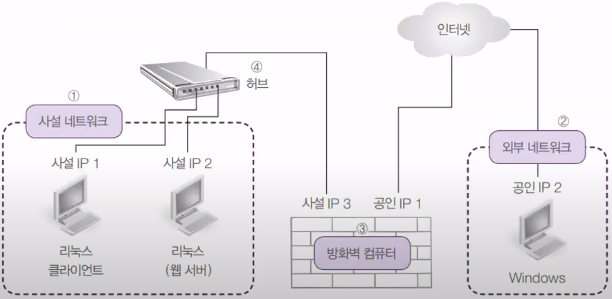
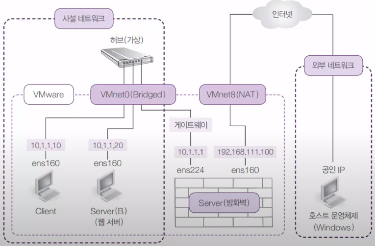
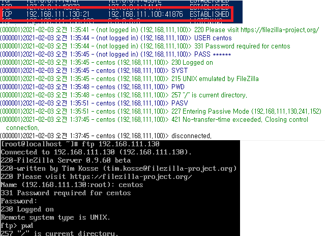
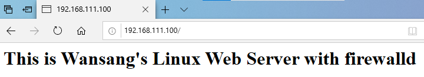

## 18-01 방화벽 서버-방화벽 개념과 실습환경 설명

### 보안을 위한 네트워크 설계

- 방화벽이란
  - 외부의 공개된 네트워크와 내부의 사설 네트워크 사이에 자리잡고 외부와 내부에 전달되는 트래픽을 정책에 의해 허용/거부하는 역할
- 사설IP(Private IP)
  - 내부의 사용자는 외부의 인터넷을 이용, 외부에서는 내부로 침입할 수 없게 하는 방법 중 가장 보편적으로 많이 사용하는 방법, nonroutable IP 주소를 이용함
  - 사설IP의 주소 범위는 `10.0.0.0 ~ 10.255.255.255`, `172.16.0.0 ~ 172.31.255.255`, `192.168.0.0 ~ 192.168.255.255` 세 범위가 있음
  - `IP 마스커레이딩(Masquerading)`: 사설IP 주소의 컴퓨터가 외부의 인터넷으로 접속할 수 있도록 해 주는 방법

### 보편적인 회사 네트워크 구성



### 보안 네트워크 실습 설계



## 18-02 방화벽 서버-방화벽 구현

### [실습1] 방화벽 컴퓨터 구현

실습목표
- 3대의 컴퓨터를 이용, 방화벽 구성
- 실제 네트워크 구성에 대한 이해의 폭을 넓힘
- iptables 유틸리티의 활용법을 이해

1. 사설 네트워크 설정

    VMware Workstation Pro에서 `Edit` -> `Virtual Network Editor`

    `Change Setting`을 누르고 네트워크 체크만 하기

    VMnet8(외부 게이트), VMnet0(내부망)을 쓸 예정

    ServerB에서

    `네트워크장치`(오른쪽 위에) 마우스 오른쪽 -> `Setting` -> `Bridged`로 바꿔주기

    ```bash
    $ dnf -y install iptables-services  # 방화벽 서비스 패키지 다운
    $ nmtui edit ens160  # 네트워크 정보 변경
    Address: 10.1.1.20/24
    Gateway: 10.1.1.1
    DNS servers: 8.8.8.8
    $ nmcli connection down ens160  # 네트워크 재시작
    $ nmcli connection up ens160
    $ ip addr  # 네트워크 확인
    $ ping -c 3 www.google.com
    # 불러오지 못함(내부망 사용), 나중에 외부망과 연결하면 가능
    ```

    클라이언트 터미널에서

    ```bash
    $ su -c 'gedit /etc/sysconfig/selinux'
    SELINUX=disabled  # 수정
    $ nmtui edit ens160  # 네트워크 정보 변경
    Address: 10.1.1.10/24
    Gateway: 10.1.1.1
    DNS servers: 8.8.8.8
    $ nmcli connection down ens160  # 네트워크 재시작
    $ nmcli connection up ens160
    $ ifconfig  # 네트워크 확인
    $ ping -c 3 www.google.com
    # 불러오지 못함(내부망 사용), 나중에 외부망과 연결하면 가능
    $ ping -c 3 10.1.1.20
    # 불러옴(내부망 끼리는 연결)
    ```

2. ServerA의 Network Adapter 추가하고 설정하기

    VMware에서 `Edit Virtual Machine` -> `Add` -> `Network Adapter`

    `Bridged` 로 설정 -> Root로 로그인 -> 오른쪽 위 이더넷 유선 네트워크 설정

    ens224 의 설정 클릭 -> 신원 -> 이름을 `ens224` 로 변경 -> 위에 IPv4 수동

    -> 주소: 10.1.1.1, 넷마스크: 255.255.255.0, 게이트웨이: 10.1.1.1 -> 네임서버, 라우팅 끄기

    -> IPv6는 사용하지 않음

3. 방화벽 정책 설정하기

    ```bash
    $ dnf -y install iptables-services  # 방화벽 서비스 패키지 다운
    $ gedit /etc/sysconfig/network-scripts/ifcfg-ens224
    # 아래 두개 삭제
    # GATEWAY=10.1.1.1  
    # DEFROUTE=yes
    $ nmcli connection down ens224
    $ nmcli connection up ens224
    $ ifconfig  # inet 설정 확인
    $ gedit /etc/sysctl.conf
    net.ipv4.ip_forward = 1  # 제일 아래에 추가
    # ip forwarding 하기
    $ echo 1 > /proc/sys/net/ipv4/ip_forward
    $ cat /proc/sys/net/ipv4/ip_forward  # 1로 설정된지 확인
    # 기존 방화벽 정책 없에기
    $ iptables --policy FORWARD DROP
    $ iptables --policy INPUT DROP
    $ iptables --policy OUTPUT DROP
    # 방화벽 정책 추가하기
    # ens224에 대해서 input, output, forward 가능, ens160에 대해서는 forward만 가능
    $ iptables --append INPUT --in-interface ens224 --source 10.1.1.0/24 --match state --state NEW,ESTABLISHED --jump ACCEPT
    $ iptables --append OUTPUT --out-interface ens224 --destination 10.1.1.0/24 --match state --state NEW,ESTABLISHED --jump ACCEPT
    $ iptables --append FORWARD --in-interface ens224 --source 10.1.1.0/24 --destination 0.0.0.0/0 --match state --state NEW,ESTABLISHED --jump ACCEPT
    $ iptables --append FORWARD --in-interface ens160 --destination 10.1.1.0/24 --match state --state ESTABLISHED --jump ACCEPT
    # 내부 인터넷이 외부로 나갈 수 있게 가능하게 함
    $ iptables --table nat --append POSTROUTING --out-interface ens160 --jump MASQUERADE
    # 설정 내용 저장
    $ iptables-save > /etc/sysconfig/iptables
    # 방화벽에서 설정 허용
    $ firewall-config
    설정 영구적 -> Masquerading -> 해당 버튼 체크
    # 네트워크 카드 재활성화
    $ nmcli connection down ens224
    $ nmcli connection down ens160
    $ nmcli connection up ens224
    $ nmcli connection up ens160
    $ reboot
    ```

4. 클라이언트에서 외부 인터넷이 잘 되는지 확인

    

5. 외부 Windows 공인 IP 설정

    Windows 클라이언트에서 FileZilla Server 다운하기 [https://filezilla-project.org/download.php?type=server](https://filezilla-project.org/download.php?type=server)

    - 유저 추가: `Edit` -> `Users` -> `Add`
    - 공유 폴더: 아무폴더 만들고 버튼 8개 체크, `Set as home dir` 클릭

    21번 포트 열어두기 powershell 에서

    ```powershell
    $ netsh advfirewall firewall add rule name ="FTP서버" dir=in action=allow protocol=tcp localport=21
    $ ipconfig
    $ netstat /an  # 접속 목록 보기
    ```

6. 클라이언트에서 내부에서 외부로 접속 시도하기

    ```bash
    $ su -c 'dnf -y install ftp'
    $ ftp 192.168.111.130  # ip 주소에 맞게 접속하기
    ftp> pwd
    ftp> bye
    ```

    접속 후 접속 목록 보기해서 외부 주소 확인해보기

    

7. 외부에서 서버B(웹)로 접속 시도하기

    ```bash
    # 서버B를 웹 서버로 설정하기
    $ dnf -y install httpd
    $ firewall-cmd --permanent --add-service=http
    $ firewall-cmd --reload
    $ cd /var/www/html/
    $ touch index.html
    $ vi index.html
    # <h1>This is Wansang's Linux Web Server with firewalld</h1>
    $ systemctl restart httpd
    $ systemctl enable httpd
    ```

8. ServerA에서 방화벽 정책 설정하고 외부에서 내부로 들어와보기

    ```bash
    # 80번 포트 요청이 오면 10.1.1.20으로 보내라
    $ iptables --table nat --append PREROUTING --proto tcp --in-interface ens160 --dport 80 --jump DNAT --to-destination 10.1.1.20
    $ iptables-save > /etc/sysconfig/iptables
    # 네트워크 카드 재활성화
    $ nmcli connection down ens160
    $ nmcli connection up ens160
    ```

    외부 PC에서 `192.168.111.100`으로 접속해 보기

    
